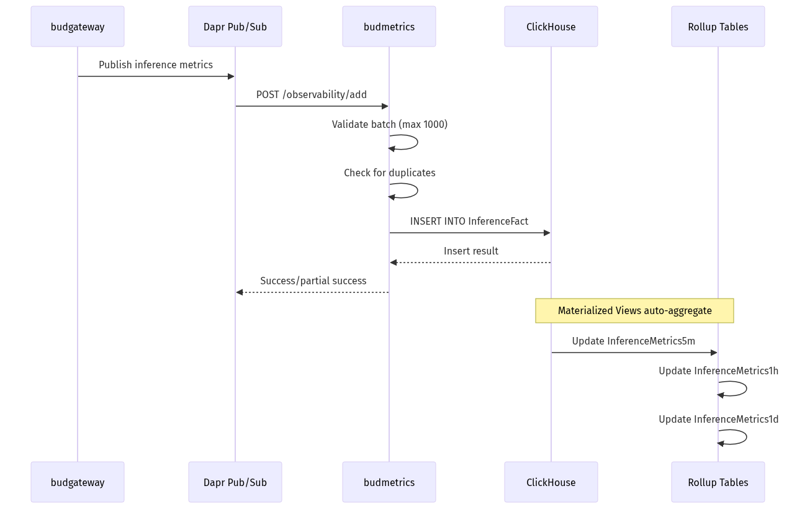
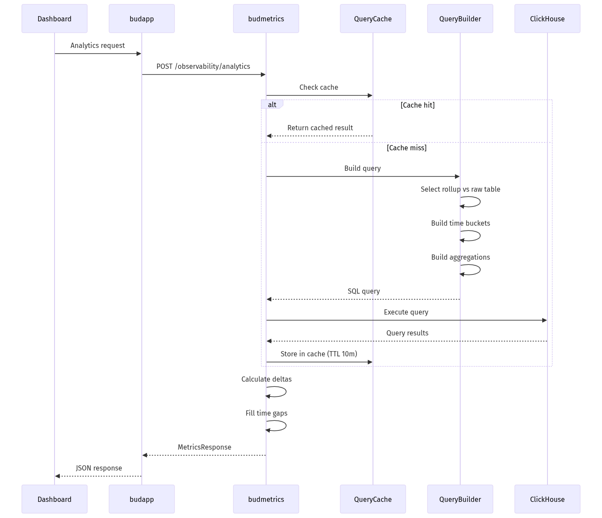

# budmetrics - Low-Level Design
---

## 1. Document Overview

### 1.1 Purpose

This LLD provides build-ready technical specifications for budmetrics, the observability and analytics service of Bud AI Foundry. Developers should be able to implement metrics collection, time-series analytics, and performance monitoring features directly from this document.

### 1.2 Scope

**In Scope:**
- ClickHouse-based inference metrics storage and analytics
- Time-series query building with dynamic aggregations
- Rollup table optimization for high-performance queries
- Geographic distribution analysis from gateway data
- Credential usage tracking and user activity monitoring
- OpenTelemetry trace storage and retrieval
- Real-time dashboard metrics with delta calculations

**Out of Scope:**
- User authentication (handled by budapp)
- Model inference execution (handled by budgateway)
- Cluster management (handled by budcluster)
- Performance simulation (handled by budsim)

### 1.3 Intended Audience

| Audience | What They Need |
|----------|----------------|
| Developers | Query builder patterns, ClickHouse optimizations, schema design |
| Data Engineers | Time-series architecture, rollup strategies, data flow |
| Operations | Performance tuning, connection pool management, caching |
| Product | Available metrics, aggregation capabilities, dashboard features |

### 1.4 References

| Document | Description |
|----------|-------------|
| [High-Level Architecture](../architecture/high-level-architecture.md) | System overview |
| [Main LLD Index](../architecture/low-level-design.md) | Cross-cutting concerns |
| [budmetrics Service Documentation](./budmetrics.md) | Service summary |

---

## 2. System Context & Assumptions

### 2.1 Business Assumptions

- Inference metrics are ingested at high velocity (thousands per second)
- Dashboard queries must return within 500ms for good UX
- Historical data retention spans 90+ days
- Users need both real-time and historical analytics
- Geographic analysis requires IP-based location data

### 2.2 Technical Assumptions

- ClickHouse is available with native protocol access (port 9000)
- budgateway pushes inference metrics via Dapr pub/sub
- OpenTelemetry traces are collected from all services
- Redis/Valkey is available for state management
- Network latency to ClickHouse is <10ms

### 2.3 Constraints

| Constraint Type | Description | Impact |
|-----------------|-------------|--------|
| Query Timeout | 300s max execution time | Long queries may fail |
| Memory | 10GB max per query | Complex aggregations limited |
| Batch Size | 1000 entries max per insert | Client must batch |
| Date Range | 90 days max per query | Prevents full table scans |
| Concurrent Queries | 10 max via semaphore | Prevents resource exhaustion |

### 2.4 External Dependencies

| Dependency | Type | Failure Impact | Fallback Strategy |
|------------|------|----------------|-------------------|
| ClickHouse | Required | No metrics storage/queries | Return 503 |
| Redis/Valkey | Required | No Dapr state | Service degraded |
| budgateway | Producer | No new metrics ingested | Queue backlog |
| budapp | Consumer | No usage sync | Queue updates |
| PostgreSQL | Optional | No PSQL fallback | Continue with ClickHouse |

---

## 3. Detailed Architecture

### 3.1 Component Overview


### 3.2 Component Breakdown

#### 3.2.1 QueryBuilder

**Purpose:** Constructs optimized ClickHouse queries for analytics

**Key Responsibilities:**
- Dynamic metric definition registration
- Time bucket expression generation
- Filter and grouping clause construction
- CTE (Common Table Expression) management
- TopK query generation
- Rollup vs raw table selection

**Metric Types Supported:**

| Metric | Description | Tables Used |
|--------|-------------|-------------|
| request_count | Total inference requests | InferenceFact/Rollup |
| success_request | Successful requests + rate | InferenceFact/Rollup |
| failure_request | Failed requests + rate | InferenceFact/Rollup |
| queuing_time | Request queue wait time | InferenceFact (raw) |
| input_token | Input token count | InferenceFact/Rollup |
| output_token | Output token count | InferenceFact/Rollup |
| concurrent_requests | Max concurrent at timestamp | InferenceFact (raw) |
| ttft | Time to first token (avg, p95, p99) | InferenceFact (raw for percentiles) |
| latency | Response latency (avg, p95, p99) | InferenceFact (raw for percentiles) |
| throughput | Tokens per second | InferenceFact/Rollup |
| cache | Cache hit rate/count | InferenceFact/Rollup |

#### 3.2.2 ClickHouseClient

**Purpose:** Manages ClickHouse connection pooling and query execution

**Configuration:**

```python
@dataclass
class ClickHouseConfig:
    host: str                          # ClickHouse server host
    port: int = 9000                   # Native protocol port
    pool_min_size: int = 2             # Minimum pool connections
    pool_max_size: int = 20            # Maximum pool connections
    query_timeout: int = 300           # 5 minute timeout
    connect_timeout: int = 30          # Connection timeout
    max_concurrent_queries: int = 10   # Semaphore limit
    enable_query_cache: bool = False   # LRU cache toggle
    query_cache_ttl: int = 600         # 10 minute cache TTL
    query_cache_max_size: int = 1000   # Max cached queries
```

**Connection Pool Lifecycle:**

```
┌─────────────┐     ┌─────────────┐     ┌─────────────┐
│  initialize │────▶│   warmup    │────▶│   ready     │
│             │     │ connections │     │             │
└─────────────┘     └─────────────┘     └─────────────┘
                                              │
                    ┌─────────────┐           │
                    │   close     │◀──────────┘
                    │             │  (shutdown)
                    └─────────────┘
```

#### 3.2.3 QueryCache

**Purpose:** LRU cache with TTL for frequently executed queries

**Cache Key Generation:**
```python
def _make_key(query: str, params: dict) -> str:
    key_data = {"query": query, "params": params or {}}
    key_str = orjson.dumps(dict(sorted(key_data.items())))
    return hashlib.md5(key_str, usedforsecurity=False).hexdigest()
```

**Cache Hit Flow:**

```
Query Request
     │
     ▼
┌─────────────┐     ┌─────────────┐
│ Check Cache │────▶│   Cache     │────▶ Return cached result
│             │ hit │   Valid?    │ yes
└─────────────┘     └─────────────┘
     │ miss              │ no (expired)
     ▼                   ▼
┌─────────────┐     ┌─────────────┐
│  Execute    │     │  Remove     │
│   Query     │     │  Expired    │
└─────────────┘     └─────────────┘
     │
     ▼
┌─────────────┐
│ Store in    │
│   Cache     │
└─────────────┘
```

---

## 4. Data Design

### 4.1 ClickHouse Tables

#### 4.1.1 InferenceFact (Raw Data)

**Purpose:** Stores individual inference events for detailed analysis

```sql
CREATE TABLE InferenceFact (
    inference_id UUID,
    project_id UUID,
    endpoint_id UUID,
    model_id UUID,
    api_key_id UUID,
    user_id UUID,
    api_key_project_id UUID,
    request_arrival_time DateTime64(3),
    request_forward_time DateTime64(3),
    response_time_ms Float64,
    ttft_ms Float64,
    input_tokens UInt32,
    output_tokens UInt32,
    is_success Bool,
    cached Bool,
    request_ip IPv4,
    cost Float64,
    error_code String,
    error_message String,
    error_type String,
    status_code UInt16
) ENGINE = MergeTree()
PARTITION BY toYYYYMM(request_arrival_time)
ORDER BY (project_id, endpoint_id, request_arrival_time)
```

**Indexes:**
- Primary: (project_id, endpoint_id, request_arrival_time)
- Secondary: model_id, api_key_id, user_id

#### 4.1.2 Rollup Tables (Pre-aggregated)

**Purpose:** Pre-aggregated metrics for fast dashboard queries

```sql
-- 5-minute rollup for recent data
CREATE TABLE InferenceMetrics5m (
    time_bucket DateTime,
    project_id UUID,
    endpoint_id UUID,
    model_id UUID,
    api_key_project_id UUID,
    request_count UInt64,
    success_count UInt64,
    error_count UInt64,
    cached_count UInt64,
    total_input_tokens UInt64,
    total_output_tokens UInt64,
    sum_response_time_ms Float64,
    min_response_time_ms Float64,
    max_response_time_ms Float64,
    sum_ttft_ms Float64
) ENGINE = SummingMergeTree()
PARTITION BY toYYYYMM(time_bucket)
ORDER BY (time_bucket, project_id, endpoint_id, model_id)
```

**Rollup Hierarchy:**

```
InferenceFact (raw events)
        │
        ▼ (5 min aggregation)
InferenceMetrics5m
        │
        ▼ (1 hour aggregation)
InferenceMetrics1h
        │
        ▼ (1 day aggregation)
InferenceMetrics1d
```

**Table Selection Logic:**

| Time Range | Frequency | Table Selected |
|------------|-----------|----------------|
| < 6 hours | hour | InferenceMetrics5m |
| 6h - 7 days | day | InferenceMetrics1h |
| > 7 days | week/month | InferenceMetrics1d |

### 4.2 Data Flow

```
budgateway (inference) ──────────────────────────────────────┐
                                                             │
                                                             ▼
                    ┌────────────────────────────────────────────────┐
                    │            Dapr Pub/Sub                        │
                    └────────────────────────────────────────────────┘
                                             │
                                             ▼
                    ┌────────────────────────────────────────────────┐
                    │        budmetrics /observability/add           │
                    │   • Batch validation (max 1000 entries)        │
                    │   • Schema mapping                             │
                    │   • Duplicate detection                        │
                    └────────────────────────────────────────────────┘
                                             │
                                             ▼
                    ┌────────────────────────────────────────────────┐
                    │              ClickHouse                         │
                    │   InferenceFact ──▶ Materialized Views ──▶     │
                    │                     Rollup Tables               │
                    └────────────────────────────────────────────────┘
```

### 4.3 Schema Relationships

```
InferenceFact
├── project_id ────────▶ budapp.projects.id
├── endpoint_id ───────▶ budapp.endpoints.id
├── model_id ──────────▶ budmodel.models.id
├── api_key_id ────────▶ budapp.credentials.id
├── user_id ───────────▶ budapp.users.id
└── api_key_project_id ▶ budapp.projects.id (client project)
```

---

## 5. API & Interface Design

### 5.1 Internal APIs

#### 5.1.1 POST /observability/add

**Purpose:** Ingest inference metrics in batches

**Request:**
```json
{
  "entries": [
    {
      "event": {
        "data": {
          "inference_id": "uuid",
          "project_id": "uuid",
          "endpoint_id": "uuid",
          "model_id": "uuid",
          "is_success": true,
          "request_arrival_time": "2024-01-15T10:00:00Z",
          "request_forward_time": "2024-01-15T10:00:00.050Z",
          "request_ip": "192.168.1.1",
          "cost": 0.0025,
          "api_key_id": "uuid",
          "user_id": "uuid"
        }
      }
    }
  ]
}
```

**Response:**
```json
{
  "message": "Successfully inserted 950 new records. Skipped 50 duplicate records",
  "summary": {
    "total_entries": 1000,
    "successfully_inserted": 950,
    "duplicates_skipped": 50,
    "validation_failures": 0
  }
}
```

**Constraints:**
- Max batch size: 1000 entries
- Duplicate detection by inference_id
- Validation errors logged, partial success allowed

#### 5.1.2 POST /observability/analytics

**Purpose:** Query time-series metrics with grouping and filtering

**Request:**
```json
{
  "metrics": ["request_count", "latency", "ttft"],
  "from_date": "2024-01-01T00:00:00Z",
  "to_date": "2024-01-15T00:00:00Z",
  "frequency_unit": "day",
  "frequency_interval": 1,
  "filters": {
    "project": ["uuid1", "uuid2"]
  },
  "group_by": ["model"],
  "return_delta": true,
  "fill_time_gaps": true,
  "topk": 5
}
```

**Response:**
```json
{
  "object": "observability_metrics",
  "items": [
    {
      "time_period": "2024-01-01T00:00:00Z",
      "items": [
        {
          "model_id": "uuid",
          "data": {
            "request_count": {
              "count": 15000,
              "delta": 500,
              "delta_percent": 3.45
            },
            "latency": {
              "avg": 245.5,
              "p95": 450.2,
              "p99": 890.1
            }
          }
        }
      ]
    }
  ]
}
```

#### 5.1.3 POST /observability/inferences/list

**Purpose:** Paginated list of individual inferences

**Request:**
```json
{
  "from_date": "2024-01-01T00:00:00Z",
  "to_date": "2024-01-15T00:00:00Z",
  "project_id": "uuid",
  "is_success": true,
  "sort_by": "latency",
  "sort_order": "desc",
  "offset": 0,
  "limit": 50
}
```

#### 5.1.4 GET /observability/traces/{trace_id}

**Purpose:** Retrieve all spans for an OpenTelemetry trace

**Response:**
```json
{
  "object": "trace_detail",
  "trace_id": "abc123",
  "spans": [
    {
      "span_id": "span1",
      "parent_span_id": null,
      "operation_name": "gateway_request",
      "service_name": "budgateway",
      "start_time": "2024-01-15T10:00:00Z",
      "duration_ms": 245,
      "attributes": {}
    }
  ]
}
```

### 5.2 Query Building Patterns

#### 5.2.1 Rollup Query Construction

```python
def build_rollup_query(
    metrics: list[str],
    from_date: datetime,
    to_date: datetime,
    frequency_unit: str,
    filters: dict,
    group_by: list[str],
    topk: int = None
) -> tuple[str, list[str]]:
    """
    Build optimized query against rollup tables.

    Returns:
        Tuple of (SQL query string, field order list)
    """
    # 1. Select appropriate rollup table
    table = _select_rollup_table(from_date, to_date, frequency_unit)

    # 2. Build time bucket expression
    time_bucket = _get_rollup_time_bucket_expr(frequency_unit)

    # 3. Build metric aggregations
    select_clauses = _build_rollup_metric_select(metrics)

    # 4. Build WHERE conditions
    conditions = _build_filter_conditions(filters, from_date, to_date)

    # 5. Build TopK CTE if needed
    topk_cte = _build_topk_cte(group_by, topk) if topk else ""

    return f"""
        {topk_cte}
        SELECT {time_bucket}, {', '.join(select_clauses)}
        FROM {table}
        WHERE {' AND '.join(conditions)}
        GROUP BY time_bucket, {', '.join(group_by)}
        ORDER BY time_bucket ASC
        WITH FILL ...
    """
```

#### 5.2.2 Raw Data Query for Percentiles

```python
# Metrics requiring raw data (cannot use rollups)
REQUIRES_RAW_DATA_METRICS = {
    "queuing_time",      # Needs raw timestamps
    "concurrent_requests", # Needs raw timestamps
    "latency",           # Needs raw values for p95/p99
    "ttft",              # Needs raw values for p95/p99
}

def can_use_rollup(metrics: list[str]) -> bool:
    """Check if all requested metrics can use rollup tables."""
    return not any(m in REQUIRES_RAW_DATA_METRICS for m in metrics)
```

---

## 6. Logic & Algorithm Details

### 6.1 Time Bucket Generation

**Standard Intervals (frequency_interval = None):**
```python
STANDARD_FUNCTIONS = {
    FrequencyUnit.HOUR: "toStartOfHour({time_field})",
    FrequencyUnit.DAY: "toDate({time_field})",
    FrequencyUnit.WEEK: "toStartOfWeek({time_field})",
    FrequencyUnit.MONTH: "toStartOfMonth({time_field})",
    FrequencyUnit.QUARTER: "toStartOfQuarter({time_field})",
    FrequencyUnit.YEAR: "toStartOfYear({time_field})",
}
```

**Custom Intervals (aligned to from_date):**
```python
# Formula: from_date + floor((timestamp - from_date) / interval) * interval
def custom_interval_expr(from_date: datetime, interval_seconds: int) -> str:
    from_ts = f"toUnixTimestamp('{from_date}')"
    return f"""
        toDateTime(
            {from_ts} +
            floor((toUnixTimestamp(time_bucket) - {from_ts}) / {interval_seconds})
            * {interval_seconds}
        )
    """
```

### 6.2 Delta Calculation (Window Functions)

```sql
-- Previous value using lagInFrame
lagInFrame(metric_value, 1, metric_value)
    OVER (PARTITION BY group_cols ORDER BY time_bucket ASC
          ROWS BETWEEN UNBOUNDED PRECEDING AND UNBOUNDED FOLLOWING)
    AS previous_value

-- Delta calculation
COALESCE(ROUND(metric_value - previous_value, 2)) AS delta

-- Percent change
COALESCE(ROUND((delta / NULLIF(previous_value, 0)) * 100, 2)) AS delta_percent
```

### 6.3 Concurrent Requests Calculation

**Algorithm:** Count overlapping requests at each timestamp

```sql
-- CTE for concurrent request counts
WITH concurrent_counts AS (
    SELECT
        request_arrival_time,
        project_id,
        COUNT(*) as concurrent_count
    FROM InferenceFact
    WHERE request_arrival_time >= '{from_date}'
      AND request_arrival_time <= '{to_date}'
    GROUP BY request_arrival_time, project_id
    HAVING COUNT(*) > 1
)
SELECT
    time_bucket,
    COALESCE(MAX(cc.concurrent_count), 0) AS max_concurrent_requests
FROM InferenceFact ifact
LEFT JOIN concurrent_counts cc
    ON cc.request_arrival_time = ifact.request_arrival_time
GROUP BY time_bucket
```

### 6.4 TopK Entity Selection

```sql
-- TopK CTE for selecting top entities by metric
WITH topk_entities AS (
    SELECT project_id
    FROM (
        SELECT project_id, SUM(request_count) as rank_value
        FROM InferenceMetrics1d
        WHERE time_bucket >= '{from_date}' AND time_bucket <= '{to_date}'
        GROUP BY project_id
    ) AS ranking_subquery
    ORDER BY rank_value DESC
    LIMIT {topk}
)
SELECT ...
FROM main_query
INNER JOIN topk_entities te ON main_query.project_id = te.project_id
```

---

## 7. GenAI/ML-Specific Design

### 7.1 Inference Metrics Captured

| Metric | Unit | Description |
|--------|------|-------------|
| input_tokens | count | Tokens in the prompt |
| output_tokens | count | Tokens generated |
| ttft_ms | milliseconds | Time to first token |
| response_time_ms | milliseconds | Total response time |
| throughput | tokens/sec | Output tokens / response time |
| cached | boolean | Whether response was cached |

### 7.2 Token Cost Tracking

```python
# Cost calculation per inference
cost = (input_tokens * input_price_per_token) +
       (output_tokens * output_price_per_token)

# Aggregation for billing
total_cost = SUM(cost) WHERE project_id = X AND date_range
```

### 7.3 Performance Percentile Tracking

**Why raw data is needed for percentiles:**
- Rollup tables store SUM/COUNT, not distribution
- p95/p99 require actual value distribution
- ClickHouse `quantile()` function operates on raw values

```sql
-- Percentile calculations from raw data
SELECT
    AVG(response_time_ms) AS avg_latency_ms,
    quantile(0.95)(response_time_ms) AS latency_p95,
    quantile(0.99)(response_time_ms) AS latency_p99
FROM InferenceFact
WHERE ...
```

---

## 8. Configuration & Environment

### 8.1 Environment Variables

| Variable | Required | Default | Description |
|----------|----------|---------|-------------|
| CLICKHOUSE_HOST | Yes | - | ClickHouse server hostname |
| CLICKHOUSE_PORT | Yes | 9000 | Native protocol port |
| CLICKHOUSE_USER | Yes | - | Database user |
| CLICKHOUSE_PASSWORD | Yes | - | Database password |
| CLICKHOUSE_DB_NAME | No | bud | Database name |
| CLICKHOUSE_ENABLE_QUERY_CACHE | No | false | Enable LRU cache |
| CLICKHOUSE_ENABLE_CONNECTION_WARMUP | No | false | Pre-warm connections |
| PSQL_HOST | No | - | PostgreSQL host (optional) |
| PSQL_PORT | No | - | PostgreSQL port (optional) |
| PSQL_DB_NAME | No | - | PostgreSQL database (optional) |

### 8.2 Feature Flags

| Flag | Default | Description |
|------|---------|-------------|
| CLICKHOUSE_ENABLE_QUERY_CACHE | false | Enable query result caching |
| CLICKHOUSE_ENABLE_CONNECTION_WARMUP | false | Pre-establish connections |

### 8.3 Connection Pool Settings

```python
# Default pool configuration
pool_min_size = 2      # Minimum connections maintained
pool_max_size = 20     # Maximum connections allowed
connect_timeout = 30   # Connection timeout in seconds
query_timeout = 300    # Query execution timeout (5 min)
max_concurrent_queries = 10  # Semaphore limit
```

---

## 9. Security Design

### 9.1 Authentication

- Service-to-service via Dapr mTLS
- No direct user authentication (handled by budapp gateway)
- API accessed through budapp reverse proxy

### 9.2 Authorization

- Project-level filtering enforced at query level
- API key project ID used for client-specific metrics
- No cross-tenant data access possible

### 9.3 Data Protection

| Data Type | Protection |
|-----------|------------|
| IP Addresses | Stored as IPv4, logged |
| User IDs | UUID, no PII |
| API Keys | Only ID stored, not key value |
| Query Strings | Not stored |

### 9.4 Input Validation

```python
# IP address validation
@field_validator("request_ip")
def validate_ip(v: str) -> str:
    ipaddress.IPv4Address(v)  # Raises on invalid
    return v

# Date range validation
def validate_date_range(from_date, to_date, max_days=90):
    if (to_date - from_date).days > max_days:
        raise ValueError(f"Date range cannot exceed {max_days} days")
```

---

## 10. Performance & Scalability

### 10.1 Query Optimization Strategies

| Strategy | Benefit | Implementation |
|----------|---------|----------------|
| Rollup tables | 100x faster aggregations | Materialized views |
| Query caching | Avoid duplicate computation | LRU with TTL |
| Connection pooling | Reduce connection overhead | asynch pool |
| Semaphore limiting | Prevent resource exhaustion | 10 concurrent max |
| Time partitioning | Efficient range queries | PARTITION BY month |

### 10.2 Expected Load

| Operation | Expected Volume | Target Latency |
|-----------|-----------------|----------------|
| Metric ingestion | 10,000/sec peak | < 100ms |
| Dashboard query | 100/sec | < 500ms |
| Trace retrieval | 10/sec | < 200ms |
| Export (large) | 1/min | < 30s |

### 10.3 Caching Strategy

```
Query Request
     │
     ▼
┌─────────────┐
│ L1: Query   │  TTL: 10 minutes
│    Cache    │  Size: 1000 queries
└──────┬──────┘
       │ miss
       ▼
┌─────────────┐
│ ClickHouse  │
│   Query     │
└─────────────┘
```

### 10.4 Scaling Approach

- **Horizontal:** Multiple budmetrics replicas behind load balancer
- **Vertical:** ClickHouse cluster with sharding for large datasets
- **Data Lifecycle:** Rollup tables + TTL-based expiration

---

## 11. Error Handling & Logging

### 11.1 Error Classification

| Error Type | HTTP Code | Retry Strategy |
|------------|-----------|----------------|
| Validation Error | 400 | No retry, fix request |
| Query Timeout | 408 | Reduce date range |
| Connection Failed | 503 | Exponential backoff |
| ClickHouse Error | 500 | Log and alert |
| Batch Partial Failure | 200 | Return partial success |

### 11.2 Error Response Format

```json
{
  "object": "error",
  "code": 400,
  "message": "Date range cannot exceed 90 days",
  "details": {
    "from_date": "2024-01-01",
    "to_date": "2024-06-01",
    "max_days": 90
  }
}
```

### 11.3 Logging Standards

```python
# Structured logging with context
logger.info(f"Received {len(entries)} entries")
logger.error(f"Validation error for entry {idx}: {e}")
logger.error(f"Query execution failed: {e}. Query: {query[:100]}...")
```

### 11.4 Connection Recovery

```python
async def execute_query(self, query: str) -> list:
    try:
        result = await cursor.execute(query)
        return await cursor.fetchall()
    except Exception as e:
        # Close connection to prevent reuse in dirty state
        await conn.close()
        logger.info("Closed connection after query failure")
        raise
```

---

## 12. Deployment & Infrastructure

### 12.1 Deployment Topology

```
┌─────────────────────────────────────────────────────────────┐
│                    Kubernetes Cluster                        │
├─────────────────────────────────────────────────────────────┤
│                                                              │
│  ┌──────────────┐   ┌──────────────┐   ┌──────────────┐     │
│  │  budmetrics  │   │  budmetrics  │   │  budmetrics  │     │
│  │  (replica 1) │   │  (replica 2) │   │  (replica 3) │     │
│  │ + Dapr sidecar│   │ + Dapr sidecar│   │ + Dapr sidecar│     │
│  └──────┬───────┘   └──────┬───────┘   └──────┬───────┘     │
│         │                  │                  │              │
│         └──────────────────┼──────────────────┘              │
│                            │                                 │
│                            ▼                                 │
│                    ┌──────────────┐                         │
│                    │  Service LB  │                         │
│                    └──────────────┘                         │
│                                                              │
└─────────────────────────────────────────────────────────────┘
                             │
                             ▼
                    ┌──────────────┐
                    │  ClickHouse  │
                    │   Cluster    │
                    └──────────────┘
```

### 12.2 Resource Requirements

| Component | CPU | Memory | Storage |
|-----------|-----|--------|---------|
| budmetrics | 500m-2 | 512Mi-2Gi | - |
| Dapr sidecar | 100m | 128Mi | - |
| ClickHouse | 4+ | 16Gi+ | 500Gi+ |

### 12.3 Health Checks

```yaml
livenessProbe:
  httpGet:
    path: /health
    port: 8080
  initialDelaySeconds: 10
  periodSeconds: 30

readinessProbe:
  httpGet:
    path: /health
    port: 8080
  initialDelaySeconds: 5
  periodSeconds: 10
```

---

## 13. Testing Strategy

### 13.1 Unit Tests

```python
# QueryBuilder tests
def test_can_use_rollup_with_compatible_metrics():
    builder = QueryBuilder()
    assert builder.can_use_rollup(["request_count", "input_token"]) is True

def test_can_use_rollup_with_percentile_metrics():
    builder = QueryBuilder()
    assert builder.can_use_rollup(["latency"]) is False  # Needs raw for p95/p99

def test_time_bucket_generation():
    result = TimeSeriesHelper.get_time_bucket_expression(
        Frequency.daily(), "request_arrival_time"
    )
    assert "toDate" in result
```

### 13.2 Integration Tests

```python
# ClickHouse integration
async def test_insert_and_query():
    client = ClickHouseClient()
    await client.initialize()

    # Insert test data
    await client.insert_data("InferenceFact", test_records)

    # Query and verify
    results = await client.execute_query("SELECT COUNT(*) FROM InferenceFact")
    assert results[0][0] == len(test_records)
```

### 13.3 Performance Tests

- Query latency under load (100 concurrent requests)
- Ingestion throughput (10,000 records/second)
- Cache hit rate monitoring
- Connection pool utilization

---

## 14. Limitations & Future Enhancements

### 14.1 Known Limitations

| Limitation | Impact | Workaround |
|------------|--------|------------|
| 90-day query range | Cannot query longer periods | Multiple queries |
| 10 concurrent queries | Potential queuing | Increase semaphore |
| No real-time streaming | Dashboard polling needed | WebSocket future |
| Rollup aggregation delay | 5-min data freshness | Query raw for recent |

### 14.2 Tech Debt

| Item | Priority | Notes |
|------|----------|-------|
| Unified error handling | Medium | Standardize across routes |
| Query plan caching | Low | Beyond result caching |
| Compression optimization | Low | Tune ClickHouse codecs |

### 14.3 Planned Improvements

1. **Real-time streaming** - WebSocket push for live dashboards
2. **Anomaly detection** - ML-based alert generation
3. **Cost forecasting** - Predict token spend
4. **Custom rollup periods** - User-defined aggregation intervals

---

## 15. Appendix

### 15.1 Glossary

| Term | Definition |
|------|------------|
| TTFT | Time to First Token - latency before first token returned |
| Rollup | Pre-aggregated table for faster queries |
| CTE | Common Table Expression - SQL WITH clause |
| TopK | Top K entities by metric value |
| Semaphore | Concurrency limiter for connections |

### 15.2 Sequence Diagrams

#### 15.2.1 Metrics Ingestion Flow



#### 15.2.2 Analytics Query Flow



### 15.3 Configuration Examples

**Production ClickHouse Config:**
```yaml
CLICKHOUSE_HOST: clickhouse.production.svc.cluster.local
CLICKHOUSE_PORT: 9000
CLICKHOUSE_DB_NAME: bud_production
CLICKHOUSE_ENABLE_QUERY_CACHE: true
CLICKHOUSE_ENABLE_CONNECTION_WARMUP: true
```

**Development Config:**
```yaml
CLICKHOUSE_HOST: localhost
CLICKHOUSE_PORT: 9000
CLICKHOUSE_DB_NAME: bud_dev
CLICKHOUSE_ENABLE_QUERY_CACHE: false
CLICKHOUSE_ENABLE_CONNECTION_WARMUP: false
```
