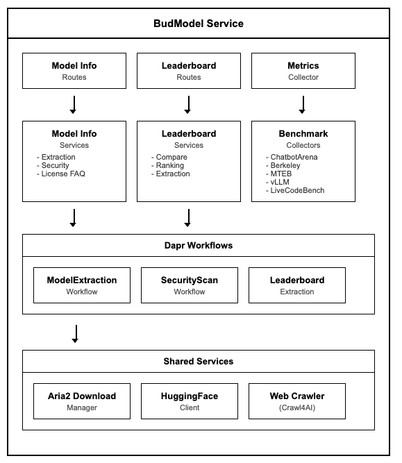
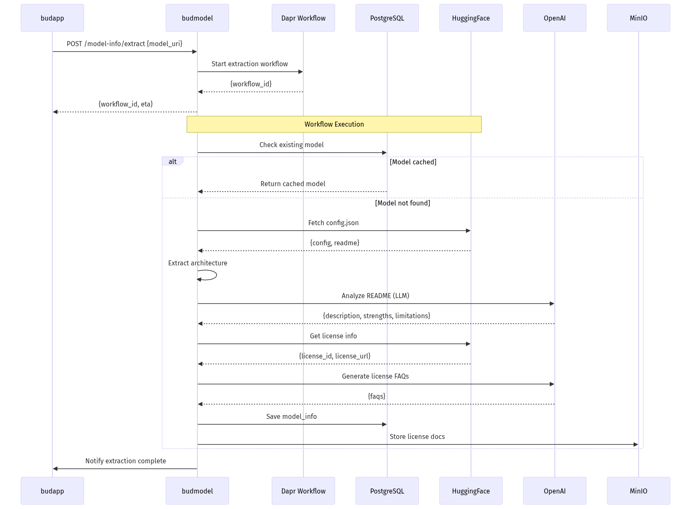
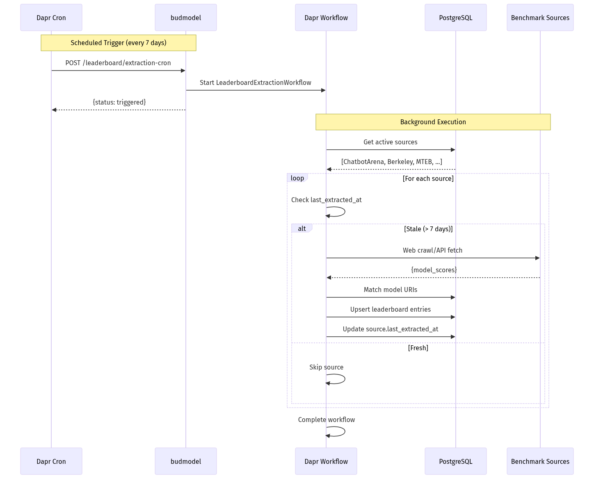

# BudModel Service - Low-Level Design (LLD)

## 1. Document Overview

### 1.1 Purpose
This document provides the Low-Level Design (LLD) for the BudModel service, a model registry and intelligence microservice within the Bud AI Foundry platform. BudModel manages model metadata extraction, license analysis, security scanning, and benchmark leaderboard aggregation.

### 1.2 Scope
- Model metadata extraction from HuggingFace and cloud providers
- License analysis and FAQ generation using LLMs
- Security scanning (ClamAV, modelscan)
- Benchmark leaderboard aggregation from multiple sources
- Model download management with Aria2

---

## 2. System Context

### 2.1 Service Role
BudModel serves as the model intelligence layer that:
- Extracts and stores model metadata from various providers
- Analyzes model licenses and generates compliance FAQs
- Performs security scans on model files
- Aggregates benchmark leaderboards from multiple sources
- Manages model file downloads and storage

### 2.2 Service Dependencies

| Dependency | Type | Purpose |
|------------|------|---------|
| budapp | Service | Triggers model extraction requests |
| PostgreSQL | Database | Model metadata, licenses, leaderboards |
| Redis/Valkey | Cache/Queue | Caching, job queuing |
| MinIO | Object Storage | Model files, license documents |
| HuggingFace | External | Model metadata, configs |
| BudConnect | External | Cloud model metadata |
| OpenAI/Perplexity | External | License analysis, FAQ generation |
| ClamAV | External | Malware scanning |

### 2.3 Integration Points
- **Inbound**: Model extraction requests from budapp via Dapr pub/sub
- **Outbound**: Stores metadata in PostgreSQL, files in MinIO
- **External APIs**: HuggingFace Hub, BudConnect, OpenAI, benchmark sources
- **Scheduled**: Dapr cron for leaderboard extraction (every 7 days)

---

## 3. Detailed Architecture

### 3.1 Component Diagram

#### 3.3.1 Model Extraction Flow

#### 3.3.2 Leaderboard Extraction Flow

---

## 4. Data Design
#### 4.1.1 model_info Table

| Column | Type | Constraints | Description |
|--------|------|-------------|-------------|
| id | UUID | PK, DEFAULT uuid4 | Primary key |
| author | TEXT | NULLABLE | Model author/organization |
| description | TEXT | NULLABLE | Model description |
| uri | TEXT | NOT NULL, UNIQUE | Model URI (e.g., meta-llama/Llama-3.1-8B) |
| modality | TEXT | NULLABLE | Model modality (text, vision, audio) |
| tags | JSONB | NULLABLE | Model tags |
| tasks | JSONB | NULLABLE | Supported tasks |
| papers | JSONB | NULLABLE | Related papers |
| github_url | TEXT | NULLABLE | GitHub repository URL |
| provider_url | TEXT | NULLABLE | Provider URL |
| website_url | TEXT | NULLABLE | Website URL |
| logo_url | TEXT | NULLABLE | Logo URL |
| use_cases | JSONB | NULLABLE | Suggested use cases |
| strengths | JSONB | NULLABLE | Model strengths |
| limitations | JSONB | NULLABLE | Model limitations |
| model_tree | JSONB | NULLABLE | Model derivation tree |
| languages | JSONB | NULLABLE | Supported languages |
| architecture | JSONB | NULLABLE | Architecture details |
| extraction_status | ENUM | NOT NULL | completed/partial/cached |
| license_id | UUID | FK -> license_info.id | License reference |
| created_at | TIMESTAMP WITH TZ | DEFAULT NOW() | Creation timestamp |
| modified_at | TIMESTAMP WITH TZ | ON UPDATE | Modification timestamp |

#### 4.1.2 license_info Table

| Column | Type | Constraints | Description |
|--------|------|-------------|-------------|
| id | UUID | PK, DEFAULT uuid4 | Primary key |
| license_id | TEXT | NOT NULL | License identifier (e.g., apache-2.0) |
| name | TEXT | NOT NULL | License full name |
| url | TEXT | NULLABLE | License URL |
| faqs | JSONB | NULLABLE | Generated FAQs |
| type | TEXT | NULLABLE | License type classification |
| description | TEXT | NULLABLE | License description |
| suitability | TEXT | NULLABLE | Usage suitability assessment |
| is_extracted | BOOLEAN | DEFAULT FALSE | FAQ extraction status |
| created_at | TIMESTAMP WITH TZ | DEFAULT NOW() | Creation timestamp |
| modified_at | TIMESTAMP WITH TZ | ON UPDATE | Modification timestamp |

**Constraint**: `UNIQUE(license_id, url)`

#### 4.1.3 leaderboard Table

| Column | Type | Constraints | Description |
|--------|------|-------------|-------------|
| id | UUID | PK, DEFAULT uuid4 | Primary key |
| model_info_id | UUID | FK -> model_info.id, NOT NULL | Model reference |
| source_id | UUID | FK -> source.id, NULLABLE | Benchmark source |
| eval_name | VARCHAR(100) | NOT NULL, INDEX | Evaluation metric name |
| normalised_eval_name | VARCHAR(100) | NOT NULL, INDEX | Normalized metric name |
| eval_score | FLOAT | NULLABLE | Score value |
| data_origin | ENUM | NOT NULL | scraped/readme_llm |
| created_at | TIMESTAMP WITH TZ | DEFAULT NOW() | Creation timestamp |
| updated_at | TIMESTAMP WITH TZ | ON UPDATE | Update timestamp |

#### 4.1.4 source Table

| Column | Type | Constraints | Description |
|--------|------|-------------|-------------|
| id | UUID | PK, DEFAULT uuid4 | Primary key |
| name | VARCHAR(100) | NOT NULL, INDEX | Source name |
| url | TEXT | NOT NULL | Source URL |
| wait_for | TEXT | NULLABLE | CSS selector to wait for |
| js_code | TEXT | NULLABLE | JavaScript to execute |
| schema | TEXT | NULLABLE | Data extraction schema |
| css_base_selector | TEXT | NULLABLE | Base CSS selector |
| is_active | BOOLEAN | DEFAULT TRUE | Active status |
| last_extracted_at | TIMESTAMP WITH TZ | NULLABLE | Last extraction time |
| created_at | TIMESTAMP WITH TZ | DEFAULT NOW() | Creation timestamp |
| updated_at | TIMESTAMP WITH TZ | ON UPDATE | Update timestamp |

#### 4.1.5 model_download_history Table

| Column | Type | Constraints | Description |
|--------|------|-------------|-------------|
| id | UUID | PK, DEFAULT uuid4 | Primary key |
| status | ENUM | NOT NULL | running/completed/uploaded/failed |
| size | FLOAT | NOT NULL | Size in GB |
| path | TEXT | NOT NULL | Local path |
| created_at | TIMESTAMP WITH TZ | DEFAULT NOW() | Creation timestamp |
| modified_at | TIMESTAMP WITH TZ | ON UPDATE | Modification timestamp |
#### 4.2.1 ModelArchitecture

#---

## 5. API Design
#### 5.1.1 POST /model-info/extract
Triggers model metadata extraction workflow.

**Request Body (ModelExtractionRequest)**:

**Response (ModelExtractionResponse)**:

#### 5.1.2 POST /model-info/scan
Performs security scan on downloaded model.

**Request Body**:

**Response**:

#### 5.1.3 POST /model-info/cloud-model/extract
Extracts cloud model metadata from BudConnect.

**Request Body**:

#### 5.1.4 POST /model-info/license-faq
Generates license FAQs using LLM analysis.

**Request Body**:

#### 5.1.5 GET /leaderboard/model-params
Gets benchmark scores for a model.

**Query Parameters**:
- `model_uri`: Model URI
- `k`: Number of entries (default: 5)

**Response**:

#### 5.1.6 GET /leaderboard/models/compare
Compares benchmark scores across models.

**Query Parameters**:
- `model_uris[]`: List of model URIs
- `benchmark_fields[]`: Fields to compare
- `k`: Number of results (default: 5)

#### 5.1.7 POST /leaderboard/extraction-cron
Scheduled leaderboard extraction (Dapr cron trigger).

#### 5.1.8 POST /leaderboard/extraction-cron/trigger
Manual leaderboard extraction trigger.

#### 5.1.9 GET /leaderboard/extraction-cron/health
Health check for extraction scheduler.

---

## 6. Logic and Algorithms

### 6.2 License Analysis

The LICENSE_ANALYSIS_PROMPT is used with LLMs to generate 22 FAQs covering:
- Modification rights (Q1-Q2)
- Distribution rights (Q3-Q5)
- Commercial use (Q6-Q8)
- Attribution requirements (Q9-Q11)
- API usage (Q12-Q14)
- Patent grants (Q15-Q17)
- Data/privacy (Q18-Q19)
- Liability/termination (Q20-Q22)

### 6.3 Benchmark Collectors

| Collector | Source | Schedule |
|-----------|--------|----------|
| ChatbotArena | lmsys.org | 7 days |
| Berkeley | Function Calling benchmark | 7 days |
| MTEB | HuggingFace MTEB leaderboard | 7 days |
| LiveCodeBench | Live coding benchmark | 7 days |
| vLLM | vLLM compatibility list | 7 days |
| AlpacaEval | Stanford Alpaca | 7 days |
| UGI | Unified General Intelligence | 7 days |

---

## 7. Configuration Management

### 7.1 Environment Variables

| Variable | Description | Default |
|----------|-------------|---------|
| `APP_NAME` | Application name | budmodel |
| `APP_PORT` | API port | 9083 |
| `DATABASE_URL` | PostgreSQL connection | Required |
| `REDIS_URL` | Redis connection | Required |
| `MINIO_ENDPOINT` | MinIO endpoint | Required |
| `MINIO_ACCESS_KEY` | MinIO access key | Required |
| `MINIO_SECRET_KEY` | MinIO secret key | Required |
| `MINIO_BUCKET` | Default bucket | budmodel |
| `HF_TOKEN` | HuggingFace token | Optional |
| `OPENAI_API_KEY` | OpenAI API key | Optional |
| `PERPLEXITY_API_KEY` | Perplexity API key | Optional |
| `BUDCONNECT_URL` | BudConnect API URL | Optional |
| `ARIA2_RPC_SECRET` | Aria2 RPC secret | Optional |

---

## 8. Security Design

### 8.1 Model Security Scanning
- **ClamAV**: Malware detection in model files
- **Modelscan**: ML-specific vulnerability detection (pickle exploits, etc.)
- **File validation**: Safe file extensions, size limits

### 8.2 Authentication
- Dapr API token for service-to-service
- HuggingFace token for gated models
- OpenAI/Perplexity API keys for LLM analysis

### 8.3 Data Protection
- License documents stored in MinIO with encryption
- Model files stored with access controls
- API keys via environment variables (never in code)

---

## 9. Performance Design

### 9.1 Optimization Strategies

| Strategy | Implementation |
|----------|----------------|
| Caching | Model metadata cached after extraction |
| Async downloads | Aria2 for parallel model downloads |
| Batch processing | Leaderboard extraction batched |
| Connection pooling | SQLAlchemy connection pool |
| Rate limiting | HuggingFace API rate limiting |

### 9.2 Performance Targets

| Metric | Target |
|--------|--------|
| Model metadata extraction | < 30s |
| Security scan (10GB model) | < 5 minutes |
| License FAQ generation | < 60s |
| Leaderboard extraction (all sources) | < 30 minutes |

### 9.3 Aria2 Download Manager

Multi-connection download with progress tracking:

---

---

## 11. Known Limitations

### 12.1 Current Limitations

| Limitation | Impact | Planned Resolution |
|------------|--------|-------------------|
| Single LLM provider | License analysis depends on OpenAI | Multi-provider fallback |
| Manual benchmark mapping | New benchmarks need code changes | Dynamic schema discovery |
| Limited vision model support | Architecture extraction incomplete | Extend architecture parser |
| No model versioning | Can't track model updates | Add version tracking |

### 12.2 Technical Debt

| Item | Priority | Estimated Effort |
|------|----------|------------------|
| Migrate to async HuggingFace client | Medium | 1 sprint |
| Add model comparison API | Low | 2 sprints |
| Implement benchmark score normalization | Medium | 1 sprint |
