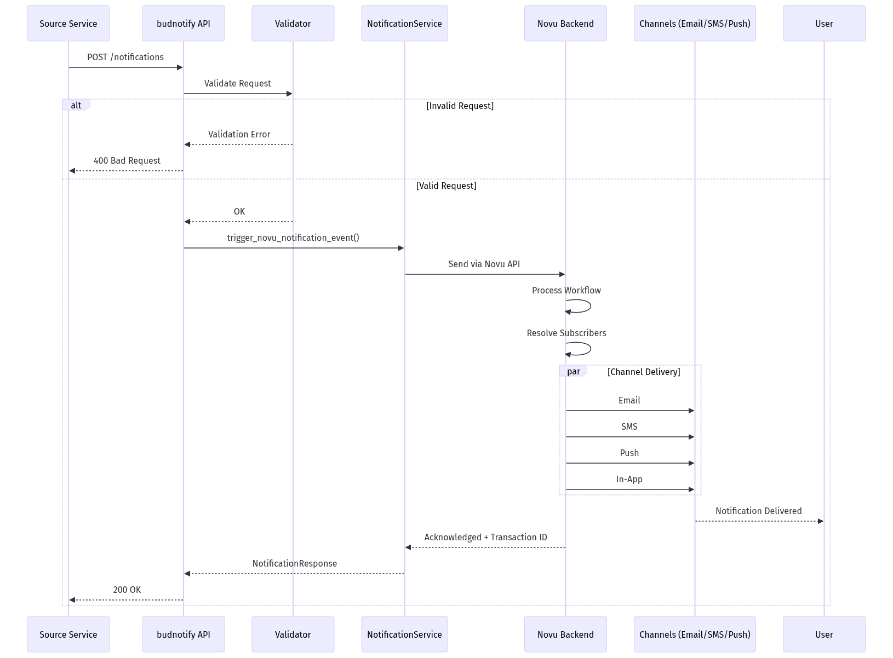

# budnotify - Low-Level Design
---

## 1. Document Overview

### 1.1 Purpose

This LLD provides build-ready technical specifications for budnotify, the notification service of Bud AI Foundry. It wraps Novu to deliver multi-channel notifications across email, SMS, push, and in-app channels.

### 1.2 Scope

**In Scope:**
- Multi-channel notification delivery via Novu
- Subscriber management
- Topic-based broadcast notifications
- Notification templates and workflows
- Integration with external providers (SMTP, Twilio, Firebase)

**Out of Scope:**
- Email/SMS provider implementation (delegated to Novu)
- User authentication (handled by budapp)
- Notification content generation (callers provide content)

### 1.3 Intended Audience

| Audience | What They Need |
|----------|----------------|
| Developers | Notification API, schema formats |
| Operations | Channel configuration, provider setup |
| Product | Notification capabilities, channels |

### 1.4 References

| Document | Description |
|----------|-------------|
| [High-Level Architecture](../architecture/high-level-architecture.md) | System overview |
| [Main LLD Index](../architecture/low-level-design.md) | Cross-cutting concerns |
| [Novu Documentation](https://docs.novu.co/) | Notification infrastructure |

---

## 2. System Context & Assumptions

### 2.1 Business Assumptions

- All platform services need to send notifications
- Users have notification preferences
- Multiple channels per notification type
- Notifications must be tracked and auditable

### 2.2 Technical Assumptions

- Novu handles channel delivery
- MongoDB stores notification state
- Dapr pub/sub for async notification triggers
- Idempotent notification delivery

### 2.3 External Dependencies

| Dependency | Type | Failure Impact | Fallback Strategy |
|------------|------|----------------|-------------------|
| Novu | Required | No notifications | Queue and retry |
| MongoDB | Required | No persistence | Return 503 |
| SMTP Provider | Optional | No email | Use alternative channel |
| Twilio | Optional | No SMS | Use alternative channel |
| Firebase | Optional | No push | Use alternative channel |

---

## 3. Detailed Architecture

### 3.1 Component Overview


### 3.2 Notification Types

| Type | Description | Target |
|------|-------------|--------|
| EVENT | Direct to subscriber(s) | subscriber_ids |
| TOPIC | Broadcast to topic subscribers | topic_keys |
| BROADCAST | All subscribers | All registered |

---

## 4. Data Design

### 4.1 Notification Request Schema

```python
class NotificationRequest(CloudEventBase):
    notification_type: NotificationType = NotificationType.EVENT
    name: str  # Workflow identifier
    subscriber_ids: Optional[Union[str, List[str]]] = None
    actor: Optional[str] = None
    topic_keys: Optional[Union[str, List[str]]] = None
    payload: NotificationPayload

class NotificationPayload(BaseModel):
    category: NotificationCategory
    type: Optional[str] = None
    event: Optional[str] = None
    workflow_id: Optional[str] = None
    source: str
    content: NotificationContent

class NotificationContent(BaseModel):
    title: Optional[str] = None
    message: Optional[str] = None
    status: Optional[str] = None
    result: Optional[Dict[str, Any]] = None
    primary_action: Optional[str] = None
    secondary_action: Optional[str] = None
    icon: Optional[str] = None
    tag: Optional[str] = None
```

### 4.2 Subscriber Schema

```python
class SubscriberRequest(BaseModel):
    subscriber_id: str
    email: str
    first_name: Optional[str] = None
    last_name: Optional[str] = None
    phone: Optional[str] = None
    avatar: Optional[str] = None
    channels: Optional[list] = []
    data: Optional[dict] = None
```

---

## 5. API & Interface Design

### 5.1 POST /notifications

**Purpose:** Trigger a notification

**Request:**
```json
{
  "notification_type": "EVENT",
  "name": "deployment-complete",
  "subscriber_ids": ["user-123"],
  "payload": {
    "category": "DEPLOYMENT",
    "source": "budcluster",
    "content": {
      "title": "Deployment Complete",
      "message": "Model llama-3.1-70b deployed successfully",
      "status": "success"
    }
  }
}
```

**Response:**
```json
{
  "object": "notification",
  "acknowledged": true,
  "status": "processed",
  "transaction_id": "txn-abc123",
  "code": 200
}
```

### 5.2 Subscriber Endpoints

| Method | Path | Description |
|--------|------|-------------|
| POST | /subscribers | Create subscriber |
| GET | /subscribers/{id} | Get subscriber |
| PUT | /subscribers/{id} | Update subscriber |
| DELETE | /subscribers/{id} | Delete subscriber |
| POST | /subscribers/bulk | Bulk create |

### 5.3 Topic Endpoints

| Method | Path | Description |
|--------|------|-------------|
| POST | /topics | Create topic |
| GET | /topics | List topics |
| POST | /topics/{key}/subscribers | Add subscriber to topic |
| DELETE | /topics/{key}/subscribers/{id} | Remove from topic |

---

## 6. Logic & Algorithm Details

### 6.1 Notification Flow



### 6.2 Validation Rules

```python
def validate_notification_rules(request: NotificationRequest):
    """Validate notification request based on type."""
    if request.notification_type == NotificationType.EVENT:
        if not request.subscriber_ids:
            raise ValueError("subscriber_ids required for EVENT")

    if request.notification_type == NotificationType.TOPIC:
        if not request.topic_keys:
            raise ValueError("topic_keys required for TOPIC")

    if request.notification_type == NotificationType.BROADCAST:
        if request.subscriber_ids or request.topic_keys:
            raise ValueError("No targets allowed for BROADCAST")
```

---

## 7. GenAI/ML-Specific Design

### 7.1 ML Platform Notifications

| Event | Category | Channels |
|-------|----------|----------|
| Deployment Complete | DEPLOYMENT | in_app, email |
| Deployment Failed | DEPLOYMENT | in_app, email, slack |
| Evaluation Complete | EVALUATION | in_app, email |
| Cluster Alert | INFRASTRUCTURE | in_app, email, slack |
| Billing Alert | BILLING | email |

---

## 8. Configuration & Environment

### 8.1 Environment Variables

| Variable | Required | Default | Description |
|----------|----------|---------|-------------|
| MONGODB_URL | Yes | - | MongoDB connection |
| NOVU_API_KEY | Yes | - | Novu API key |
| NOVU_BASE_URL | No | https://api.novu.co | Novu API endpoint |
| SMTP_HOST | No | - | Email server |
| SMTP_PORT | No | 587 | Email port |
| TWILIO_SID | No | - | Twilio account |
| TWILIO_AUTH_TOKEN | No | - | Twilio auth |
| FIREBASE_CREDENTIALS | No | - | Push notifications |

---

## 9. Security Design

### 9.1 API Security

- All endpoints require authentication
- Subscriber IDs validated against user permissions
- Sensitive content not logged

### 9.2 Provider Credentials

- Stored in secrets manager
- Rotated periodically
- Never exposed in responses

---

## 10. Performance & Scalability

### 10.1 Throughput

- Async notification processing
- Batch support for bulk notifications
- Novu handles delivery queuing

### 10.2 Scaling

- Horizontal: Multiple budnotify instances
- Novu: Managed scaling

---

## 11. Error Handling & Logging

### 11.1 Error Types

| Error | HTTP Code | Handling |
|-------|-----------|----------|
| Invalid Request | 400 | Return validation errors |
| Novu Error | 502 | Retry with backoff |
| Internal Error | 500 | Log and alert |

---

## 12. Deployment & Infrastructure

### 12.1 Resource Requirements

| Component | CPU | Memory |
|-----------|-----|--------|
| budnotify | 250m-500m | 256Mi-512Mi |

---

## 13. Testing Strategy

- Unit tests for validation logic
- Integration tests with Novu mock
- E2E tests for notification delivery

---

## 14. Limitations & Future Enhancements

### 14.1 Current Limitations

- Single Novu backend
- No notification scheduling
- Limited retry customization

### 14.2 Planned Improvements

1. Scheduled notifications
2. Notification preferences UI
3. Rich notification templates
4. Notification analytics

---

## 15. Appendix

### 15.1 Notification Categories

```python
class NotificationCategory(str, Enum):
    DEPLOYMENT = "DEPLOYMENT"
    EVALUATION = "EVALUATION"
    INFRASTRUCTURE = "INFRASTRUCTURE"
    BILLING = "BILLING"
    SYSTEM = "SYSTEM"
    USER = "USER"
```
