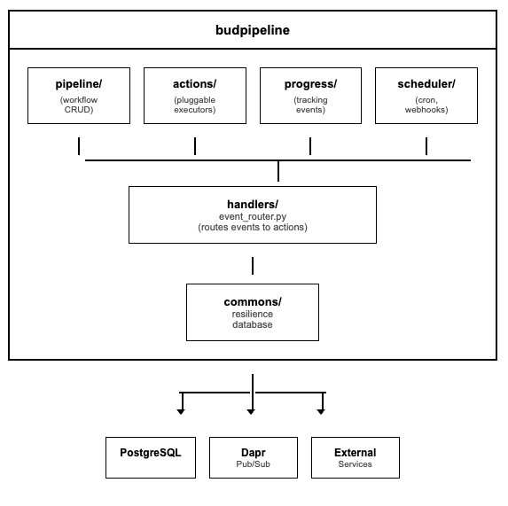
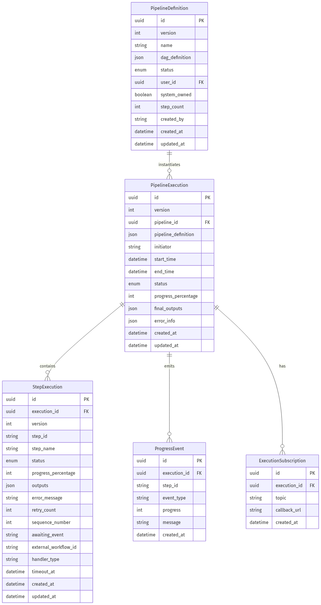
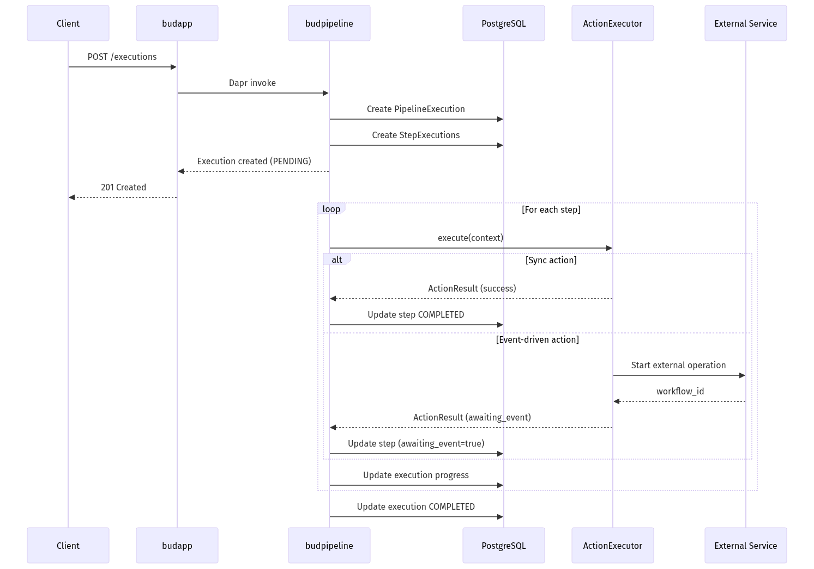
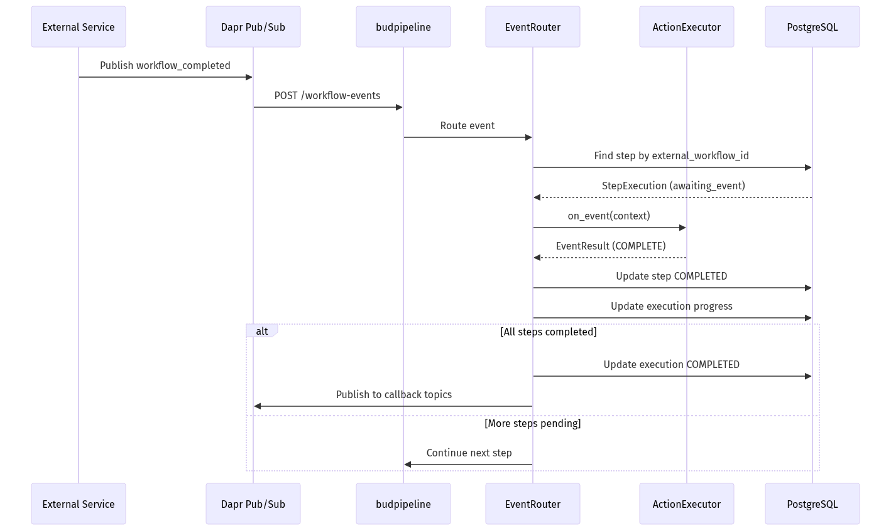

# budpipeline - Low-Level Design
---

## 1. Document Overview

### 1.1 Purpose

This LLD provides build-ready technical specifications for budpipeline, the pipeline orchestration service of Bud AI Foundry. Developers should be able to implement workflow definitions, executions, scheduling, and event-driven triggers directly from this document.

### 1.2 Scope

**In Scope:**
- Pipeline/workflow definition management with DAG structures
- Execution lifecycle with optimistic locking
- Pluggable action architecture with declarative metadata
- Event-driven step completion for long-running operations
- Progress tracking with weighted averaging
- Cron-based scheduling and webhook triggers
- Callback subscription management
- Data retention and cleanup workflows

**Out of Scope:**
- User authentication (handled by budapp)
- Model inference (handled by budgateway)
- Cluster management (handled by budcluster)
- Performance optimization (handled by budsim)

### 1.3 Intended Audience

| Audience | What They Need |
|----------|----------------|
| Developers | Action implementation, DAG structure, event handling |
| Integrators | API contracts, callback patterns, service communication |
| Operations | Retention policies, circuit breaker tuning, scaling |
| Product | Action catalog, progress tracking, scheduling options |

### 1.4 References

| Document | Description |
|----------|-------------|
| [High-Level Architecture](../architecture/high-level-architecture.md) | System overview |
| [Main LLD Index](../architecture/low-level-design.md) | Cross-cutting concerns |
| [Appendix A: DAG Structure](#appendix-a-dag-structure) | Pipeline DAG schema |
| [Appendix B: Event Flow](#appendix-b-event-flow-architecture) | Event-driven architecture |

---

## 2. System Context & Assumptions

### 2.1 Business Assumptions

- Users create multi-step workflows for model operations
- Pipelines may run for minutes to hours (model downloads, benchmarks)
- Multiple concurrent executions of the same pipeline are common
- Real-time progress visibility is critical for UX
- Webhooks enable external system integration

### 2.2 Technical Assumptions

- PostgreSQL with async support (asyncpg) is available
- Dapr sidecar provides pub/sub and service invocation
- Redis/Valkey provides state store for Dapr
- External services (budcluster, budmodel) are reachable via Dapr
- Keycloak JWT validation handled by budapp gateway

### 2.3 Constraints

| Constraint Type | Description | Impact |
|-----------------|-------------|--------|
| Concurrent Updates | Optimistic locking required | Version conflicts possible |
| Progress Monotonic | Progress can only increase | Cannot show step rollbacks |
| Retention | 30-day default retention | Old executions auto-deleted |
| Circuit Breaker | Opens after 5 failures | 30s recovery period |

### 2.4 External Dependencies

| Dependency | Type | Failure Impact | Fallback Strategy |
|------------|------|----------------|-------------------|
| PostgreSQL | Required | No persistence | Return 503 |
| Redis/Valkey | Required | No Dapr state | Service degraded |
| budcluster | Optional | Cluster actions fail | Return error to step |
| budmodel | Optional | Model actions fail | Return error to step |
| budapp | Consumer | No auth proxy | Queue events |
| budnotify | Optional | No notifications | Log warning |

---

## 3. Detailed Architecture

### 3.1 Component Overview




### 3.2 Component Breakdown

#### 3.2.1 Pipeline Module

**Purpose:** Manages pipeline definitions and executions

**Key Classes:**
- `PipelineDefinition` - Workflow DAG storage
- `PipelineExecution` - Execution state with optimistic locking
- `StepExecution` - Step-level state tracking
- `PipelineCRUD` - Database operations with version checking
- `PipelineService` - Business logic orchestration

#### 3.2.2 Actions Module

**Purpose:** Pluggable action architecture for extensibility

**Structure:**
```
actions/
├── base/
│   ├── meta.py           # ActionMeta, ParamDefinition
│   ├── context.py        # ActionContext, EventContext
│   ├── result.py         # ActionResult, EventResult
│   ├── executor.py       # BaseActionExecutor ABC
│   └── registry.py       # ActionRegistry singleton
├── builtin/              # Control flow actions
├── model/                # Model-related actions
├── cluster/              # Cluster actions
└── integration/          # HTTP, webhooks, notifications
```

#### 3.2.3 Progress Module

**Purpose:** Tracks and aggregates execution progress

**Key Features:**
- Weighted averaging across concurrent steps
- Monotonic enforcement (progress never decreases)
- ETA estimation based on step durations
- Event publishing to callback topics

#### 3.2.4 Scheduler Module

**Purpose:** Cron schedules and trigger management

**Trigger Types:**
- Cron schedules (interval-based)
- Webhooks (HTTP-triggered)
- Event triggers (Dapr pub/sub)

---

## 4. Data Design

### 4.1 Entity Relationship Diagram




### 4.2 Status Enumerations

**PipelineStatus (Definition):**
| Status | Description |
|--------|-------------|
| DRAFT | Under construction, not executable |
| ACTIVE | Ready for execution |
| ARCHIVED | Soft-deleted, not listed |

**ExecutionStatus:**
| Status | Description |
|--------|-------------|
| PENDING | Created, not yet started |
| RUNNING | Currently executing |
| COMPLETED | Successfully finished |
| FAILED | Terminated with error |
| INTERRUPTED | Manually stopped |

**StepStatus:**
| Status | Description |
|--------|-------------|
| PENDING | Not yet started |
| RUNNING | Currently executing |
| COMPLETED | Successfully finished |
| FAILED | Step failed |
| SKIPPED | Skipped due to condition |
| RETRYING | Retry in progress |
| TIMEOUT | Timed out waiting for event |

### 4.3 Optimistic Locking

All main entities use version columns for concurrent update handling:

```python
class PipelineExecution(Base):
    version = Column(Integer, default=1)  # Incremented on update

    __mapper_args__ = {"version_id_col": version}
```

**Update Pattern:**
```python
async def update_with_version(id: UUID, expected_version: int, **updates):
    result = await session.execute(
        update(PipelineExecution)
        .where(
            PipelineExecution.id == id,
            PipelineExecution.version == expected_version
        )
        .values(version=expected_version + 1, **updates)
    )
    if result.rowcount == 0:
        raise OptimisticLockError(f"Version mismatch for execution {id}")
```

---

## 5. API & Interface Design

### 5.1 Pipeline Management APIs

#### 5.1.1 POST /workflows

**Purpose:** Create new pipeline definition

**Request:**
```json
{
  "name": "Model Download Pipeline",
  "description": "Downloads and validates a model",
  "dag_definition": {
    "steps": [
      {
        "id": "step1",
        "name": "Download Model",
        "action_type": "model_add",
        "params": {
          "model_uri": "{{ inputs.model_uri }}"
        },
        "dependencies": []
      }
    ],
    "parameters": [
      {
        "name": "model_uri",
        "type": "string",
        "required": true
      }
    ],
    "outputs": ["step1.model_id"]
  }
}
```

**Response:**
```json
{
  "id": "uuid",
  "name": "Model Download Pipeline",
  "status": "draft",
  "step_count": 1,
  "created_at": "2024-01-15T10:00:00Z"
}
```

#### 5.1.2 POST /executions

**Purpose:** Start pipeline execution

**Request:**
```json
{
  "pipeline_id": "uuid",
  "inputs": {
    "model_uri": "meta-llama/Llama-3-8B"
  },
  "callback_topics": ["pipeline.completed", "pipeline.failed"]
}
```

**Response:**
```json
{
  "id": "uuid",
  "pipeline_id": "uuid",
  "status": "PENDING",
  "progress_percentage": 0.00,
  "created_at": "2024-01-15T10:00:00Z"
}
```

#### 5.1.3 GET /executions/{id}/progress

**Purpose:** Get detailed execution progress

**Query Parameters:**
- `granularity`: "summary" | "steps" | "detailed"
- `include_eta`: boolean

**Response:**
```json
{
  "execution_id": "uuid",
  "status": "RUNNING",
  "progress_percentage": 45.5,
  "eta_seconds": 120,
  "steps": [
    {
      "step_id": "step1",
      "status": "COMPLETED",
      "progress_percentage": 100.0,
      "duration_seconds": 30
    },
    {
      "step_id": "step2",
      "status": "RUNNING",
      "progress_percentage": 40.0,
      "awaiting_event": true,
      "external_workflow_id": "budapp-workflow-123"
    }
  ]
}
```

### 5.2 Actions API

#### 5.2.1 GET /actions

**Purpose:** List all available actions with metadata

**Response:**
```json
{
  "actions": [
    {
      "type": "model_add",
      "version": "1.0.0",
      "name": "Add Model",
      "description": "Downloads and registers a model",
      "category": "Model",
      "icon": "🤖",
      "params": [
        {
          "name": "model_uri",
          "type": "string",
          "required": true,
          "description": "HuggingFace model identifier"
        }
      ],
      "outputs": [
        {"name": "model_id", "type": "uuid"}
      ],
      "executionMode": "event_driven",
      "idempotent": false
    }
  ],
  "categories": [
    {"name": "Control Flow", "actions": ["log", "delay", "conditional"]},
    {"name": "Model", "actions": ["model_add", "model_delete"]}
  ],
  "total": 15
}
```

### 5.3 Scheduling APIs

#### 5.3.1 POST /schedules

**Purpose:** Create cron-based schedule

**Request:**
```json
{
  "pipeline_id": "uuid",
  "cron_expression": "0 3 * * *",
  "inputs": {
    "model_uri": "meta-llama/Llama-3-8B"
  },
  "enabled": true
}
```

#### 5.3.2 POST /webhooks

**Purpose:** Create webhook trigger

**Request:**
```json
{
  "pipeline_id": "uuid",
  "secret": "webhook-secret-123",
  "input_mapping": {
    "model_uri": "$.payload.model"
  }
}
```

**Response includes webhook URL:**
```json
{
  "id": "uuid",
  "webhook_url": "https://api.bud.ai/webhooks/abc123",
  "pipeline_id": "uuid"
}
```

---

## 6. Logic & Algorithm Details

### 6.1 Progress Aggregation Algorithm

**Weighted Average with Monotonic Enforcement:**

```python
def calculate_overall_progress(steps: list[StepExecution]) -> Decimal:
    """
    Calculate overall progress using weighted averaging.
    Progress is monotonically increasing (never decreases).
    """
    if not steps:
        return Decimal("0.00")

    total_weight = Decimal("0")
    weighted_sum = Decimal("0")

    for step in steps:
        # Each step has equal weight by default
        weight = Decimal("1")

        # Completed steps contribute full progress
        if step.status == StepStatus.COMPLETED:
            step_progress = Decimal("100.00")
        elif step.status == StepStatus.SKIPPED:
            step_progress = Decimal("100.00")  # Skipped counts as complete
        else:
            step_progress = step.progress_percentage

        weighted_sum += weight * step_progress
        total_weight += weight

    new_progress = weighted_sum / total_weight if total_weight > 0 else Decimal("0.00")

    # Monotonic enforcement: never decrease
    current_progress = get_current_progress()
    return max(new_progress, current_progress)
```

### 6.2 Event-Driven Step Completion

**Flow for Long-Running Actions:**

```
┌─────────────┐     ┌─────────────┐     ┌─────────────┐
│ Step Start  │────▶│ Action      │────▶│ External    │
│             │     │ Executor    │     │ Service     │
└─────────────┘     └──────┬──────┘     └──────┬──────┘
                          │                    │
              Return ActionResult:             │
              awaiting_event=True              │
              external_workflow_id=X           │
                          │                    │
                          ▼                    │
                    ┌─────────────┐            │
                    │ Step Status │            │
                    │ = RUNNING   │            │
                    │ awaiting_event=True│     │
                    └──────┬──────┘            │
                          │                    │
                          │  Dapr pub/sub      │
                          │◀───────────────────┘
                          │  workflow_completed
                          │  event
                          ▼
                    ┌─────────────┐
                    │ Event       │
                    │ Router      │
                    └──────┬──────┘
                          │
                          ▼
                    ┌─────────────┐
                    │ Action      │
                    │ on_event()  │
                    └──────┬──────┘
                          │
                          ▼
                    ┌─────────────┐
                    │ Step Status │
                    │ = COMPLETED │
                    └─────────────┘
```

### 6.3 Conditional Routing (Branching)

**Multi-Branch Conditional Action:**

```json
{
  "step_id": "router",
  "action_type": "conditional",
  "params": {
    "branches": [
      {
        "condition": "{{ steps.check.output.type == 'llm' }}",
        "next_step": "process_llm"
      },
      {
        "condition": "{{ steps.check.output.type == 'embedding' }}",
        "next_step": "process_embedding"
      },
      {
        "default": true,
        "next_step": "process_unknown"
      }
    ]
  }
}
```

### 6.4 Retry with Exponential Backoff

```python
async def execute_with_retry(action: BaseActionExecutor, context: ActionContext):
    """Execute action with exponential backoff retry."""
    max_attempts = context.retry_policy.max_attempts or 3
    base_delay = 2  # seconds

    for attempt in range(max_attempts):
        try:
            return await action.execute(context)
        except RetryableError as e:
            if attempt == max_attempts - 1:
                raise

            delay = base_delay ** attempt  # 2, 4, 8 seconds
            await asyncio.sleep(delay)

            # Update step status
            await update_step_status(
                context.step_id,
                StepStatus.RETRYING,
                retry_count=attempt + 1
            )
```

---

## 7. GenAI/ML-Specific Design

### 7.1 Model Actions

| Action | Purpose | Execution Mode |
|--------|---------|----------------|
| model_add | Download and register model | Event-driven (30min timeout) |
| model_delete | Remove model from registry | Sync |
| model_benchmark | Run performance benchmark | Event-driven (60min timeout) |

### 7.2 Model Add Action Implementation

```python
class ModelAddAction:
    meta = ActionMeta(
        type="model_add",
        version="1.0.0",
        name="Add Model",
        category="Model",
        execution_mode=ExecutionMode.EVENT_DRIVEN,
        timeout_seconds=1800,  # 30 minutes
        params=[
            ParamDefinition(name="model_uri", type=ParamType.STRING, required=True),
            ParamDefinition(name="quantization", type=ParamType.SELECT, options=["bf16", "INT8", "INT4"]),
        ],
        outputs=[
            OutputDefinition(name="model_id", type="uuid"),
            OutputDefinition(name="status", type="string"),
        ],
    )

class Executor(BaseActionExecutor):
    async def execute(self, context: ActionContext) -> ActionResult:
        # Start model download via budmodel
        workflow_id = await invoke_dapr_service(
            "budmodel",
            "/api/v1/models/add",
            http_method="POST",
            data={"uri": context.params["model_uri"]},
        )

        return ActionResult(
            success=True,
            awaiting_event=True,
            external_workflow_id=workflow_id,
            timeout_seconds=1800,
            outputs={"status": "downloading"},
        )

    async def on_event(self, context: EventContext) -> EventResult:
        if context.event_type == "workflow_completed":
            return EventResult(
                action=EventAction.COMPLETE,
                outputs={"model_id": context.event_data["model_id"]},
            )
        return EventResult(action=EventAction.IGNORE)
```

### 7.3 Benchmark Pipeline Example

```json
{
  "name": "Model Benchmark Pipeline",
  "dag_definition": {
    "steps": [
      {
        "id": "download",
        "action_type": "model_add",
        "params": {"model_uri": "{{ inputs.model_uri }}"}
      },
      {
        "id": "simulate",
        "action_type": "dapr_invoke",
        "params": {
          "service": "budsim",
          "method": "/simulator/run",
          "data": {"model_id": "{{ steps.download.model_id }}"}
        },
        "dependencies": ["download"]
      },
      {
        "id": "deploy",
        "action_type": "dapr_invoke",
        "params": {
          "service": "budcluster",
          "method": "/deployments",
          "data": "{{ steps.simulate.config }}"
        },
        "dependencies": ["simulate"]
      }
    ]
  }
}
```

---

## 8. Configuration & Environment

### 8.1 Environment Variables

| Variable | Required | Default | Description |
|----------|----------|---------|-------------|
| DATABASE_URL | Yes | - | PostgreSQL async connection string |
| DAPR_HTTP_ENDPOINT | Yes | - | Dapr sidecar HTTP endpoint |
| DAPR_API_TOKEN | Yes | - | Dapr authentication token |
| APP_API_TOKEN | Yes | - | Application-level auth token |
| PIPELINE_RETENTION_DAYS | No | 30 | Days to retain execution history |
| PIPELINE_CLEANUP_SCHEDULE | No | 0 3 * * * | Cron for retention cleanup |
| DB_RETRY_MAX_ATTEMPTS | No | 3 | Max database retry attempts |
| CIRCUIT_BREAKER_FAILURE_THRESHOLD | No | 5 | Failures before circuit opens |
| CIRCUIT_BREAKER_RECOVERY_TIMEOUT | No | 30 | Seconds before recovery attempt |

### 8.2 Database Connection Pool

```python
# Async SQLAlchemy configuration
engine = create_async_engine(
    DATABASE_URL,
    pool_size=10,
    max_overflow=20,
    pool_timeout=30,
    pool_recycle=1800,
    echo=False,
)
```

### 8.3 Action Registration (pyproject.toml)

```toml
[project.entry-points."budpipeline.actions"]
log = "budpipeline.actions.builtin.log:LogAction"
delay = "budpipeline.actions.builtin.delay:DelayAction"
conditional = "budpipeline.actions.builtin.conditional:ConditionalAction"
transform = "budpipeline.actions.builtin.transform:TransformAction"
model_add = "budpipeline.actions.model.add:ModelAddAction"
model_delete = "budpipeline.actions.model.delete:ModelDeleteAction"
http_request = "budpipeline.actions.integration.http_request:HttpRequestAction"
notification = "budpipeline.actions.integration.notification:NotificationAction"
```

---

## 9. Security Design

### 9.1 Authentication Layers

| Layer | Mechanism | Validates |
|-------|-----------|-----------|
| Service Mesh | dapr-api-token | Inter-service calls |
| Application | APP_API_TOKEN | Internal endpoints |
| External | Keycloak JWT | User requests (via budapp) |

### 9.2 Endpoint Security

```python
@app.middleware("http")
async def validate_internal_requests(request: Request, call_next):
    # Internal endpoints require application token
    if request.url.path.startswith("/internal/") or request.url.path == "/workflow-events":
        token = request.headers.get("dapr-api-token")
        if token != settings.APP_API_TOKEN:
            return JSONResponse(status_code=403, content={"detail": "Forbidden"})
    return await call_next(request)
```

### 9.3 Credential Sanitization

```python
# Mask sensitive data in outputs and errors
SENSITIVE_PATTERNS = [
    r"password[=:]\s*\S+",
    r"api[_-]?key[=:]\s*\S+",
    r"token[=:]\s*\S+",
    r"secret[=:]\s*\S+",
]

def sanitize_output(data: dict) -> dict:
    """Remove sensitive data from step outputs."""
    sanitized = deep_copy(data)
    for key, value in sanitized.items():
        if isinstance(value, str):
            for pattern in SENSITIVE_PATTERNS:
                value = re.sub(pattern, "[REDACTED]", value, flags=re.IGNORECASE)
            sanitized[key] = value
    return sanitized
```

### 9.4 User Isolation

```sql
-- Pipeline definitions can be user-owned or system-owned
SELECT * FROM pipeline_definition
WHERE (user_id = :current_user_id OR system_owned = true)
  AND status = 'active';
```

---

## 10. Performance & Scalability

### 10.1 Resilience Stack

| Component | Configuration | Purpose |
|-----------|---------------|---------|
| Circuit Breaker | 5 failures → open, 30s recovery | Prevent cascade failures |
| Retry | Exponential backoff, 3 attempts | Handle transient errors |
| In-Memory Fallback | Serves stale data | Degraded availability |

### 10.2 Circuit Breaker Implementation

```python
class CircuitBreaker:
    def __init__(self):
        self.failure_count = 0
        self.failure_threshold = 5
        self.recovery_timeout = 30
        self.state = CircuitState.CLOSED
        self.last_failure_time = None

    async def call(self, func, *args, **kwargs):
        if self.state == CircuitState.OPEN:
            if time.time() - self.last_failure_time > self.recovery_timeout:
                self.state = CircuitState.HALF_OPEN
            else:
                raise CircuitOpenError()

        try:
            result = await func(*args, **kwargs)
            if self.state == CircuitState.HALF_OPEN:
                self.state = CircuitState.CLOSED
                self.failure_count = 0
            return result
        except Exception as e:
            self.failure_count += 1
            self.last_failure_time = time.time()
            if self.failure_count >= self.failure_threshold:
                self.state = CircuitState.OPEN
            raise
```

### 10.3 Rate Limiting

```python
# Per-execution progress query rate limiting
PROGRESS_RATE_LIMIT = {
    "requests_per_minute": 60,
    "burst": 10,
}

@rate_limit(PROGRESS_RATE_LIMIT)
async def get_execution_progress(execution_id: UUID):
    ...
```

### 10.4 Scaling Considerations

- **Horizontal:** Multiple budpipeline replicas behind load balancer
- **Database:** Connection pooling with asyncpg
- **Events:** Non-blocking async publishing
- **Retention:** Automated cleanup prevents unbounded growth

---

## 11. Error Handling & Logging

### 11.1 Error Classification

| Error Type | HTTP Code | Retry | User Message |
|------------|-----------|-------|--------------|
| ValidationError | 400 | No | Show validation details |
| OptimisticLockError | 409 | Yes | Retry request |
| CircuitOpenError | 503 | Yes (after delay) | Service temporarily unavailable |
| StepTimeoutError | 408 | Depends on action | Step timed out |
| ExternalServiceError | 502 | Yes | External service failed |

### 11.2 Staleness Headers

```python
# When serving from fallback cache
response.headers["X-Data-Staleness"] = "true"
response.headers["X-Cache-Age"] = str(cache_age_seconds)
```

### 11.3 Structured Logging

```python
import structlog

logger = structlog.get_logger()

# All logs include correlation ID
logger.info(
    "step_completed",
    execution_id=str(execution.id),
    step_id=step.step_id,
    duration_ms=duration,
    correlation_id=context.correlation_id,
)
```

### 11.4 Error Info Schema

```json
{
  "error_info": {
    "error_type": "StepTimeoutError",
    "message": "Step 'download' timed out after 1800 seconds",
    "step_id": "download",
    "external_workflow_id": "budmodel-workflow-123",
    "timestamp": "2024-01-15T10:30:00Z"
  }
}
```

---

## 12. Deployment & Infrastructure

### 12.1 Deployment Topology

```
┌─────────────────────────────────────────────────────────────┐
│                    Kubernetes Cluster                        │
├─────────────────────────────────────────────────────────────┤
│                                                              │
│  ┌──────────────┐   ┌──────────────┐   ┌──────────────┐     │
│  │  budpipeline │   │  budpipeline │   │  budpipeline │     │
│  │  (replica 1) │   │  (replica 2) │   │  (replica 3) │     │
│  │ + Dapr sidecar│   │ + Dapr sidecar│   │ + Dapr sidecar│     │
│  └──────┬───────┘   └──────┬───────┘   └──────┬───────┘     │
│         │                  │                  │              │
│         └──────────────────┼──────────────────┘              │
│                            │                                 │
│                            ▼                                 │
│                    ┌──────────────┐                         │
│                    │  Service LB  │                         │
│                    └──────────────┘                         │
│                                                              │
└─────────────────────────────────────────────────────────────┘
                             │
              ┌──────────────┼──────────────┐
              ▼              ▼              ▼
       ┌────────────┐ ┌────────────┐ ┌────────────┐
       │ PostgreSQL │ │   Redis/   │ │   Dapr     │
       │            │ │   Valkey   │ │  Pub/Sub   │
       └────────────┘ └────────────┘ └────────────┘
```

### 12.2 Resource Requirements

| Component | CPU | Memory | Notes |
|-----------|-----|--------|-------|
| budpipeline | 500m-2 | 512Mi-2Gi | Scales with concurrent executions |
| Dapr sidecar | 100m | 128Mi | Per pod |

### 12.3 Health Checks

```yaml
livenessProbe:
  httpGet:
    path: /health
    port: 8080
  initialDelaySeconds: 10
  periodSeconds: 30

readinessProbe:
  httpGet:
    path: /health
    port: 8080
  initialDelaySeconds: 5
  periodSeconds: 10
```

---

## 13. Testing Strategy

### 13.1 Unit Tests

```python
# Test optimistic locking
async def test_concurrent_update_raises_error():
    execution = await create_execution()

    # Simulate concurrent update
    await update_execution(execution.id, version=1, status="RUNNING")

    # Second update with stale version should fail
    with pytest.raises(OptimisticLockError):
        await update_execution(execution.id, version=1, status="COMPLETED")
```

### 13.2 Integration Tests

```python
# Test event-driven completion
async def test_model_add_event_completion():
    # Start execution with model_add step
    execution = await start_execution(pipeline_id, inputs={"model_uri": "test"})

    # Verify step is awaiting event
    step = await get_step(execution.id, "model_add")
    assert step.awaiting_event is True

    # Simulate completion event
    await publish_event("workflow_completed", {
        "workflow_id": step.external_workflow_id,
        "model_id": "uuid",
    })

    # Verify step completed
    step = await get_step(execution.id, "model_add")
    assert step.status == StepStatus.COMPLETED
```

### 13.3 Test Categories

| Category | Files | Coverage |
|----------|-------|----------|
| CRUD | test_pipeline_crud.py | Optimistic locking, CRUD |
| Progress | test_progress_aggregation.py | Weighted averaging, monotonic |
| API | test_api_endpoints.py | Contract validation |
| Events | test_event_publishing.py | Multi-topic publishing |
| Actions | test_action_*.py | Action execution |

---

## 14. Limitations & Future Enhancements

### 14.1 Known Limitations

| Limitation | Impact | Workaround |
|------------|--------|------------|
| Single database | SPOF for persistence | Plan for HA PostgreSQL |
| Sync execution start | Potential bottleneck | Background queue future |
| No step parallelism | Sequential execution | DAG dependencies planned |
| 30-day retention | Limited history | Export before cleanup |

### 14.2 Tech Debt

| Item | Priority | Notes |
|------|----------|-------|
| Step parallelism | High | Execute independent steps concurrently |
| Execution queue | Medium | Background processing for starts |
| Action versioning | Medium | Multiple versions of same action |
| Progress streaming | Low | WebSocket real-time updates |

### 14.3 Planned Improvements

1. **Parallel Step Execution** - Run independent DAG branches concurrently
2. **Action Marketplace** - External action package discovery
3. **Visual DAG Editor** - Frontend pipeline builder
4. **Execution Templates** - Pre-built pipeline templates

---

## 15. Appendix

### 15.1 Glossary

| Term | Definition |
|------|------------|
| DAG | Directed Acyclic Graph - pipeline step structure |
| Action | Atomic unit of work in a pipeline |
| Executor | Class that implements action logic |
| Event-driven | Completion via external event notification |
| Optimistic Lock | Version-based concurrent update control |

### 15.2 Sequence Diagrams

#### 15.2.1 Pipeline Execution Flow



#### 15.2.2 Event-Driven Step Completion



### 15.3 ParamType Reference

| Type | Description |
|------|-------------|
| STRING | Single-line text input |
| NUMBER | Numeric with optional min/max |
| BOOLEAN | Checkbox |
| SELECT | Dropdown with options |
| MULTISELECT | Multi-select dropdown |
| JSON | JSON editor |
| TEMPLATE | Jinja2 template |
| BRANCHES | Multi-branch routing |
| MODEL_REF | Model reference (dynamic) |
| CLUSTER_REF | Cluster reference |
| PROJECT_REF | Project reference |
| ENDPOINT_REF | Endpoint reference |

---

## Appendix A: DAG Structure

This appendix defines the Directed Acyclic Graph (DAG) structure used by budpipeline to represent multi-step workflows for model operations.

### A.1 DAG Schema

**Pipeline Definition:**
```json
{
  "id": "uuid",
  "name": "string",
  "description": "string",
  "version": "string",
  "steps": [
    {
      "id": "string",
      "name": "string",
      "action": "string",
      "params": {},
      "dependencies": ["step_id"],
      "retry_policy": {},
      "timeout_seconds": 3600,
      "weight": 1.0
    }
  ],
  "metadata": {}
}
```

**Step Definition:**
```json
{
  "id": "step-001",
  "name": "Download Model",
  "action": "model.download",
  "params": {
    "model_id": "meta-llama/Llama-3.1-70B",
    "destination": "/models/llama-70b"
  },
  "dependencies": [],
  "retry_policy": {
    "max_retries": 3,
    "backoff_multiplier": 2,
    "initial_delay_seconds": 10
  },
  "timeout_seconds": 7200,
  "weight": 0.4
}
```

### A.2 Example: Model Deployment Pipeline DAG

```
                    ┌─────────────────┐
                    │  validate_model │
                    │    (step-001)   │
                    └────────┬────────┘
                             │
              ┌──────────────┼──────────────┐
              │              │              │
              ▼              ▼              ▼
       ┌──────────┐   ┌──────────┐   ┌──────────┐
       │ download │   │  check   │   │  reserve │
       │  weights │   │ licenses │   │   gpus   │
       │(step-002)│   │(step-003)│   │(step-004)│
       └────┬─────┘   └────┬─────┘   └────┬─────┘
            │              │              │
            └──────────────┼──────────────┘
                           │
                           ▼
                    ┌─────────────────┐
                    │   run_budsim    │
                    │    (step-005)   │
                    └────────┬────────┘
                             │
                             ▼
                    ┌─────────────────┐
                    │ deploy_endpoint │
                    │    (step-006)   │
                    └────────┬────────┘
                             │
                             ▼
                    ┌─────────────────┐
                    │  health_check   │
                    │    (step-007)   │
                    └─────────────────┘
```

**JSON Representation:**
```json
{
  "id": "pipeline-model-deploy",
  "name": "Model Deployment Pipeline",
  "steps": [
    {"id": "step-001", "name": "Validate Model", "action": "model.validate", "dependencies": [], "weight": 0.05},
    {"id": "step-002", "name": "Download Weights", "action": "model.download", "dependencies": ["step-001"], "weight": 0.40},
    {"id": "step-003", "name": "Check Licenses", "action": "model.check_license", "dependencies": ["step-001"], "weight": 0.05},
    {"id": "step-004", "name": "Reserve GPUs", "action": "cluster.reserve_gpus", "dependencies": ["step-001"], "weight": 0.05},
    {"id": "step-005", "name": "Run BudSim", "action": "optimization.simulate", "dependencies": ["step-002", "step-003", "step-004"], "weight": 0.15},
    {"id": "step-006", "name": "Deploy Endpoint", "action": "endpoint.deploy", "dependencies": ["step-005"], "weight": 0.25},
    {"id": "step-007", "name": "Health Check", "action": "endpoint.health_check", "dependencies": ["step-006"], "weight": 0.05}
  ]
}
```

### A.3 Dependency Rules

| Rule | Description |
|------|-------------|
| Acyclic | No circular dependencies allowed |
| Forward only | Dependencies must reference earlier steps |
| Existing | All referenced step IDs must exist |

**Dependency Validation:**
```python
def validate_dag(pipeline: Pipeline) -> ValidationResult:
    graph = {step.id: step.dependencies for step in pipeline.steps}
    visited = set()
    rec_stack = set()

    def has_cycle(node):
        visited.add(node)
        rec_stack.add(node)
        for neighbor in graph.get(node, []):
            if neighbor not in visited:
                if has_cycle(neighbor):
                    return True
            elif neighbor in rec_stack:
                return True
        rec_stack.remove(node)
        return False

    for step_id in graph:
        if step_id not in visited:
            if has_cycle(step_id):
                return ValidationResult.CYCLE_DETECTED
    return ValidationResult.VALID
```

### A.4 Built-in Actions

| Action | Description | Service |
|--------|-------------|---------|
| `model.validate` | Validate model configuration | budmodel |
| `model.download` | Download model weights | budmodel |
| `model.check_license` | Verify licensing | budmodel |
| `cluster.reserve_gpus` | Reserve GPU resources | budcluster |
| `cluster.provision` | Provision cluster | budcluster |
| `optimization.simulate` | Run BudSim optimization | budsim |
| `endpoint.deploy` | Deploy inference endpoint | budcluster |
| `endpoint.health_check` | Verify endpoint health | budcluster |
| `notification.send` | Send notification | budnotify |

### A.5 Progress Calculation

**Weighted Progress Formula:**
```
Total Progress = Σ (step_weight × step_progress) / Σ step_weights

Where:
- step_progress: 0.0 (pending), 0.5 (in_progress), 1.0 (completed)
- step_weight: Relative weight of the step
```

### A.6 Execution Order

Steps are executed in topological order:
1. All steps with no dependencies can run in parallel
2. A step runs only after all its dependencies complete
3. Failed dependencies block dependent steps

```
Level 0: [step-001]                     # No dependencies
Level 1: [step-002, step-003, step-004] # Depend on step-001
Level 2: [step-005]                     # Depends on 002, 003, 004
Level 3: [step-006]                     # Depends on step-005
Level 4: [step-007]                     # Depends on step-006
```

---

## Appendix B: Event Flow Architecture

This appendix describes the event-driven architecture used by budpipeline for step completion, progress tracking, and inter-service communication.

### B.1 Event Flow Overview

```
┌─────────────┐     ┌─────────────┐     ┌─────────────┐     ┌─────────────┐
│  budpipeline│     │    Dapr     │     │  External   │     │  budpipeline│
│  (Producer) │────►│   Pub/Sub   │────►│  Services   │────►│  (Consumer) │
└─────────────┘     └─────────────┘     └─────────────┘     └─────────────┘
      │                                       │                    │
      │  1. Start step                        │  2. Process        │
      │  2. Publish event                     │  3. Complete       │
      │                                       │  4. Publish result │
      │                                       │                    │
      └───────────────────────────────────────┴────────────────────┘
                           Event-driven loop
```

### B.2 Event Types

| Event Type | Direction | Purpose |
|------------|-----------|---------|
| `step.started` | Out | Step execution began |
| `step.progress` | Out | Step progress update |
| `step.completed` | In/Out | Step finished successfully |
| `step.failed` | In/Out | Step failed |
| `pipeline.started` | Out | Pipeline execution began |
| `pipeline.completed` | Out | Pipeline finished |
| `pipeline.failed` | Out | Pipeline failed |

### B.3 Event Schemas

**Step Started Event:**
```json
{
  "event_type": "step.started",
  "event_id": "evt-uuid",
  "timestamp": "2026-01-25T10:30:00Z",
  "data": {
    "execution_id": "exec-uuid",
    "pipeline_id": "pipeline-uuid",
    "step_id": "step-001",
    "step_name": "Download Model",
    "action": "model.download",
    "params": {"model_id": "meta-llama/Llama-3.1-70B"}
  }
}
```

**Step Progress Event:**
```json
{
  "event_type": "step.progress",
  "event_id": "evt-uuid",
  "timestamp": "2026-01-25T10:35:00Z",
  "data": {
    "execution_id": "exec-uuid",
    "step_id": "step-001",
    "progress": 0.45,
    "message": "Downloading weights: 45% complete",
    "details": {"bytes_downloaded": 45000000000, "bytes_total": 100000000000}
  }
}
```

**Step Completed Event:**
```json
{
  "event_type": "step.completed",
  "event_id": "evt-uuid",
  "timestamp": "2026-01-25T10:45:00Z",
  "data": {
    "execution_id": "exec-uuid",
    "step_id": "step-001",
    "status": "SUCCESS",
    "result": {"model_path": "/models/llama-70b", "checksum": "sha256:abc123..."},
    "duration_seconds": 900
  }
}
```

**Step Failed Event:**
```json
{
  "event_type": "step.failed",
  "event_id": "evt-uuid",
  "timestamp": "2026-01-25T10:45:00Z",
  "data": {
    "execution_id": "exec-uuid",
    "step_id": "step-001",
    "status": "FAILED",
    "error": {"code": "DOWNLOAD_FAILED", "message": "Connection timeout", "retry_count": 3, "retriable": false},
    "duration_seconds": 300
  }
}
```

### B.4 Pub/Sub Topics

| Topic | Publisher | Subscribers | Purpose |
|-------|-----------|-------------|---------|
| `pipeline-events` | budpipeline | UI, notifications | Pipeline status |
| `step-commands` | budpipeline | budmodel, budcluster, budsim | Step execution |
| `step-results` | All services | budpipeline | Step completion |

**Dapr Configuration:**
```yaml
apiVersion: dapr.io/v1alpha1
kind: Component
metadata:
  name: pipeline-pubsub
spec:
  type: pubsub.redis
  version: v1
  metadata:
    - name: redisHost
      value: redis:6379
    - name: consumerID
      value: budpipeline
---
apiVersion: dapr.io/v1alpha1
kind: Subscription
metadata:
  name: step-results-sub
spec:
  pubsubname: pipeline-pubsub
  topic: step-results
  route: /api/v1/events/step-results
```

### B.5 Asynchronous Step Flow

```
budpipeline                     External Service
     │                                │
     │  1. Publish step.started       │
     │────────────────────────────────►
     │                                │
     │  2. Return 202 Accepted        │
     │◄────────────────────────────────
     │                                │
     │        [Processing...]         │
     │                                │
     │  3. (Optional) Progress events │
     │◄────────────────────────────────
     │                                │
     │  4. Publish step.completed     │
     │◄────────────────────────────────
     │                                │
     │  5. Update state, trigger next │
     │                                │
```

### B.6 Callback Webhooks

**Webhook Registration:**
```json
{
  "pipeline_id": "pipeline-uuid",
  "callbacks": [
    {
      "event_types": ["pipeline.completed", "pipeline.failed"],
      "url": "https://api.example.com/webhooks/pipeline",
      "headers": {"Authorization": "Bearer token123"},
      "retry_policy": {"max_retries": 3, "backoff_seconds": 60}
    }
  ]
}
```

**Webhook Payload:**
```json
{
  "event_type": "pipeline.completed",
  "timestamp": "2026-01-25T11:00:00Z",
  "pipeline_id": "pipeline-uuid",
  "execution_id": "exec-uuid",
  "status": "SUCCESS",
  "duration_seconds": 1800,
  "results": {
    "endpoint_id": "endpoint-uuid",
    "endpoint_url": "https://api.bud.ai/v1/models/my-model"
  }
}
```

### B.7 Event Delivery Guarantees

| Guarantee | Implementation |
|-----------|----------------|
| At-least-once | Dapr pub/sub with acknowledgment |
| Idempotency | Event ID deduplication |
| Ordering | Per-execution ordering via locks |

### B.8 Dead Letter Queue

```yaml
apiVersion: dapr.io/v1alpha1
kind: Component
metadata:
  name: pipeline-pubsub
spec:
  type: pubsub.redis
  metadata:
    - name: deadLetterTopic
      value: pipeline-dlq
    - name: maxDeliveryCount
      value: "5"
```

### B.9 Event Metrics

| Metric | Type | Description |
|--------|------|-------------|
| `pipeline_events_published_total` | Counter | Events published |
| `pipeline_events_received_total` | Counter | Events received |
| `pipeline_event_processing_seconds` | Histogram | Processing latency |
| `pipeline_dlq_messages_total` | Counter | DLQ messages |
