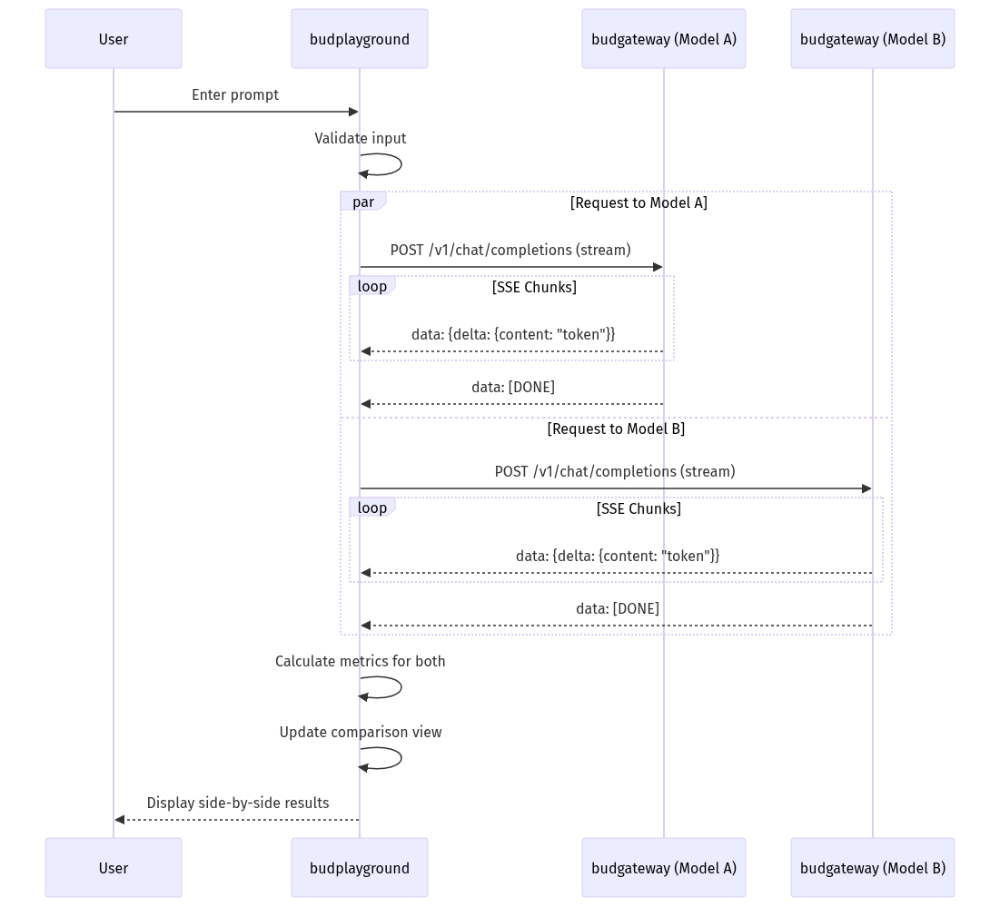

# budplayground - Low-Level Design
---

## 1. Document Overview

### 1.1 Purpose

This LLD provides build-ready technical specifications for budplayground, the interactive model testing interface of Bud AI Foundry. It enables developers and ML engineers to experiment with deployed models.

### 1.2 Scope

**In Scope:**
- Interactive chat interface
- Model comparison (side-by-side)
- Parameter tuning (temperature, top_p, etc.)
- Response streaming
- Prompt templates

**Out of Scope:**
- Model deployment (handled by budadmin)
- Model inference (handled by budgateway)

### 1.3 Intended Audience

| Audience | What They Need |
|----------|----------------|
| ML Engineers | Testing and comparison features |
| Frontend Developers | Component architecture |
| Product | Capability overview |

---

## 2. System Context & Assumptions

### 2.1 Business Assumptions

- Users need to test models before production use
- Side-by-side comparison helps model selection
- Parameter tuning requires real-time feedback
- Conversation history should be exportable

### 2.2 Technical Assumptions

- Next.js for the frontend
- Direct connection to budgateway for inference
- WebSocket/SSE for streaming responses
- Local storage for conversation history

### 2.3 External Dependencies

| Dependency | Type | Failure Impact | Fallback Strategy |
|------------|------|----------------|-------------------|
| budgateway | Required | No inference | Show error |
| budapp | Required | No auth/model list | Cached data |

---

## 3. Detailed Architecture

### 3.1 Application Structure

```
src/
├── pages/
│   ├── index.tsx          # Main playground page
│   ├── compare.tsx        # Side-by-side comparison
│   └── prompts.tsx        # Prompt library
│
├── components/
│   ├── ChatInterface/     # Main chat UI
│   ├── MessageList/       # Message display
│   ├── ParameterPanel/    # Tuning controls
│   ├── ModelSelector/     # Model dropdown
│   └── StreamingText/     # Token streaming display
│
├── hooks/
│   ├── useChat.ts         # Chat state and actions
│   ├── useStreaming.ts    # SSE handling
│   └── useModels.ts       # Model list fetching
│
└── utils/
    ├── api.ts             # API client
    └── formatters.ts      # Text formatting
```

---

## 4. Data Design

### 4.1 Chat State

```typescript
interface ChatState {
  messages: Message[];
  model: string;
  parameters: InferenceParameters;
  isStreaming: boolean;
  metrics: ResponseMetrics;
}

interface Message {
  id: string;
  role: 'user' | 'assistant' | 'system';
  content: string;
  timestamp: number;
  tokens?: number;
  latency?: number;
}

interface InferenceParameters {
  temperature: number;      // 0.0 - 2.0
  top_p: number;            // 0.0 - 1.0
  max_tokens: number;       // 1 - 4096
  frequency_penalty: number; // 0.0 - 2.0
  presence_penalty: number;  // 0.0 - 2.0
}

interface ResponseMetrics {
  latency_ms: number;
  tokens_generated: number;
  tokens_per_second: number;
}
```

---

## 5. API & Interface Design

### 5.1 Chat Completion Request

```typescript
// POST to budgateway /v1/chat/completions
const request = {
  model: "llama-3.1-70b",
  messages: [
    { role: "system", content: "You are a helpful assistant." },
    { role: "user", content: "Explain quantum computing." }
  ],
  temperature: 0.7,
  top_p: 0.9,
  max_tokens: 1024,
  stream: true
};
```

### 5.2 Streaming Response Handler

```typescript
async function handleStream(response: Response) {
  const reader = response.body?.getReader();
  const decoder = new TextDecoder();

  while (true) {
    const { done, value } = await reader.read();
    if (done) break;

    const chunk = decoder.decode(value);
    const lines = chunk.split('\n');

    for (const line of lines) {
      if (line.startsWith('data: ')) {
        const data = JSON.parse(line.slice(6));
        if (data.choices[0].delta.content) {
          appendToken(data.choices[0].delta.content);
        }
      }
    }
  }
}
```

---

## 6. Logic & Algorithm Details

### 6.1 Comparison Mode Flow



### 6.2 Token Streaming

```
User Input → Send to Gateway → Receive SSE → Update UI → Display Token
                    ↑                              ↓
                    └──────────── Metrics ─────────┘
```

---

## 7. GenAI/ML-Specific Design

### 7.1 Parameter Controls

| Parameter | Range | Default | Effect |
|-----------|-------|---------|--------|
| temperature | 0.0-2.0 | 0.7 | Randomness |
| top_p | 0.0-1.0 | 0.9 | Nucleus sampling |
| max_tokens | 1-4096 | 1024 | Response length |
| frequency_penalty | 0.0-2.0 | 0.0 | Repetition |
| presence_penalty | 0.0-2.0 | 0.0 | Topic diversity |

### 7.2 Metrics Display

- First token latency (TTFT)
- Total response time
- Tokens per second
- Total tokens generated

---

## 8. Configuration & Environment

### 8.1 Environment Variables

| Variable | Required | Default | Description |
|----------|----------|---------|-------------|
| NEXT_PUBLIC_GATEWAY_URL | Yes | - | budgateway URL |
| NEXT_PUBLIC_API_URL | Yes | - | budapp API URL |

---

## 9. Security Design

- Authentication via Keycloak (shared with budadmin)
- API keys not exposed to browser
- Conversation data stored locally only

---

## 10. Performance & Scalability

### 10.1 Streaming Optimization

- Efficient DOM updates for token streaming
- Virtual scrolling for long conversations
- Debounced parameter changes

---

## 11. Error Handling & Logging

| Error | User Impact | Handling |
|-------|-------------|----------|
| Stream timeout | No response | Retry button |
| Model unavailable | Cannot use model | Show alternatives |
| Rate limit | Slow responses | Queue messages |

---

## 12. Deployment & Infrastructure

### 12.1 Build

```bash
npm run build
npm run start
```

### 12.2 Resources

| Component | CPU | Memory |
|-----------|-----|--------|
| budplayground | 250m | 256Mi |

---

## 13. Testing Strategy

- Unit tests for hooks
- Component tests for UI
- E2E tests for chat flow

---

## 14. Limitations & Future Enhancements

### 14.1 Current Limitations

- Two models max in comparison
- No conversation branching
- Limited export formats

### 14.2 Planned Improvements

1. Multi-model comparison (3+)
2. Conversation branching
3. Export to JSON/Markdown
4. Prompt versioning

---

## 15. Appendix

### 15.1 Sequence Diagrams

#### Single Model Chat

```
User → Input → budplayground → budgateway → Model
                    ↑                    ↓
                    └──── SSE Stream ────┘
```
