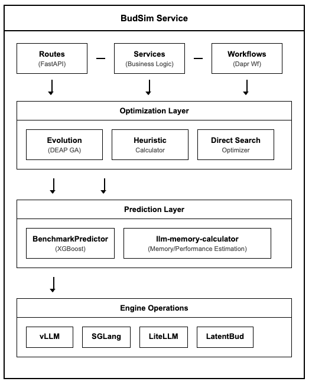
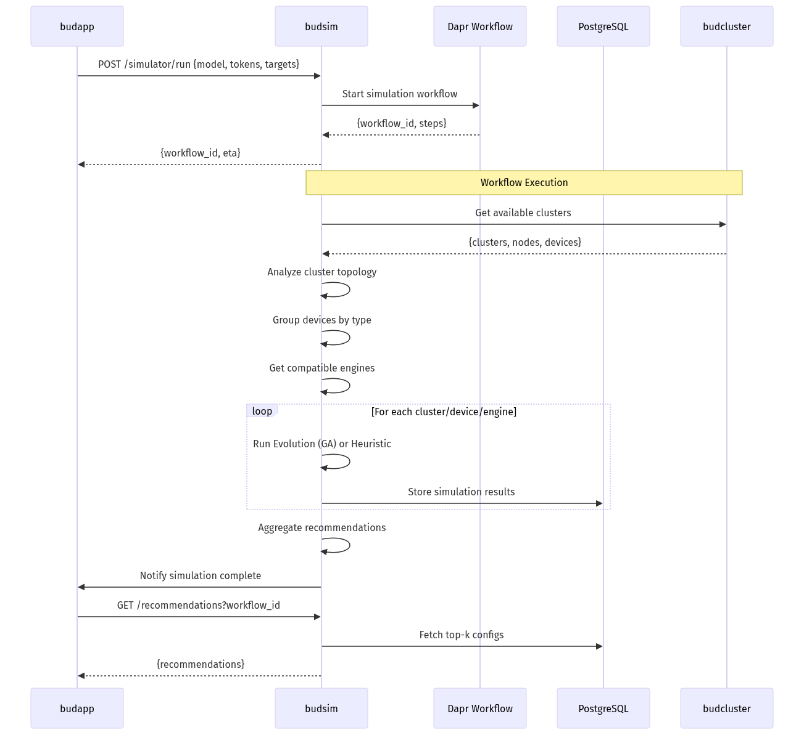
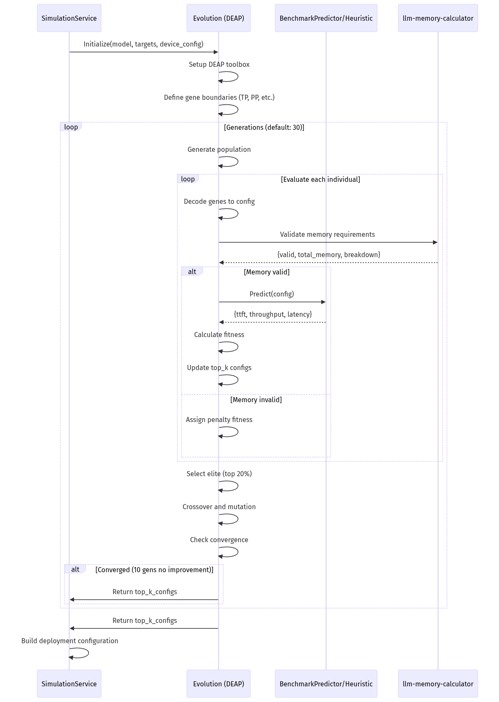

# BudSim Service - Low-Level Design (LLD)

## 1. Document Overview

### 1.1 Purpose
This document provides the Low-Level Design (LLD) for the BudSim service, a performance simulation and optimization microservice within the Bud AI Foundry platform. BudSim predicts LLM deployment performance and optimizes configurations using machine learning models and genetic algorithms.

### 1.2 Scope
- Performance prediction using XGBoost regressors
- Configuration optimization using DEAP genetic algorithms
- Heuristic-based calculations using llm-memory-calculator
- Multi-hardware support (CPU, CUDA, HPU)
- Tensor Parallel (TP) and Pipeline Parallel (PP) optimization

### 1.3 Audience
- Platform engineers implementing performance optimization features
- DevOps engineers configuring simulation workflows
- ML engineers training and deploying prediction models

### 1.4 Related Documents
- [High-Level Architecture](../architecture/high-level-architecture.md)
- [budcluster LLD](./budcluster.md)
- [budapp LLD](./budapp.md)

---

## 2. System Context

### 2.1 Service Role
BudSim serves as the performance simulation engine that:
- Predicts LLM inference metrics (TTFT, throughput, latency)
- Optimizes deployment configurations across heterogeneous hardware
- Recommends optimal cluster and device allocations
- Validates memory requirements for deployment feasibility

### 2.2 Service Dependencies

| Dependency | Type | Purpose |
|------------|------|---------|
| budcluster | Service | Provides cluster topology and device information |
| budapp | Service | Triggers simulation requests, receives recommendations |
| PostgreSQL | Database | Stores simulation results and workflow state |
| Redis/Valkey | State Store | Dapr state management and pub/sub |
| Dapr Sidecar | Runtime | Service mesh, workflows, pub/sub |

### 2.3 Integration Points
- **Inbound**: Receives simulation requests from budapp via Dapr pub/sub
- **Outbound**: Stores results in PostgreSQL, publishes notifications
- **External**: Fetches model configs from HuggingFace (AutoConfig)

---

## 3. Detailed Architecture

### 3.1 Component Diagram



### 3.2 Module Structure

```
budsim/
├── __init__.py
├── main.py                    # FastAPI app initialization
├── commons/
│   ├── config.py              # Application settings
│   └── device_utils.py        # Device type normalization
├── simulator/
│   ├── routes.py              # API endpoints
│   ├── services.py            # Business logic (SimulationService)
│   ├── workflows.py           # Dapr workflow definitions
│   ├── schemas.py             # Pydantic request/response models
│   ├── models.py              # SQLAlchemy models (SimulationResultsSchema)
│   ├── evolution.py           # Genetic algorithm optimization
│   ├── heuristic.py           # Heuristic-based calculations
│   ├── regressor.py           # XGBoost benchmark predictor
│   ├── direct_search.py       # Direct search optimizer
│   └── hardware.py            # Hardware cost calculations
├── engine_ops/
│   ├── __init__.py            # Engine factory and compatibility
│   ├── base.py                # Base engine interfaces
│   ├── vllm.py                # vLLM engine support
│   ├── sglang.py              # SGLang engine support
│   ├── litellm.py             # LiteLLM engine support
│   ├── latentbud.py           # LatentBud engine support
│   └── utils.py               # Engine utilities
├── model_ops/
│   ├── services.py            # Model operations
│   ├── schemas.py             # Model schemas
│   └── analysis.py            # Model analysis utilities
└── cache/
    └── pretrained_models/     # Pre-trained XGBoost models
        ├── vllm/
        │   ├── cuda/
        │   ├── cpu/
        │   └── hpu/
        └── sglang/
            └── cuda/
```

### 3.3 Key Flows

#### 3.3.1 Simulation Request Flow



#### 3.3.2 Genetic Algorithm Optimization Flow



---

## 4. Data Design

### 4.1 Database Schema

#### 4.1.1 simulation_results Table

| Column | Type | Constraints | Description |
|--------|------|-------------|-------------|
| id | INTEGER | PK, AUTO | Primary key |
| workflow_id | UUID | NOT NULL, INDEX | Workflow identifier |
| model_name | VARCHAR(255) | NOT NULL | Model name/path |
| model_version | VARCHAR(50) | NOT NULL | Model version |
| input_tokens | INTEGER | NOT NULL | Input token count |
| output_tokens | INTEGER | NOT NULL | Output token count |
| target_concurrency | INTEGER | NOT NULL | Target concurrent requests |
| target_ttft | FLOAT | NOT NULL | Target time to first token |
| target_throughput_per_user | FLOAT | NOT NULL | Target throughput |
| target_e2e_latency | FLOAT | NOT NULL | Target end-to-end latency |
| cluster_id | VARCHAR(255) | NOT NULL | Cluster identifier |
| node_id | VARCHAR(255) | NOT NULL | Node identifier |
| node_name | VARCHAR(255) | NOT NULL | Node hostname |
| device_id | VARCHAR(255) | NOT NULL | Device identifier |
| device_name | VARCHAR(255) | NOT NULL | Device name (e.g., A100) |
| device_type | VARCHAR(10) | NOT NULL | Device type (cuda/cpu/hpu) |
| device_model | VARCHAR(255) | NULLABLE | Specific device model |
| raw_name | VARCHAR(255) | NULLABLE | Raw device name |
| available_count | INTEGER | NOT NULL | Available device count |
| cores | INTEGER | NULLABLE | CPU cores (for cpu/cpu_high) |
| mem_per_gpu_in_gb | FLOAT | NOT NULL | Memory per device |
| hbm_bandwidth_in_gb_per_sec | FLOAT | NOT NULL | HBM bandwidth |
| intra_node_bandwidth_in_gb_per_sec | FLOAT | NOT NULL | Intra-node bandwidth |
| intra_node_min_message_latency | FLOAT | NOT NULL | Min message latency |
| peak_fp16_tflops | FLOAT | NOT NULL | Peak FP16 performance |
| peak_i8_tflops | FLOAT | NOT NULL | Peak INT8 performance |
| peak_i4_tflops | FLOAT | NOT NULL | Peak INT4 performance |
| inter_node_bandwidth_in_gb_per_sec | FLOAT | NOT NULL | Inter-node bandwidth |
| engine | VARCHAR(255) | NOT NULL | Engine name |
| engine_image | VARCHAR(255) | NOT NULL | Container image |
| engine_version | VARCHAR(50) | NULLABLE | Engine version |
| tool_calling_parser_type | VARCHAR(100) | NULLABLE | Tool calling parser |
| reasoning_parser_type | VARCHAR(100) | NULLABLE | Reasoning parser |
| architecture_family | VARCHAR(100) | NULLABLE | Model architecture |
| chat_template | VARCHAR(500) | NULLABLE | Chat template |
| supports_lora | BOOLEAN | NULLABLE | LoRA support flag |
| supports_pipeline_parallelism | BOOLEAN | NULLABLE | PP support flag |
| top_k_configs | JSONB | NULLABLE | Top-K configurations |
| is_blacklisted | BOOLEAN | DEFAULT FALSE | Blacklist flag |
| created_at | TIMESTAMP WITH TZ | DEFAULT NOW() | Creation timestamp |
| modified_at | TIMESTAMP WITH TZ | ON UPDATE | Modification timestamp |

#### 4.1.2 Indexes

```sql
CREATE INDEX idx_simulation_results_workflow_id ON simulation_results(workflow_id);
CREATE INDEX idx_simulation_results_cluster_id ON simulation_results(cluster_id);
CREATE INDEX idx_simulation_results_workflow_cluster ON simulation_results(workflow_id, cluster_id);
CREATE INDEX idx_simulation_results_topk_cost ON simulation_results
    USING GIN (top_k_configs jsonb_path_ops);
```

### 4.2 Key Data Structures

#### 4.2.1 EvaluationResult

```python
@dataclass
class EvaluationResult:
    config: Dict[str, Any]       # Engine configuration
    total_memory: float          # Total memory required (GB)
    ttft: float                  # Time to first token (ms)
    e2e_latency: float           # End-to-end latency (s)
    throughput_per_user: float   # Throughput per user (tok/s)
    concurrency: int             # Concurrent requests
    fitness: Tuple[float, float, float]  # Optimization fitness
    error_rate: float            # Estimated error rate
    cost_per_million_tokens: float  # Cost estimation
    weight_memory: float         # Model weight memory (GB)
    kv_cache_memory: float       # KV cache memory (GB)
```

#### 4.2.2 NodeGroupConfiguration

```python
class NodeGroupConfiguration(BaseModel):
    config_id: str
    name: str                    # Device group name
    labels: Dict[str, str]       # Kubernetes labels
    type: str                    # Hardware type (cpu/cuda/hpu)
    engine_type: str             # Engine (vllm/sglang/etc)
    tp_size: int                 # Tensor parallelism
    pp_size: int                 # Pipeline parallelism
    envs: Dict[str, Any]         # Environment variables
    args: Dict[str, Any]         # Engine arguments
    replicas: int                # Number of replicas
    image: str                   # Container image
    memory: float                # Memory requirement
    hardware_mode: str           # dedicated/shared
    # Performance metrics
    ttft: float
    throughput_per_user: float
    e2e_latency: float
    error_rate: float
    cost_per_million_tokens: float
```

---

## 5. API Design

### 5.1 REST Endpoints

#### 5.1.1 POST /simulator/run
Triggers a simulation workflow for cluster recommendations.

**Request Body (ClusterRecommendationRequest)**:
```json
{
  "pretrained_model_uri": "meta-llama/Llama-3.1-8B-Instruct",
  "model_uri": "meta-llama/Llama-3.1-8B-Instruct",
  "is_proprietary_model": false,
  "input_tokens": 1024,
  "output_tokens": 512,
  "concurrency": 10,
  "target_ttft": 100.0,
  "target_throughput_per_user": 50.0,
  "target_e2e_latency": 5.0,
  "cluster_id": "uuid-optional",
  "simulation_method": "regressor",
  "hardware_mode": "dedicated"
}
```

**Response (ClusterRecommendationResponse)**:
```json
{
  "object": "cluster_recommendations",
  "workflow_id": "uuid",
  "recommendations": [
    {
      "cluster_id": "cluster-uuid",
      "metrics": {
        "device_types": [{"device_type": "cuda", "num_replicas": 2}],
        "replica": 2,
        "concurrency": 10,
        "ttft": 85.5,
        "throughput_per_user": 55.2,
        "e2e_latency": 4.2,
        "error_rate": 0.01,
        "cost_per_million_tokens": 0.25
      }
    }
  ],
  "created": 1706000000
}
```

#### 5.1.2 GET /simulator/recommendations
Retrieves cached recommendations for a workflow.

**Query Parameters**:
- `workflow_id` (UUID): Required workflow identifier
- `cluster_id` (string): Optional cluster filter
- `concurrency` (int): Optional concurrency filter
- `error_rate_threshold` (float): Max error rate (default: 0.5)
- `page` (int): Page number (default: 1)
- `limit` (int): Results per page (default: 1)

#### 5.1.3 POST /simulator/configurations
Retrieves deployment configurations for a workflow.

**Request Body**:
```json
{
  "workflow_id": "uuid",
  "cluster_id": "cluster-uuid",
  "error_rate_threshold": 0.5,
  "concurrency": 10,
  "feedback": [
    {"config_id": "1", "failed": false},
    {"config_id": "2", "failed": true, "reason": "OOM"}
  ]
}
```

#### 5.1.4 POST /simulator/node-configurations
Gets valid TP/PP configuration options for selected nodes.

**Request Body**:
```json
{
  "model_id": "uuid",
  "cluster_id": "uuid",
  "hostnames": ["node-1", "node-2"],
  "hardware_mode": "dedicated",
  "input_tokens": 1024,
  "output_tokens": 512,
  "concurrency": 10
}
```

#### 5.1.5 POST /simulator/benchmark-config
Generates deployment configuration for benchmark with user-selected parameters.

---

## 6. Logic and Algorithms

### 6.1 Simulation Methods

BudSim supports two simulation methods:

| Method | Description | Use Case |
|--------|-------------|----------|
| **REGRESSOR** | ML-based (XGBoost) genetic algorithm optimizing all engine parameters | Production deployments requiring accuracy |
| **HEURISTIC** | Memory-based calculations using llm-memory-calculator | Quick estimates, memory validation |

### 6.2 Genetic Algorithm (Evolution Class)

The Evolution class implements a genetic algorithm using DEAP:

**Optimization Parameters**:
- `tensor_parallel_size`: 1 to max_devices_per_node
- `pipeline_parallel_size`: 1 to total_nodes
- `max_num_seqs`: 1 to 256
- `scheduler_delay_factor`: 0.1 to 1.0
- `enable_chunked_prefill`: boolean
- `enable_prefix_caching`: boolean
- `block_size`: 8, 16, 32

**Fitness Function**:
```python
fitness = (
    -error_rate,           # Minimize error rate
    -cost_per_million,     # Minimize cost
    throughput_per_user    # Maximize throughput
)
```

**Algorithm Parameters**:
- Population size: Configurable (default: 50)
- Generations: Configurable (default: 30)
- Elite ratio: 0.2 (top 20% preserved)
- Crossover probability: 0.7
- Mutation probability: 0.2
- Convergence check: 10 generations without improvement

### 6.3 TP/PP Validation

```python
def validate_tp_pp_combination(tp_size: int, pp_size: int) -> bool:
    # Constraint 1: TP cannot exceed node capacity
    if tp_size > node_device_count:
        return False

    # Constraint 2: PP cannot exceed nodes with device type
    if pp_size > nodes_with_device:
        return False

    # Constraint 3: Total devices available
    if tp_size * pp_size > total_devices_available:
        return False

    # Constraint 4: Node distribution feasibility
    return _check_node_distribution_feasibility(tp_size, pp_size)
```

### 6.4 Memory Validation

```python
def validate_memory_requirements(model_params, max_loras=None):
    # Calculate memory with llm-memory-calculator
    memory_report = calculate_memory(
        model_id_or_config=model_uri,
        batch_size=concurrency,
        seq_length=int((input_tokens + output_tokens) * 1.1),
        precision=precision,
        tensor_parallel=tp_size
    )

    # Apply safety buffers
    buffer_gb = 1 if total_memory <= 10 else 2
    usable_memory = available_memory - buffer_gb
    threshold = usable_memory * 0.95

    return total_memory < threshold
```

---

## 7. GenAI/ML-Specific Design

### 7.1 XGBoost Regressor Models

Pre-trained models predict three metrics:
- `regressor_mean_ttft_ms.pkl`: Time to first token
- `regressor_output_token_throughput_per_user_tok_s.pkl`: Throughput
- `regressor_mean_end_to_end_latency_s.pkl`: E2E latency

**Input Features**:
- Model parameters (num_params, num_layers, hidden_size)
- Hardware specs (memory, bandwidth, TFLOPS)
- Configuration (TP, PP, batch_size, seq_length)
- Engine settings (chunked_prefill, prefix_caching)

**Model Organization**:
```
cache/pretrained_models/
├── vllm/
│   ├── cuda/
│   │   ├── regressor_mean_ttft_ms.pkl
│   │   ├── regressor_output_token_throughput_per_user_tok_s.pkl
│   │   └── regressor_mean_end_to_end_latency_s.pkl
│   ├── cpu/
│   └── hpu/
└── sglang/
    └── cuda/
```

### 7.2 llm-memory-calculator Integration

Used for heuristic-based calculations:
- Memory requirement estimation
- Performance prediction based on roofline model
- Hardware configuration matching (29+ CPU, 11+ GPU configs)

### 7.3 Engine Compatibility

Automatic engine selection based on model architecture:

```python
_engine_compatibility_checks = {
    "vllm": vllm.EngineCompatibility,
    "sglang": sglang.EngineCompatibility,
    "litellm": litellm.EngineCompatibility,
    "latentbud": latentbud.EngineCompatibility,
}
```

---

## 8. Configuration Management

### 8.1 Environment Variables

| Variable | Description | Default |
|----------|-------------|---------|
| `DATABASE_URL` | PostgreSQL connection string | Required |
| `REDIS_URL` | Redis/Valkey connection | Required |
| `BENCHMARK_PREDICTOR_MODELS_DIR` | Path to pre-trained models | `./cache/pretrained_models` |
| `MODEL_REGISTRY_DIR` | Local model registry path | `/models` |
| `DEFAULT_SIMULATION_METHOD` | Default method (regressor/heuristic) | `regressor` |
| `SKIP_MASTER_NODE_FOR_CPU` | Skip master for CPU deployments | `true` |
| `NFD_DETECTION_TIMEOUT` | Node feature detection timeout | `300` |
| `VLLM_IMAGE` | Default vLLM image | Configurable |
| `SGLANG_IMAGE` | Default SGLang image | Configurable |
| `LITELLM_IMAGE` | Default LiteLLM image | Configurable |

### 8.2 Application Settings

```python
class AppSettings(BaseSettings):
    benchmark_predictor_models_dir: str
    model_registry_dir: str
    default_simulation_method: str = "regressor"
    skip_master_node_for_cpu: bool = True
    vllm_image: str
    sglang_image: str
    litellm_image: str
```

---

## 9. Security Design

### 9.1 Authentication
- All endpoints require valid Dapr API token
- Service-to-service communication via Dapr mTLS

### 9.2 Authorization
- Simulation requests validated against user's project access
- Cluster access validated via budcluster

### 9.3 Data Protection
- No sensitive data stored (model URIs are public)
- Configuration data encrypted in transit
- Database credentials via environment variables

---

## 10. Performance Design

### 10.1 Optimization Strategies

| Strategy | Implementation |
|----------|----------------|
| Parallel evaluation | ThreadPoolExecutor for XGBoost predictions |
| Caching | LRU cache for llm-memory-calculator results |
| Batch processing | Dapr workflow parallel activities |
| Early termination | Convergence detection in GA |
| Database optimization | Window functions, JSONB indexes |

### 10.2 Performance Targets

| Metric | Target |
|--------|--------|
| Single simulation (regressor) | < 60s |
| Single simulation (heuristic) | < 10s |
| GA convergence | < 30 generations |
| Memory validation | < 1s |

### 10.3 ETA Calculation

Dynamic ETA based on simulation complexity:
```python
def get_eta(current_step, cluster_count, simulation_method, total_devices):
    if simulation_method == HEURISTIC:
        base_time = 5  # Fast path
    else:
        base_time = 30 + (total_devices * 2)  # Scale with devices
    return base_time * cluster_count
```

---

## 11. Error Handling

### 11.1 Error Categories

| Category | HTTP Code | Recovery |
|----------|-----------|----------|
| Invalid model | 400 | User fixes model URI |
| No compatible engine | 400 | User selects different model |
| Cluster unavailable | 503 | Retry with backoff |
| Simulation timeout | 408 | Retry or use heuristic |
| Memory validation fail | 400 | Suggest smaller config |

### 11.2 Dapr Retry Policy

```python
retry_policy = wf.RetryPolicy(
    first_retry_interval=timedelta(seconds=1),
    max_number_of_attempts=3,
    backoff_coefficient=2,
    max_retry_interval=timedelta(seconds=10),
    retry_timeout=timedelta(seconds=100),
)
```

### 11.3 Feedback Handling

Blacklist mechanism for failed configurations:
```python
def update_feedback(feedback: List[Feedback]):
    failed_configs = [f.config_id for f in feedback if f.failed]
    session.query(SimulationResults).filter(
        SimulationResults.id.in_(failed_configs)
    ).update({"is_blacklisted": True})
```

---

## 12. Deployment Design

### 12.1 Container Specifications

```yaml
resources:
  requests:
    cpu: "500m"
    memory: "2Gi"
  limits:
    cpu: "2"
    memory: "8Gi"
```

### 12.2 Health Checks

```yaml
livenessProbe:
  httpGet:
    path: /health
    port: 8080
  initialDelaySeconds: 30
  periodSeconds: 10

readinessProbe:
  httpGet:
    path: /ready
    port: 8080
  initialDelaySeconds: 5
  periodSeconds: 5
```

### 12.3 Dapr Sidecar Configuration

```yaml
dapr.io/enabled: "true"
dapr.io/app-id: "budsim"
dapr.io/app-port: "8080"
dapr.io/enable-api-logging: "true"
```

---

## 13. Testing Strategy

### 13.1 Unit Tests
- Evolution class optimization logic
- Heuristic calculator accuracy
- TP/PP validation rules
- Engine compatibility checks

### 13.2 Integration Tests
- Dapr workflow execution
- Database CRUD operations
- Pub/sub message flow

### 13.3 Test Commands

```bash
# Run all tests
pytest --dapr-http-port 3510 --dapr-api-token <TOKEN>

# Run specific test modules
pytest tests/test_evolution_local.py -v
pytest tests/test_hardware_mode_filtering.py -v
pytest tests/test_node_group_schemas.py -v
```

---

## 14. Known Limitations

### 14.1 Current Limitations

| Limitation | Impact | Planned Resolution |
|------------|--------|-------------------|
| Pre-trained models required | New hardware needs training data | Model retraining pipeline |
| Single-cluster optimization | Cannot optimize across clusters | Multi-cluster support |
| Static cost model | Costs hardcoded | Dynamic pricing integration |
| Limited quantization support | Only int8/int4 | Broader quant methods |

### 14.2 Technical Debt

| Item | Priority | Estimated Effort |
|------|----------|------------------|
| Migrate to async XGBoost | Medium | 2 sprints |
| Add model versioning | Low | 1 sprint |
| Implement A/B testing for predictions | Medium | 2 sprints |

---

## 15. Appendix

### 15.1 Glossary

| Term | Definition |
|------|------------|
| TTFT | Time to First Token - latency before first token generated |
| TP | Tensor Parallelism - splitting model across GPUs within a node |
| PP | Pipeline Parallelism - splitting model layers across nodes |
| KV Cache | Key-Value cache for attention computation |
| DEAP | Distributed Evolutionary Algorithms in Python |

### 15.2 References

- [DEAP Documentation](https://deap.readthedocs.io/)
- [XGBoost Documentation](https://xgboost.readthedocs.io/)
- [Dapr Workflows](https://docs.dapr.io/developing-applications/building-blocks/workflow/)

### 15.3 Revision History

| Version | Date | Author | Changes |
|---------|------|--------|---------|
| 1.0 | 2025-01-23 | Platform Team | Initial LLD |
