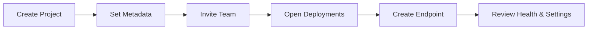

This guide walks through a practical setup flow for your first Bud AI Foundry project.

## Before You Start

Make sure you have permission to create and manage projects in your workspace.

## 1. Create the Project Record

1. Open **Projects**.
2. Click **\+ Project**.
3. Fill in:
   - **Name**: `Fraud Detection Assistant`
   - **Description**: `Project for fraud triage model APIs`
   - **Tags**: `risk`, `production`, `llm`
4. Click Next to create project.
5. Proceed to the Invite members step.

## 2. Add Team Members

1. Open the new project.
2. Click **Share/Invite**.
3. Add users and assign view/manage scopes.
4. Confirm invited members appear in project access controls.

## 3. Deploy a Model in the Project

1. Go to the **Deployments** tab.
2. Create a deployment and select:
   - Model source (for example Hugging Face or cloud provider)
   - Target cluster
   - Deployment name
3. Save and wait for deployment status to become healthy/ready.

## 4. Configure Deployment Settings

Open deployment **Settings** and configure:

- **Rate limits** to protect capacity
- **Retry/fallback** rules for resiliency
- **Autoscaling** minimum/maximum replicas and trigger metrics

## 5. Add Route Logic

1. Open the **Routes** tab.
2. Create a route and select strategy (for example simple shuffle or least busy).
3. Attach one or more eligible deployments.
4. Save and validate route status.

## 6. Validate Analytics and Observability

1. Open **Analytics** to inspect baseline latency/throughput.
2. Open **Observability** to verify runtime event visibility.
3. Confirm traffic and error patterns are visible before broad rollout.

## 7. Apply Guardrails

1. Open **Guardrails**.
2. Attach required safety or compliance policies.
3. Verify policies are active and aligned with project requirements.

## Completion Checklist

- Project created with metadata
- Team members invited with scoped permissions
- At least one deployment running
- Route configured to active deployment
- Analytics and observability validated
- Guardrails applied

## Creation-to-Readiness Flow

