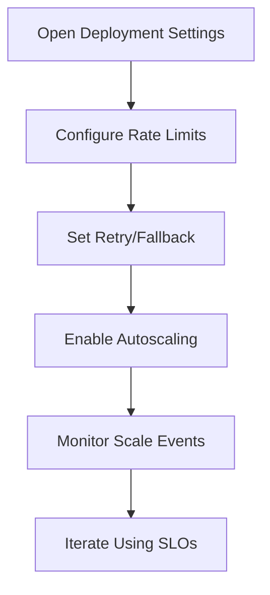

## Overview

Project deployments support operational controls for reliability and cost efficiency.

## Reliability and Scaling Flow

## Configure Rate Limiting

In deployment **Settings**:

1. Enable **Rate Limit**.
2. Choose an algorithm (fixed, sliding, or token bucket based on availability).
3. Set request thresholds and burst behavior.
4. Save and verify limits in runtime behavior.

## Configure Retry and Fallback

1. Set retry limits for transient failures.
2. Add fallback deployment targets when available.
3. Save and test with controlled failure scenarios.

## Enable Autoscaling

1. Toggle **Autoscaling** on.
2. Set minimum and maximum replicas.
3. Select trigger metrics (for example queue depth or latency-aligned signals).
4. Configure stabilization windows/policies to avoid rapid oscillation.
5. Save and monitor scale events in analytics/observability.

## Best Practices

<Check>Start with conservative max replica values, then scale after observing load.</Check>
<Check>Pair autoscaling thresholds with realistic SLO targets.</Check>
<Check>Use fallback only when secondary deployments are validated.</Check>
<Check>Review settings after model or traffic profile changes.</Check>
