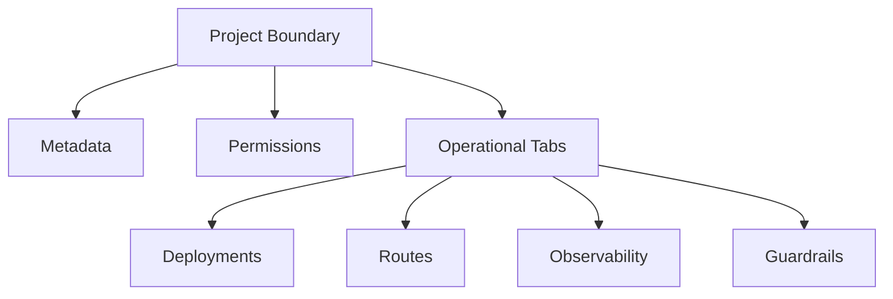

## Project as an Operational Boundary

A project is the primary boundary for organizing AI assets and operations in Bud AI Foundry. Most day-to-day activities—deployment lifecycle, routing, analytics, and safety controls—are scoped to a project.

## Project Scope Diagram

## Core Concepts

### 1. Project Metadata

Each project has a name, icon, description, and tags. Metadata helps teams discover and classify workloads across environments.

### 2. Permission Scope

Project permissions determine who can:

- View project assets
- Manage project settings and members
- Create/edit/delete deployments and routes (depending on role scope)

### 3. Tab-Based Functional Areas

Project detail pages are organized into focused tabs for operational clarity:

- **Deployments**: endpoint lifecycle and runtime settings
- **Agents**: prompt- and agent-centric assets
- **Routes**: traffic distribution strategy
- **Analytics**: performance and capacity trends
- **Clusters**: infrastructure placement context
- **Observability**: runtime traces, logs, and request signals
- **Guardrails**: policy and safety controls

### 4. Safe Lifecycle Management

Project deletion is intentionally guarded. If active deployments are present, deletion can be blocked until dependencies are removed or paused.

### 5. SLO-Aware Scaling

Deployment settings can be tuned with SLO-aligned autoscaling signals (for example latency or queue-related metrics), allowing teams to balance performance and cost.

## How Projects Relate to Other Modules

| Module | Relationship to Projects |
|--------|---------------------------|
| **Models** | Models are selected and deployed into project-scoped endpoints |
| **Deployments** | Deployments are managed and governed within projects |
| **Routes** | Routing policies are configured from project context |
| **Observability** | Monitoring is filtered by project for faster diagnostics |
| **User Management** | Access is granted to project resources via RBAC |

## Best Practices

<Check>Use one project per product, tenant, or major workload boundary.</Check>
<Check>Keep project tags consistent for reporting and governance.</Check>
<Check>Grant manage permissions to a minimal set of operators.</Check>
<Check>Review analytics and observability before scaling or route changes.</Check>
<Check>Enable guardrails early in lifecycle, not only after incidents.</Check>
