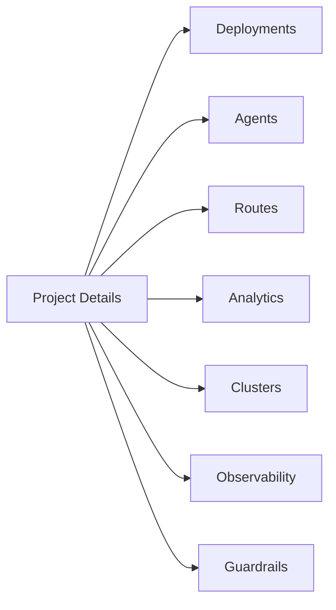

## Overview

The project detail page is organized into tabbed operational areas.

## Tab Navigation Map

## Tabs

### Deployments

Manage endpoint lifecycle, view health/status, and open deployment-level configuration (including rate limits, retries, and autoscaling).

### Agents

View, create, update, and remove project-linked agents/prompts depending on permission scope.

### Routes

Create and maintain routing entries that distribute traffic to deployment targets.

### Analytics

Review performance metrics such as latency and throughput for project-scoped workloads.

### Clusters

Inspect associated clusters and placement context relevant to project deployments.

### Observability

Analyze runtime behavior, logs/signals, and operational events tied to project activity.

### Guardrails

Attach and monitor guardrail policies to enforce safety/compliance controls.

## Notes on Permissions

Some actions (create/edit/delete/publish/settings) appear only for users with manage-level access.

## Notes on Deletion Behavior

Project deletion can be restricted when active deployments exist to prevent accidental service disruption.
