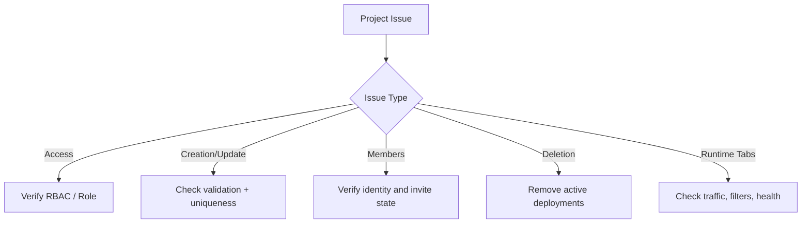

## Troubleshooting Decision Flow

## Project Access Issues

### Can't see Projects in navigation

**Cause**: Missing project view permissions.

**Resolution**:
- Verify your assigned role in User Management.
- Ask an admin to grant project view/manage access.

### Project opens but actions are disabled

**Cause**: You have view-only access.

**Resolution**:
- Request manage-level permissions for the project.
- Re-open the page after permission updates.

## Project Creation and Updates

### Project creation fails

**Common causes**:
- Required fields missing
- Invalid name format
- Duplicate/conflicting project metadata

**Resolution**:
- Re-check name, description, and tag format.
- Retry with a unique name.

### Can't update project metadata

**Cause**: Insufficient permissions or validation errors.

**Resolution**:
- Confirm manage permission.
- Simplify fields and retry incrementally.

## Member Management

### Invite not delivered or member not visible

**Cause**: Invalid user identity/email or delayed propagation.

**Resolution**:
- Verify the user account exists in the workspace.
- Re-send invite.
- Refresh project page and member list.

## Deletion and Lifecycle

### Unable to delete project

**Cause**: Active deployments still exist (safeguard behavior).

**Resolution**:
1. Go to **Deployments**.
2. Pause/delete active endpoints.
3. Retry project deletion.

## Operational Tabs

### Analytics/Observability appear empty

**Cause**: Low/zero traffic, filtering windows, or delayed ingestion.

**Resolution**:
- Expand time range and check filters.
- Generate controlled test requests.
- Validate deployment health and route configuration.

### Route creation fails

**Cause**: No eligible deployment targets or invalid routing inputs.

**Resolution**:
- Ensure at least one healthy deployment exists.
- Re-check strategy and target mapping fields.

## Still Need Help?

If issues persist, collect:
- Project ID
- User email/role
- Failing action and timestamp
- Relevant deployment/route IDs

Share these details with your platform administrator or support channel.
