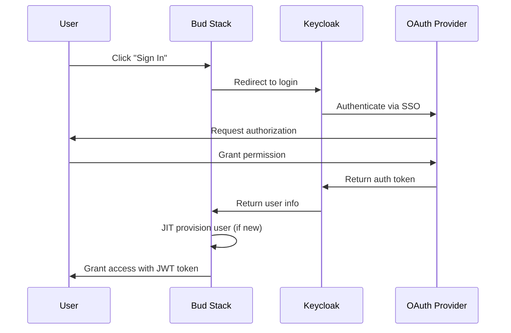

# SSO Integration

Configure Single Sign-On (SSO) for your organization to streamline authentication and improve security. Bud Stack supports multiple authentication providers through Keycloak integration.

## Overview

SSO provides several benefits:
- **Centralized Authentication**: One set of credentials for all applications
- **Enhanced Security**: Leverage your existing identity provider's security features
- **Simplified User Management**: Auto-provision users from your directory
- **Improved User Experience**: Seamless login across services
- **Compliance**: Meet enterprise security requirements

<Note>
SSO configuration requires Admin privileges with SUPER_ADMIN or ADMIN role. Contact support for assistance with setup.
</Note>

## Supported Authentication Providers

Bud Stack supports the following authentication methods through Keycloak:

<CardGroup cols={2}>
  <Card title="Google OAuth" icon="google">
    Sign in with Google Workspace accounts
  </Card>
  <Card title="Microsoft OAuth" icon="microsoft">
    Sign in with Microsoft 365 / Azure AD accounts
  </Card>
  <Card title="LinkedIn OAuth" icon="linkedin">
    Sign in with LinkedIn accounts
  </Card>
  <Card title="GitHub OAuth" icon="github">
    Sign in with GitHub accounts
  </Card>
</CardGroup>

### Coming Soon

- **SAML 2.0**: Generic SAML integration for enterprise IdPs
- **Okta**: Direct Okta integration
- **Azure AD**: Native Azure Active Directory
- **Custom OIDC**: OpenID Connect providers

## How SSO Works in Bud Stack

### Authentication Flow



### Just-In-Time (JIT) Provisioning

When a user logs in via SSO for the first time:

1. **User Authentication**: User authenticates with OAuth provider
2. **Token Verification**: Keycloak verifies the authentication
3. **User Lookup**: System checks if user exists in database
4. **Auto-Provisioning**: If new, system automatically creates user account
5. **Role Assignment**: User type and role derived from Keycloak realm roles
6. **Permission Setup**: Appropriate permissions assigned automatically
7. **Resource Creation**: Default project and billing plan created (for Client users)

<Info>
JIT provisioning means you don't need to manually create accounts for SSO users - they're automatically created on first login.
</Info>

## Setting Up SSO

### Prerequisites

Before configuring SSO:
- Admin access to your OAuth provider (Google, Microsoft, etc.)
- Ability to create OAuth applications
- Redirect URLs approved by your IT security team
- Understanding of your organization's identity provider setup

### Configuration Steps

<Tabs>
  <Tab title="Google OAuth">
    ## Google OAuth Setup

    <Steps>
      <Step title="Create OAuth App in Google Cloud">
        1. Go to [Google Cloud Console](https://console.cloud.google.com/)
        2. Navigate to **APIs & Services** > **Credentials**
        3. Click **Create Credentials** > **OAuth 2.0 Client ID**
        4. Select **Web application**
        5. Add authorized redirect URI: `https://auth.bud.studio/realms/{your-realm}/broker/google/endpoint`
      </Step>

      <Step title="Get OAuth Credentials">
        Copy the Client ID and Client Secret provided by Google.
      </Step>

      <Step title="Configure in Bud Stack">
        Contact Bud Stack support with:
        - Your OAuth Client ID
        - Your OAuth Client Secret
        - Your organization domain
        - Desired user mapping (Admin vs Client)
      </Step>

      <Step title="Test Authentication">
        1. Log out of Bud Stack
        2. Click "Sign in with Google"
        3. Authenticate with your Google account
        4. Verify you're logged into Bud Stack
      </Step>
    </Steps>

    **Domain Restriction:**
    Restrict authentication to your organization's domain by configuring the `hd` parameter in Google OAuth to only allow `@yourcompany.com` emails.
  </Tab>

  <Tab title="Microsoft OAuth">
    ## Microsoft OAuth Setup

    <Steps>
      <Step title="Register App in Azure Portal">
        1. Go to [Azure Portal](https://portal.azure.com/)
        2. Navigate to **Azure Active Directory** > **App registrations**
        3. Click **New registration**
        4. Name: "Bud Stack Authentication"
        5. Add redirect URI: `https://auth.bud.studio/realms/{your-realm}/broker/microsoft/endpoint`
      </Step>

      <Step title="Configure API Permissions">
        Add the following Microsoft Graph permissions:
        - `User.Read` - Read user profile
        - `email` - Read user email
        - `profile` - Read user profile info
      </Step>

      <Step title="Create Client Secret">
        1. Go to **Certificates & secrets**
        2. Click **New client secret**
        3. Copy the secret value (shown only once)
      </Step>

      <Step title="Provide to Bud Stack">
        Send to support:
        - Application (client) ID
        - Client secret value
        - Directory (tenant) ID
        - Organization info
      </Step>
    </Steps>

    **Tenant Configuration:**
    Use single-tenant configuration for maximum security, restricting to your Azure AD tenant only.
  </Tab>

  <Tab title="GitHub OAuth">
    ## GitHub OAuth Setup

    <Steps>
      <Step title="Create OAuth App in GitHub">
        1. Go to [GitHub Developer Settings](https://github.com/settings/developers)
        2. Click **New OAuth App**
        3. Fill in application details
        4. Authorization callback URL: `https://auth.bud.studio/realms/{your-realm}/broker/github/endpoint`
      </Step>

      <Step title="Generate Client Secret">
        After creating the app, generate a new client secret.
      </Step>

      <Step title="Configure Organization Access">
        If using GitHub Organizations:
        1. Enable organization access
        2. Restrict to specific organizations
        3. Request organization email access
      </Step>

      <Step title="Submit to Bud Stack">
        Provide support with:
        - Client ID
        - Client secret
        - Organization restrictions (if any)
      </Step>
    </Steps>

    **Organization Filtering:**
    Configure GitHub OAuth to only allow users from specific GitHub organizations.
  </Tab>

  <Tab title="LinkedIn OAuth">
    ## LinkedIn OAuth Setup

    <Steps>
      <Step title="Create LinkedIn App">
        1. Go to [LinkedIn Developers](https://www.linkedin.com/developers)
        2. Create new app
        3. Request access to Sign In with LinkedIn product
        4. Add redirect URL: `https://auth.bud.studio/realms/{your-realm}/broker/linkedin/endpoint`
      </Step>

      <Step title="Configure OAuth Scopes">
        Request the following scopes:
        - `r_liteprofile` - Read profile
        - `r_emailaddress` - Read email
      </Step>

      <Step title="Get Credentials">
        Copy Client ID and Client Secret from app settings.
      </Step>

      <Step title="Configure with Bud Stack">
        Send credentials and configuration to support team.
      </Step>
    </Steps>
  </Tab>
</Tabs>

## User Type Mapping

Configure how SSO users are mapped to Bud Stack user types:

### Option 1: Domain-Based Mapping

Map users based on email domain:

```yaml
# Example configuration
domain_mapping:
  admin_domains:
    - "@yourcompany.com"
    - "@corp.yourcompany.com"
  client_domains:
    - "@partner.com"
    - "@contractor.com"
```

### Option 2: Role-Based Mapping

Use Keycloak realm roles to determine user type:

```yaml
# Example configuration
role_mapping:
  keycloak_role: "bud-admin"
  bud_user_type: "ADMIN"
  bud_role: "DEVELOPER"

  keycloak_role: "bud-client"
  bud_user_type: "CLIENT"
```

### Option 3: Group-Based Mapping

Map based on OAuth provider groups (Azure AD, Google Workspace):

```yaml
# Example configuration
group_mapping:
  "Engineering Team":
    user_type: "ADMIN"
    role: "DEVELOPER"
  "Data Science Team":
    user_type: "ADMIN"
    role: "DEVELOPER"
  "Business Users":
    user_type: "CLIENT"
```

## Security Considerations

### Multi-Factor Authentication (MFA)

<Warning>
Bud Stack relies on your identity provider's MFA. Ensure MFA is enabled in your OAuth provider (Google, Microsoft, etc.) for enhanced security.
</Warning>

### Session Management

- **Session Duration**: 8 hours by default
- **Refresh Tokens**: Automatically refreshed
- **Forced Re-authentication**: Can be configured
- **Logout**: Logs out of both Bud Stack and Keycloak

### Access Control

- **IP Whitelisting**: Configure allowed IP ranges in Keycloak
- **Device Trust**: Leverage provider's device trust features
- **Conditional Access**: Use Azure AD conditional access policies

## Troubleshooting SSO

### Common Issues

<Accordion title="Redirect URI Mismatch">
  **Error**: `redirect_uri_mismatch`

  **Solution**:
  1. Verify redirect URI in OAuth provider matches exactly
  2. Check for http vs https
  3. Ensure realm name is correct in URL
  4. No trailing slashes
</Accordion>

<Accordion title="User Not Provisioned">
  **Error**: User authenticates but doesn't get created

  **Solution**:
  1. Check JIT provisioning is enabled
  2. Verify user email is accessible from OAuth provider
  3. Check realm role mapping configuration
  4. Review Keycloak logs for errors
</Accordion>

<Accordion title="Wrong User Type Assigned">
  **Error**: User gets Client instead of Admin (or vice versa)

  **Solution**:
  1. Review domain/role/group mapping configuration
  2. Check user's realm roles in Keycloak
  3. Verify OAuth provider returns correct group information
  4. User may need to log out and back in after role change
</Accordion>

<Accordion title="Permission Errors After Login">
  **Error**: User logs in but can't access expected features

  **Solution**:
  1. Verify user type and role in User Management
  2. Check permission assignment for that role
  3. User should log out and log back in
  4. Refer to [Roles & Permissions](/user-management/roles-permissions)
</Accordion>

### Getting Help

For SSO setup assistance:
1. **Check Configuration**: Review OAuth app settings
2. **Test OAuth Flow**: Use provider's OAuth testing tools
3. **Review Logs**: Check Keycloak logs for errors
4. **Contact Support**: Email support@bud.studio with:
   - OAuth provider being used
   - Error messages or screenshots
   - Organization details
   - Current configuration (without secrets)

## Best Practices

<CardGroup cols={2}>
  <Card title="Enable MFA" icon="shield-check">
    Require multi-factor authentication in your identity provider for all users.
  </Card>

  <Card title="Restrict Domains" icon="building-lock">
    Limit SSO to your organization's email domains to prevent unauthorized access.
  </Card>

  <Card title="Regular Audits" icon="list-check">
    Review SSO user access quarterly and remove inactive users.
  </Card>

  <Card title="Test Thoroughly" icon="vial">
    Test SSO with different user types before rolling out organization-wide.
  </Card>

  <Card title="Document Process" icon="book">
    Maintain documentation of your SSO configuration for your team.
  </Card>

  <Card title="Monitor Activity" icon="chart-line">
    Track SSO logins in audit logs to detect anomalies.
  </Card>
</CardGroup>

## Enterprise Features

### SAML 2.0 (Coming Soon)

For organizations with custom identity providers:
- Generic SAML 2.0 support
- Works with Okta, OneLogin, Auth0, etc.
- Attribute mapping configuration
- SP-initiated and IdP-initiated flows

Contact sales for early access.

### Advanced Provisioning (Coming Soon)

- **SCIM Protocol**: Automated user sync from your directory
- **Deprovisioning**: Automatic account deactivation when users leave
- **Attribute Sync**: Keep user profiles updated automatically
- **Group Sync**: Automatic permission assignment based on groups

## Related Pages

- [Inviting Users](/user-management/inviting-users) - Manual user invitation
- [Roles & Permissions](/user-management/roles-permissions) - Understanding permissions
- [User Activity](/user-management/user-activity) - Monitor SSO logins
- [Security Best Practices](/api-keys/security-best-practices) - Secure your organization

## API Reference

### Get User SSO Info

```python
import requests

response = requests.get(
    "https://api.bud.studio/users/me",
    headers={"Authorization": f"Bearer {api_key}"}
)

user = response.json()
print(f"Auth Method: {user.get('auth_provider', 'email_password')}")
print(f"SSO Email: {user['email']}")
```

### Check SSO Configuration

```bash
# Check if SSO is configured for your realm
curl -X GET https://api.bud.studio/auth/sso-config \
  -H "Authorization: Bearer YOUR_API_KEY"

# Response:
{
  "sso_enabled": true,
  "providers": ["google", "microsoft"],
  "jit_provisioning": true
}
```

## Summary

SSO integration provides:
- **Seamless Authentication**: One-click login with existing credentials
- **Auto-Provisioning**: New users created automatically (JIT)
- **Enhanced Security**: Leverage enterprise identity provider features
- **Centralized Management**: Manage access from your identity provider
- **Better User Experience**: No need to remember multiple passwords

For SSO setup assistance, contact support@bud.studio or your account manager.
