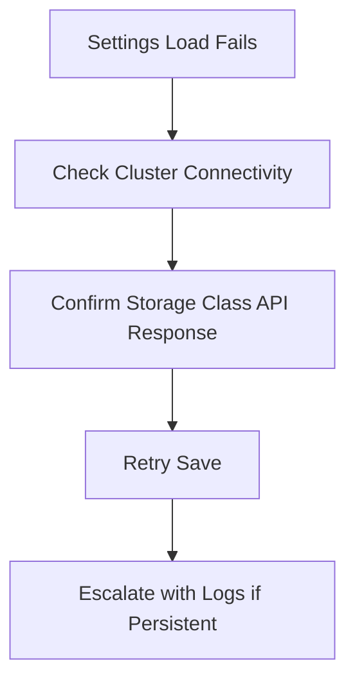

## Why Settings Matter

Cluster-level settings reduce deployment drift by standardizing how persistent storage is provisioned.

## Settings Model

## Configure Default Storage Class

1. Open **Clusters** and select the target cluster.
2. Go to **Settings**.
3. Load available storage classes returned by the cluster.
4. Select the preferred default class.

## Configure Access Mode

1. Pick default access mode (`ReadWriteOnce`, `ReadWriteMany`, etc.).
2. Prefer the recommended mode shown by storage class metadata.
3. Save changes and verify values persist on reload.

## Validation Checklist

- Storage class list loads without API errors.
- Selected values remain after refresh.
- New deployments inherit expected storage defaults.

## Operational Guardrails

<Check>Use production-approved storage classes only.</Check>
<Check>Document rationale when deviating from recommended access mode.</Check>
<Check>Revalidate settings after cluster upgrades or CSI changes.</Check>

## Troubleshooting Signals

