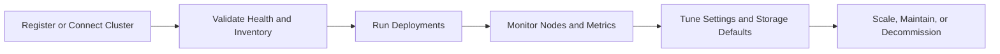

## Overview

The **Clusters** module is Bud's infrastructure control plane for model-serving and evaluation workloads. It gives platform teams a single place to onboard clusters, track health, manage node capacity, and apply runtime defaults.

Whether you run GPU-heavy production inference or mixed CPU/GPU environments, Clusters helps you keep operations reliable and auditable.

## Why Clusters Matter

**Unified infrastructure visibility**
Track capacity, status, and deployments across all connected clusters.

**Safe cluster lifecycle operations**
Add, edit, and remove clusters with guardrails for active deployments.

**Hardware-aware planning**
Understand CPU/GPU/HPU availability, worker utilization, and scaling readiness.

**Operational defaults at cluster level**
Configure storage classes and access modes once and reuse across deployments.

## Cluster Lifecycle in Bud

## Core Areas in the Clusters Module

| Area | What you can do |
|------|------------------|
| **Cluster List** | View all clusters, hardware profile, endpoints, and status |
| **General Tab** | Review node and resource summaries with utilization trends |
| **Deployments Tab** | Inspect deployments running on the selected cluster |
| **Nodes Tab** | Analyze per-node status, capacity, and events |
| **Analytics Tab** | Review cluster-level metrics and usage views |
| **Settings Tab** | Configure default storage class and access mode |

## Who Uses This Module

- **Platform / Infra teams** managing capacity and reliability.
- **MLOps teams** validating where models should run.
- **Security and governance leads** auditing cluster operations and permissions.

## Getting Started

<CardGroup cols={3}>
  <Card title="Quick Start" icon="play" href="/clusters/quickstart">
    Register your first cluster and verify readiness
  </Card>

  <Card title="Cluster Concepts" icon="book" href="/clusters/cluster-concepts">
    Learn module structure, tabs, and lifecycle concepts
  </Card>

  <Card title="Step-by-Step Tutorial" icon="graduation-cap" href="/clusters/creating-first-cluster">
    Walk through creation, validation, and operations
  </Card>
</CardGroup>
