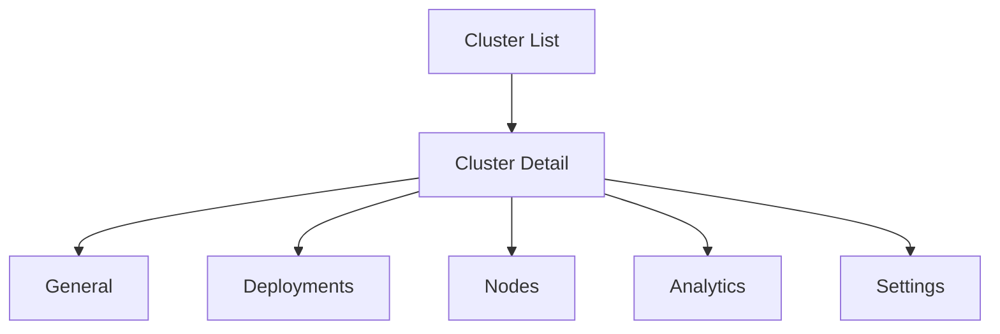

## Overview

This reference summarizes what each cluster tab provides and when to use it.

## Tab Matrix

| Tab | Primary Use | Typical Actions |
|-----|-------------|-----------------|
| **General** | Health and capacity overview | Review nodes, workers, utilization trends |
| **Deployments** | Workload visibility | Open deployment details, validate status |
| **Nodes** | Node-level diagnostics | Inspect allocatable resources and events |
| **Analytics** | Aggregate cluster performance view | Compare resource usage and hotspots |
| **Settings** | Runtime defaults | Set storage class and access mode |

## Navigation Flow

## Key Permissions

- `cluster:view`: access list and detail insights.
- `cluster:manage`: modify cluster metadata and settings, initiate deletion.

## Common Operator Queries

### Where do I check if a cluster is ready for new workloads?
Start in **General**, then validate **Nodes** for recent warnings.

### Where do I find workloads currently running on the cluster?
Use the **Deployments** tab.

### Where do I set storage defaults for future deployments?
Use the **Settings** tab.

### Where do I inspect usage patterns over time?
Use **Analytics** for comparative trend analysis.
