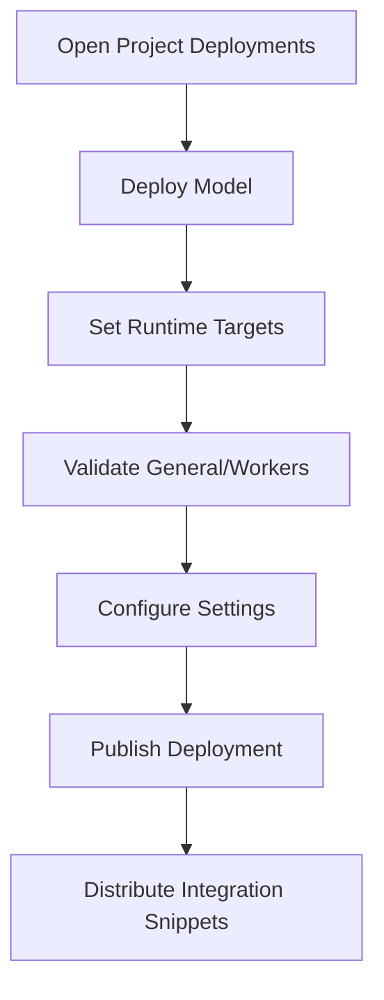

## What You'll Build

In this walkthrough, you will create a deployment, validate runtime health, add reliability settings, and publish it for consumers.

## Prerequisites

- Access to a project workspace
- Permission to manage deployments
- At least one available model source and cluster target

## Step 1: Navigate to Deployments

1. Open **Projects**.
2. Select your project.
3. Click **Deployments**.

## Step 2: Start Deployment Creation

1. Click **Deploy Model**.
2. Choose model source.
3. Select cluster and template/use-case profile.

## Step 3: Configure Runtime Targets

1. Enter deployment name.
2. Set concurrency and performance targets.
3. Review context/sequence-related runtime fields as applicable.

## Step 4: Launch and Validate

1. Submit the deployment.
2. Open its detail page.
3. Confirm **General** tab status is healthy.
4. If local, verify **Workers** activity.

## Step 5: Harden Reliability Settings

1. Open **Settings**.
2. Configure rate limiting strategy and quotas.
3. Add retry and fallback logic.
4. Save changes.

## Step 6: Publish and Share

1. Return to Deployments table.
2. Click **Publish** and provide pricing metadata.
3. Use **Use this model** to copy cURL/Python/JavaScript integration snippets.

## End-to-End Flow

## Best Practices

- Use clear, environment-aware naming conventions for deployments.
- Validate deployment status before publishing.
- Start with conservative limits and tune based on observed traffic.
- Use evaluations and observability signals before increasing production exposure.
