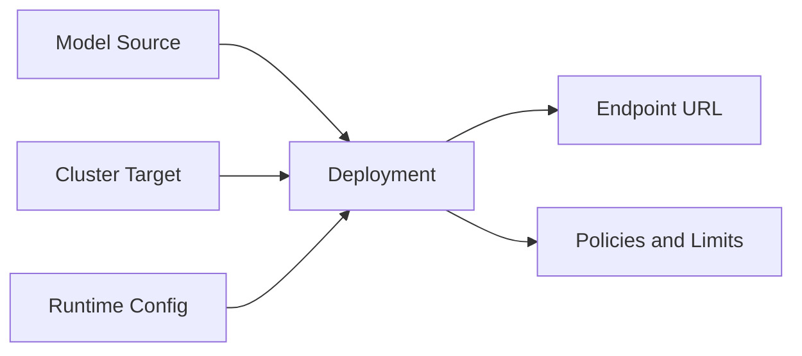
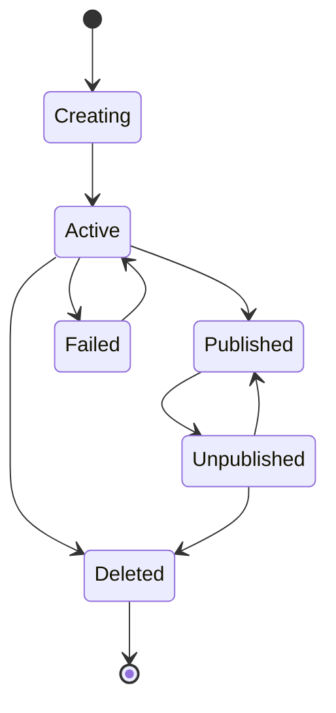

## What is a Deployment?

A deployment is a managed runtime endpoint that binds a selected model to infrastructure, execution settings, and access controls. It is the unit used for serving inference traffic in Bud AI Foundry projects.

## Deployment Building Blocks

## Deployment Types

### Cloud Deployments
Use managed cloud model providers when you need fast setup and external model access.

### Local Deployments
Use local model artifacts (for example Hugging Face or disk-based assets) when you need infrastructure control or custom runtime tuning.

## Deployment Detail Tabs

### General
Shows model, cluster, and status-level summary information.

### Workers
Available for local deployments. Shows worker state, placement, and capacity signals.

### Settings
Central place to configure rate limits, retries, and fallback behavior.

### Model Evaluations
Tracks evaluation runs and results linked to a deployment.

## Lifecycle States

## Reliability Concepts

- **Rate Limiting** controls traffic volume and burst behavior.
- **Retry Limits** define automatic re-attempt behavior.
- **Fallback Chains** route traffic to alternate endpoints during failure conditions.

## Permission Model

Deployment actions are permission-aware. View-only users can inspect metadata while manage permissions are required for create, edit, publish, and delete actions.
