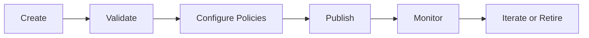

## Overview

Lifecycle management helps teams keep deployments stable, auditable, and cost-aware as they evolve from testing to production.

## Recommended Lifecycle Stages

## Launch Stage

- Select model source and cluster intentionally.
- Use naming that encodes environment or business domain.
- Validate endpoint readiness immediately after creation.

## Policy Stage

- Add rate limits aligned to expected traffic.
- Configure retries and fallback routes for resiliency.
- Re-check permission boundaries for sensitive projects.

## Publish Stage

- Publish only after health and quality checks.
- Attach pricing metadata for downstream consumers.
- Document endpoint usage expectations for consuming teams.

## Operate Stage

- Track status, performance, and error trends.
- Scale workers for local deployments when demand rises.
- Re-run evaluations after meaningful model or policy changes.

## Retire Stage

- Unpublish before deletion when external users consume the endpoint.
- Confirm route dependencies are removed.
- Delete only after migration to replacement endpoints is complete.
