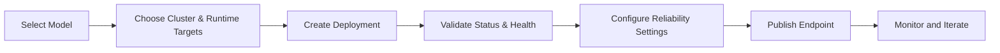

## Overview

The **Deployments** module is where a project turns models into live, consumable endpoints. It centralizes endpoint creation, runtime tuning, publishing, and lifecycle operations for both cloud and local models.

From a single project tab, teams can deploy workloads, monitor status, control reliability policies, and expose approved endpoints to downstream consumers.

## Why Deployments Matter

**Unified endpoint lifecycle**
Create, publish, unpublish, and retire endpoints in one operational workflow.

**Cloud + local flexibility**
Deploy cloud-hosted APIs and local model artifacts with consistent governance.

**Built-in reliability controls**
Configure retries, fallback chains, and rate limiting directly from deployment settings.

**Production visibility**
Track endpoint health and review runtime details through deployment-level tabs.

## Deployment Lifecycle

## Core Areas in Deployments

| Area | What you can do |
|------|------------------|
| **Deployment List** | Search, filter, and manage project endpoints |
| **General Tab** | Review model/cluster metadata and deployment status |
| **Workers Tab** | Inspect and scale workers for local deployments |
| **Settings Tab** | Set rate limits, retries, and fallback behavior |
| **Model Evaluations Tab** | Review quality checks before wider rollout |

## Typical Workflow

1. Open a project and navigate to **Deployments**.
2. Deploy a model with the right cluster and runtime profile.
3. Validate endpoint readiness from deployment details.
4. Add reliability and scaling guardrails in settings.
5. Publish with pricing metadata when consumer access is required.

## Getting Started

<CardGroup cols={3}>
  <Card title="Quick Start" icon="play" href="/deployments/quickstart">
    Launch your first deployment in minutes
  </Card>

  <Card title="Deployment Concepts" icon="book" href="/deployments/deployment-concepts">
    Understand endpoint types, lifecycle states, and tabs
  </Card>

  <Card title="Step-by-Step Tutorial" icon="graduation-cap" href="/deployments/creating-first-deployment">
    Build and publish a first deployment with best practices
  </Card>
</CardGroup>
