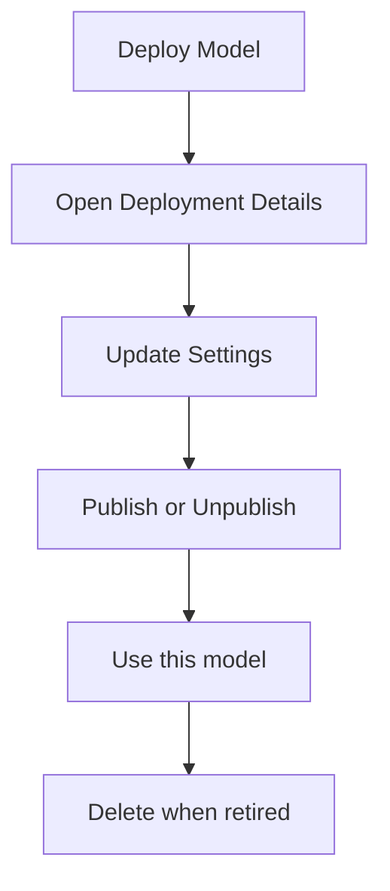

## Overview

This page summarizes the most common deployment actions available from project deployment views.

## Action Flow

## Core Actions

| Action | Where | Purpose |
|--------|-------|---------|
| **Deploy Model** | Deployments list | Create a new endpoint from selected model + cluster |
| **Publish** | Deployments list row | Expose endpoint for governed consumption |
| **Publish Details** | Published endpoint row | Review or adjust publication pricing metadata |
| **Use this model** | List row or General tab | Copy cURL, Python, and JavaScript integration snippets |
| **Delete** | Deployments list row | Remove endpoint after dependency checks |

## Detail-Page Actions

| Tab | Action | Use Case |
|-----|--------|----------|
| **Workers** | Add Worker | Increase local serving capacity |
| **Settings** | Save policy changes | Apply rate limits, retries, and fallback rules |
| **Model Evaluations** | Run Another Evaluation / Export | Validate quality and share result artifacts |

## Operational Notes

- Some actions are permission-gated.
- Workers tab appears only for non-cloud deployments.
- Publish/unpublish flows should be coordinated with consumers to avoid disruption.
