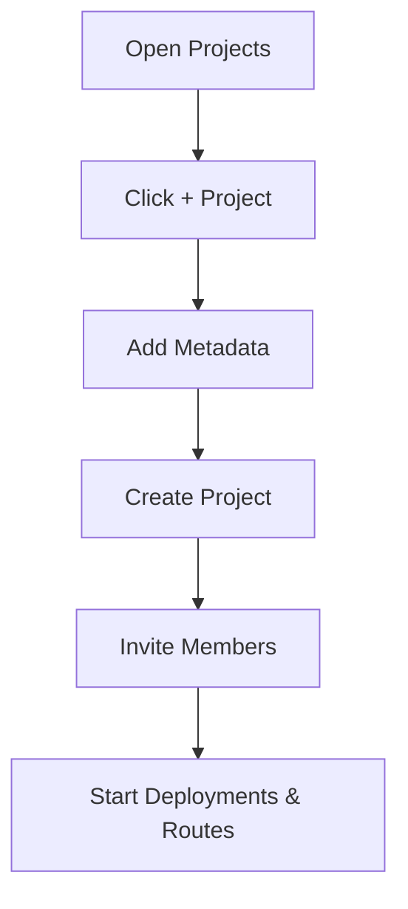

# Creating Projects

Use this guide to create a new project workspace and prepare it for team collaboration and deployment operations.

## Steps

1. Open **Projects** from the left navigation.
2. Click **+ Project**.
3. Enter project metadata:
   - Name
   - Description
   - Icon
   - Tags
4. Click **Create**.
5. Open the project and invite members with view/manage access.

## Project Creation Flow

## Best Practices

- Use business-aligned names (product/team/environment).
- Keep tags standardized for filtering and governance.
- Grant manage access only to operators who need mutation rights.
