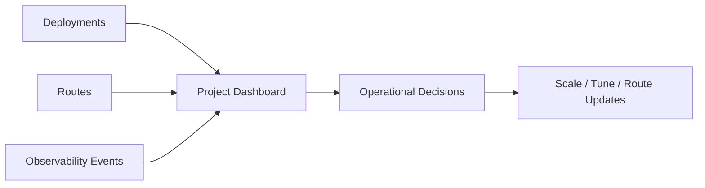

# Project Dashboard

The project dashboard gives a consolidated view of delivery and runtime signals across deployments, routes, and operations.

## What to Monitor

- Deployment health and status changes
- Latency and throughput trends
- Queue depth and utilization patterns
- Alerts or anomalous behavior in observability

## Dashboard Data Flow

## Recommended Workflow

1. Review service health first.
2. Inspect latency and throughput trends.
3. Correlate with route and deployment changes.
4. Apply scaling or reliability updates as needed.
