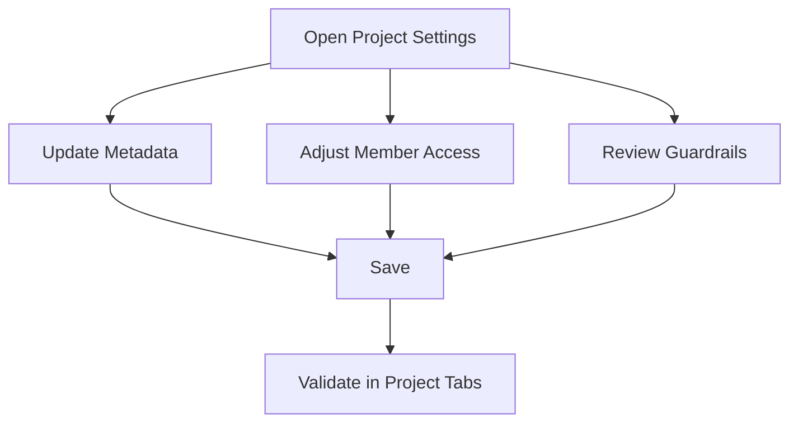

# Project Settings

Project settings define metadata, access posture, and operational defaults for the project workspace.

## Common Settings Areas

- Project metadata (name, description, icon, tags)
- Member access and permission scopes
- Guardrail associations
- Reliability and deployment policy alignment

## Settings Update Flow

## Tips

- Apply changes during low-risk windows for production projects.
- Audit permission changes after team transitions.
- Validate downstream impacts in Deployments, Routes, and Observability.
