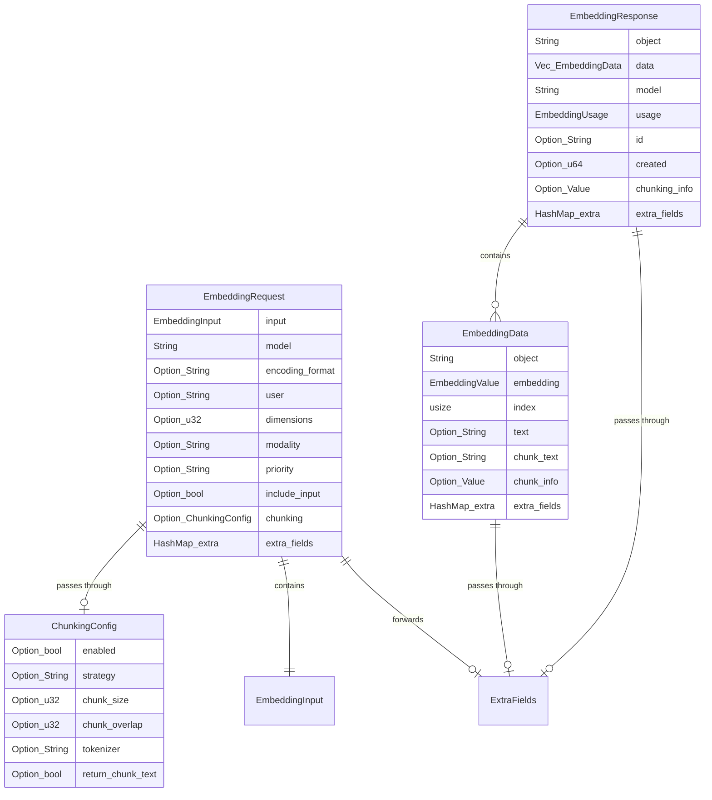

# feat: Extended Embedding API Parameters for BudGateway

## Enhancement Summary

**Deepened on:** 2026-01-21
**Sections enhanced:** 8
**Research agents used:** architecture-strategist, performance-oracle, security-sentinel, code-simplicity-reviewer, pattern-recognition-specialist, best-practices-researcher, framework-docs-researcher

### Key Architecture Principle

> ⚠️ **CRITICAL: BudGateway is a PROXY** - No tokenization, chunking logic, or extra processing happens in the gateway. All extended parameters are simply passed through to downstream providers (e.g., Infinity embedding server). The provider is responsible for all processing.

### Key Improvements from Research

1. **Proxy-only design** - Gateway accepts, validates schema, and forwards parameters; no business logic
2. **Security hardening** - Input size validation at gateway level to prevent abuse
3. **Cache key design** - Use `skip_serializing_if = "Option::is_none"` to maintain backward compatibility
4. **Schema flexibility** - Accept all Infinity-compatible parameters and pass through transparently

### Critical Design Decisions

- **No tokenization in gateway**: All chunking/tokenization happens at the provider (Infinity server)
- **Pass-through parameters**: New fields like `chunking`, `dimensions`, `priority` are forwarded as-is
- **Basic validation only**: Gateway validates JSON schema, not business rules (that's the provider's job)
- **Cache key composition**: Include new params in cache key only when present (backward compatible)

---

## Overview

Enhance the BudGateway embedding endpoint (`/v1/embeddings`) to support additional parameters for multimodal inputs, chunking, priority-based routing, and enhanced response metadata. **BudGateway acts as a transparent proxy** - it accepts these extended parameters and forwards them to the downstream embedding provider (e.g., Infinity server). The provider is responsible for all processing logic including chunking, tokenization, and multimodal handling.

## Problem Statement / Motivation

The current embedding endpoint supports only basic parameters:
- `input` (string or array of strings)
- `model`
- `encoding_format` (captured but not fully utilized)
- `tensorzero::cache_options` (TensorZero-specific caching)

Users need:
1. **Chunking support** - Large documents need to be split into chunks for embedding, with metadata tracking chunk positions
2. **Multimodal support** (future) - Embedding images and audio, not just text
3. **Priority routing** - Different priority levels for time-sensitive vs background embedding tasks
4. **Enhanced metadata** - Response includes unique IDs, timestamps, and input text for debugging

## Proposed Solution

Extend the embedding endpoint to **accept and pass through** additional parameters to downstream providers.

### New Request Parameters (Pass-Through)

> **Architecture Principle:** Gateway is a transparent proxy. These parameters are accepted, optionally validated for schema correctness, and forwarded to the provider unchanged. The provider (e.g., Infinity server) handles all business logic.

```rust
// Text Embedding Request - Extended for pass-through
#[derive(Debug, Deserialize, Serialize)]
pub struct ExtendedEmbeddingParams {
    input: EmbeddingInput,                    // str | list[str] (existing)
    model: String,                            // existing
    #[serde(default)]
    encoding_format: Option<String>,          // "float" (default) | "base64"
    #[serde(default)]
    user: Option<String>,                     // NEW: user identifier (logged, passed to provider)
    #[serde(default)]
    dimensions: Option<u32>,                  // NEW: Matryoshka dimensions (passed to provider)
    #[serde(default)]
    modality: Option<String>,                 // NEW: "text" | "image" | "audio" (passed to provider)
    #[serde(default)]
    priority: Option<String>,                 // NEW: "high" | "normal" | "low" (passed to provider)
    #[serde(default)]
    include_input: Option<bool>,              // NEW: include original text in response (passed to provider)
    #[serde(default)]
    chunking: Option<ChunkingConfig>,         // NEW: chunking config (passed to provider)
    #[serde(rename = "tensorzero::cache_options")]
    tensorzero_cache_options: Option<CacheParamsOptions>, // existing (gateway-handled)
    #[serde(flatten)]
    extra: HashMap<String, Value>,            // Forward any unknown fields to provider
}

// ChunkingConfig - passed through to provider as-is
#[derive(Debug, Clone, Default, Deserialize, Serialize)]
pub struct ChunkingConfig {
    #[serde(default)]
    enabled: Option<bool>,             // Passed to provider
    #[serde(default)]
    strategy: Option<String>,          // "token" | "sentence" | "recursive" | etc.
    #[serde(default)]
    chunk_size: Option<u32>,           // Provider default if not specified
    #[serde(default)]
    chunk_overlap: Option<u32>,        // Provider default if not specified
    #[serde(default)]
    tokenizer: Option<String>,         // e.g., "cl100k_base"
    #[serde(default)]
    return_chunk_text: Option<bool>,   // Whether provider returns chunk text
}

// NOTE: All values are Option<T> - gateway passes through whatever is provided
// Provider is responsible for defaults and validation
```

### Response Format (Pass-Through from Provider)

> **Architecture Principle:** Gateway forwards the provider's response structure unchanged. New fields like `chunking_info`, `chunk_text`, etc. are passed through transparently.

```rust
// Response - Deserialize from provider, serialize to client unchanged
#[derive(Debug, Deserialize, Serialize)]
pub struct EmbeddingResponse {
    object: String,
    data: Vec<EmbeddingData>,
    model: String,
    usage: EmbeddingUsage,
    #[serde(default, skip_serializing_if = "Option::is_none")]
    id: Option<String>,                // From provider (e.g., "infinity-{uuid}")
    #[serde(default, skip_serializing_if = "Option::is_none")]
    created: Option<u64>,              // From provider
    #[serde(default, skip_serializing_if = "Option::is_none")]
    chunking_info: Option<Value>,      // From provider - pass through as raw JSON
    #[serde(flatten)]
    extra: HashMap<String, Value>,     // Forward any unknown fields from provider
}

#[derive(Debug, Deserialize, Serialize)]
pub struct EmbeddingData {
    object: String,
    embedding: EmbeddingValue,         // Vec<f32> or base64 string
    index: usize,
    #[serde(default, skip_serializing_if = "Option::is_none")]
    text: Option<String>,              // From provider when include_input=true or chunking
    #[serde(default, skip_serializing_if = "Option::is_none")]
    chunk_text: Option<String>,        // From provider when chunking enabled
    #[serde(default, skip_serializing_if = "Option::is_none")]
    chunk_info: Option<Value>,         // From provider - pass through as raw JSON
    #[serde(flatten)]
    extra: HashMap<String, Value>,     // Forward any unknown fields from provider
}
```

## Technical Approach

### Architecture (Proxy Pattern)

> **CRITICAL: BudGateway is a transparent proxy.** No business logic, no tokenization, no chunking. The gateway's only responsibilities are:
> 1. Parse incoming request (accept extended parameters)
> 2. Basic schema validation (JSON structure, required fields)
> 3. Forward request to provider with all parameters preserved
> 4. Forward provider response back to client unchanged
> 5. Handle caching (gateway-level concern)

```
┌─────────────────────────────────────────────────────────────────────────┐
│                         embedding_handler (Proxy)                        │
│  ┌─────────────┐  ┌──────────────┐  ┌───────────────────────────────┐  │
│  │   Parse     │→ │   Schema     │→ │   Forward to Provider         │  │
│  │   Extended  │  │   Validate   │  │   (with all params)           │  │
│  │   Params    │  │   (basic)    │  │                               │  │
│  └─────────────┘  └──────────────┘  └───────────────────────────────┘  │
│                                                ↓                        │
│  ┌─────────────┐  ┌──────────────┐  ┌───────────────────────────────┐  │
│  │   Return    │← │   Pass       │← │   Provider Response           │  │
│  │   to Client │  │   Through    │  │   (chunking_info, etc.)       │  │
│  └─────────────┘  └──────────────┘  └───────────────────────────────┘  │
└─────────────────────────────────────────────────────────────────────────┘
                                                ↓
                        ┌───────────────────────────────────────┐
                        │       Infinity Embedding Server       │
                        │   (handles all business logic:        │
                        │    tokenization, chunking, etc.)      │
                        └───────────────────────────────────────┘
```

**Key Architecture Decisions:**

1. **Pass-Through Design** - All extended parameters forwarded to provider unchanged
2. **Schema Validation Only** - Gateway validates JSON structure, not business rules
3. **Response Transparency** - Provider response fields passed through without modification
4. **Cache Key Extension** - Include new params in cache key using `skip_serializing_if`

### Implementation (Single Phase)

> **Simplified Scope:** Since gateway is just a proxy, implementation is straightforward - extend request/response types to accept and forward new fields.

#### Phase 1: Extended Parameter Support (Pass-Through)
**Scope:** Accept new request parameters and forward them to provider; pass through new response fields

**Tasks:**
- [x] Extend `EmbeddingRequest` struct with new optional fields:
  - `user: Option<String>` - forwarded to provider, logged for observability
  - `dimensions: Option<u32>` - forwarded to provider
  - `modality: Option<String>` - forwarded to provider
  - `priority: Option<String>` - forwarded to provider (for future routing)
  - `include_input: Option<bool>` - forwarded to provider
  - `chunking: Option<ChunkingConfig>` - forwarded to provider
- [x] Add `ChunkingConfig` struct (all fields optional, passed through)
- [x] Extend `EmbeddingResponse` to accept new fields from provider:
  - `id: Option<String>` - from provider
  - `created: Option<u64>` - from provider
  - `chunking_info: Option<Value>` - from provider (raw JSON pass-through)
- [x] Extend `EmbeddingData` to accept chunking fields:
  - `text: Option<String>` - from provider
  - `chunk_text: Option<String>` - from provider
  - `chunk_info: Option<Value>` - from provider (raw JSON pass-through)
- [x] Add `#[serde(flatten)] extra: HashMap<String, Value>` to both request and response for forward compatibility
- [x] Update cache key composition:
  - Use `skip_serializing_if = "Option::is_none"` for backward compatibility
  - Include `dimensions` and `chunking` in cache key when present
- [x] Log `user` parameter to observability
- [x] Add unit tests for request parsing with new fields
- [x] Add unit tests for response deserialization with new fields

**Files:**
- `services/budgateway/gateway/src/gateway_util/types/request.rs` - Extended request types
- `services/budgateway/gateway/src/gateway_util/types/embedding.rs` - Extended embedding types
- `services/budgateway/gateway/src/inference/providers/*.rs` - Ensure params forwarded
- `services/budgateway/gateway/src/cache.rs` - Cache key update

**No New Dependencies Required** - Just serde attribute changes

**Performance Impact:** Minimal - only adds optional field parsing/serialization

## Acceptance Criteria

### Functional Requirements (Proxy Pass-Through)

- [x] Existing embedding requests continue to work unchanged (backward compatibility)
- [x] New parameters (`modality`, `priority`, `dimensions`, `user`, `include_input`, `chunking`) are accepted and forwarded to provider
- [x] Unknown/extra parameters are forwarded to provider via `#[serde(flatten)]`
- [x] Provider response fields (`id`, `created`, `chunking_info`, `chunk_text`, `chunk_info`) are passed through to client
- [x] Unknown/extra response fields from provider are passed through to client
- [x] `user` parameter is logged to observability (gateway-level concern)
- [x] Cache keys incorporate new parameters when present (different params = different cache entry)
- [x] Cache keys remain unchanged when new parameters are absent (backward compatibility)

### Non-Functional Requirements

- [x] No latency regression (<1ms P99 additional gateway overhead)
- [x] Memory usage unchanged (no buffering beyond request/response)
- [x] Full test coverage for new request/response parsing

### Quality Gates

- [x] All existing tests pass
- [x] New unit tests for extended request parsing
- [x] New unit tests for extended response deserialization
- [ ] API documentation updated (document pass-through parameters)
- [x] No clippy warnings (pre-existing warnings in other files not related to this change)

## Technical Considerations

### Proxy Validation (Gateway-Level Only)

> **Architecture Principle:** Gateway performs minimal validation. Business logic validation (chunk_size ranges, overlap constraints, etc.) is the provider's responsibility.

| Gateway Validates | Provider Validates |
|-------------------|-------------------|
| JSON syntax | `chunk_overlap < chunk_size` |
| Required fields (`input`, `model`) | `chunk_size` range (1-8192) |
| Basic type checking | Total input size limits |
| Request body size (HTTP layer) | Embedding count limits |

### Cache Key Composition (Backward Compatible)

> **Key Design:** Use `skip_serializing_if = "Option::is_none"` to ensure requests without new parameters produce the SAME cache keys as before.

Current: `hash(model, input, encoding_format)`
New: `hash(model, input, encoding_format, dimensions?, chunking?)`

```rust
#[derive(Debug, PartialEq, Serialize)]
pub struct EmbeddingCacheKey {
    pub input: EmbeddingInput,
    #[serde(skip_serializing_if = "Option::is_none")]
    pub encoding_format: Option<String>,
    #[serde(skip_serializing_if = "Option::is_none")]
    pub dimensions: Option<u32>,
    #[serde(skip_serializing_if = "Option::is_none")]
    pub chunking: Option<ChunkingConfig>,
}
// When chunking = None and dimensions = None, serialization matches old format
// → Same cache key as before!
```

### Backward Compatibility

- All new request parameters are optional
- Response structure unchanged when provider doesn't return new fields
- `#[serde(flatten)]` captures any unknown fields for forward compatibility
- Existing clients can ignore new response fields (`id`, `created`, `chunking_info`)
- Cache keys unchanged for requests without new features

## Dependencies & Prerequisites

### Rust Crates

**No new crates required** - this is purely a pass-through feature using existing serde capabilities.

Existing crates already provide everything needed:
- `serde` with `#[serde(default)]`, `#[serde(skip_serializing_if)]`, `#[serde(flatten)]`
- `serde_json::Value` for raw JSON pass-through

### Infrastructure

- No infrastructure changes required
- Provider (Infinity server) must support the extended parameters

## Risk Analysis & Mitigation

| Risk | Probability | Impact | Mitigation |
|------|-------------|--------|------------|
| Provider doesn't support parameter | Medium | Low | Gateway passes through; provider returns error (expected behavior) |
| Cache key bloat from new params | Low | Medium | Use `skip_serializing_if` to only include non-None values |
| Breaking changes for existing clients | Low | High | All new fields optional; extensive backward compat testing |
| Unknown fields cause issues | Low | Medium | `#[serde(flatten)]` ensures unknown fields forwarded safely |

## Resource Requirements

### Development

- 1 developer (straightforward pass-through implementation)
- Code review from team member familiar with budgateway serde patterns

### Testing

- Unit tests: Request parsing, response deserialization
- Integration tests: Verify parameters forwarded to provider
- E2E tests: Verify full round-trip with Infinity server

## Future Considerations

### Extensibility

- `#[serde(flatten)]` pattern allows provider to add new fields without gateway changes
- New request parameters can be added without breaking backward compatibility
- Gateway remains thin proxy as provider capabilities evolve

### Long-term Vision

- Gateway may add routing logic based on `priority` field (future)
- Gateway may add metrics/observability for new fields
- Keep gateway simple; business logic stays in provider

## References & Research

### Internal References

- Current embedding types: `tensorzero-internal/src/embeddings.rs:188-245`
- Embedding handler: `tensorzero-internal/src/endpoints/openai_compatible.rs:3356-3530`
- Provider trait: `tensorzero-internal/src/embeddings.rs:373-380`
- Cache implementation: `tensorzero-internal/src/cache.rs:395-400`
- Fireworks provider (dimensions example): `tensorzero-internal/src/inference/providers/fireworks.rs:373-379`

### External References

- OpenAI Embeddings API: https://platform.openai.com/docs/api-reference/embeddings
- Infinity Embedding Server: https://github.com/michaelfeil/infinity
- tiktoken-rs: https://github.com/zurawiki/tiktoken-rs
- Best practice - base64 encoding for embeddings: https://techcommunity.microsoft.com/blog/azuredevcommunityblog/speed-up-openai-embedding-by-4x-with-this-simple-trick/4390081

### Related Work

- Audio endpoint implementation: `tensorzero-internal/src/audio.rs` (similar pattern for multimodal)
- Response format: `tensorzero-internal/src/endpoints/openai_compatible.rs` (model for extending responses)

---

## ERD: Extended Types (Pass-Through)



> **Note:** All `Option_*` fields use `#[serde(default, skip_serializing_if = "Option::is_none")]` for backward compatibility. `HashMap_extra` uses `#[serde(flatten)]` to forward unknown fields.

---

*Plan created: 2026-01-21*
*Updated: 2026-01-21 (simplified to proxy-only architecture)*
*Generated with Claude Code*
