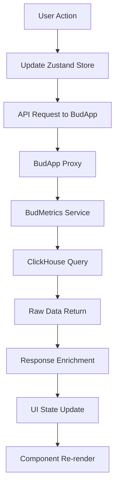

# Inference Listing UI Feature Documentation

## Overview

The Inference Listing feature provides a comprehensive interface for viewing and analyzing AI model inference requests within the BudAdmin dashboard. This feature enables project administrators and team members to examine detailed information about model interactions, including prompts, responses, performance metrics, and user feedback.

## Feature Architecture

### Component Hierarchy

```
InferenceListView (Page Component)
├── InferenceFilters (Filter Panel)
│   ├── Date Range Picker
│   ├── Success Status Filter
│   ├── Token Range Filters
│   ├── Latency Filter
│   └── Export Options
├── InferenceListTable (Data Table)
│   ├── Pagination Controls
│   ├── Sort Headers
│   ├── Row Actions
│   └── Loading States
└── InferenceDetailModal (Popup Detail View)
    ├── Overview Tab
    ├── Messages Tab
    ├── Performance Tab
    ├── Raw Data Tab
    └── Feedback Tab
```

### State Management

The feature uses Zustand for centralized state management:

**Store**: `useInferences.ts`
- Manages inference list data and pagination
- Handles filter states and sorting preferences
- Caches detailed inference information
- Manages loading states and error handling

## User Interface Components

### 1. InferenceListView (Main Container)

**Location**: `/src/pages/home/projects/[slug]/inferences/index.tsx`

The main container component that orchestrates the inference listing interface.

**Props:**
```typescript
interface InferenceListViewProps {
  projectId?: string;
}
```

**Features:**
- Project-scoped inference viewing
- Responsive layout design
- Integration with project navigation
- Context-aware user permissions

### 2. InferenceFilters (Filter Panel)

**Location**: `/src/components/inferences/InferenceFilters.tsx`

Advanced filtering interface allowing users to narrow down inference results.

**Filter Options:**

| Filter Type | Options | Description |
|-------------|---------|-------------|
| **Date Range** | From/To Date Pickers | Filter by inference creation time |
| **Success Status** | All, Success, Failed | Filter by inference completion status |
| **Token Range** | Min/Max Token Inputs | Filter by total token count |
| **Latency** | Max Latency (ms) | Filter by response time |
| **Model** | Dropdown Selection | Filter by specific model |
| **Endpoint** | Dropdown Selection | Filter by specific endpoint |

**Export Features:**
- CSV Export: Tabular data for spreadsheet analysis
- JSON Export: Structured data for further processing
- Filtered Export: Respects current filter settings

### 3. InferenceListTable (Data Table)

**Location**: `/src/components/ui/bud/table/InferenceListTable.tsx`

High-performance data table with advanced features for displaying inference lists.

**Table Columns:**

| Column | Type | Description | Sortable |
|--------|------|-------------|----------|
| **Timestamp** | DateTime | When the inference occurred | Yes |
| **Model** | String | Model name with provider info | Yes |
| **Prompt Preview** | Text | First 100 characters of prompt | No |
| **Response Preview** | Text | First 100 characters of response | No |
| **Tokens** | Number | Input/Output/Total token counts | Yes |
| **Latency** | Number | Response time in milliseconds | Yes |
| **Cost** | Currency | Inference cost in USD | Yes |
| **Status** | Badge | Success/Failed status indicator | No |
| **Actions** | Buttons | View details, copy, export | No |

**Table Features:**
- **Pagination**: Server-side pagination with configurable page sizes
- **Sorting**: Click column headers to sort (supports multi-column)
- **Row Selection**: Select multiple rows for batch operations
- **Responsive Design**: Collapses columns on smaller screens
- **Loading States**: Skeleton loaders during data fetch
- **Empty States**: Friendly messages when no data available

### 4. InferenceDetailModal (Detail Popup)

**Location**: `/src/components/inferences/InferenceDetailModal.tsx`

Comprehensive modal displaying complete inference information across multiple tabs.

#### Tab 1: Overview
- **Inference Metadata**: ID, timestamp, success status
- **Model Information**: Name, provider, version
- **Project Context**: Project and endpoint names
- **Performance Summary**: Key metrics overview
- **Quick Actions**: Copy ID, export data, share link

#### Tab 2: Messages
- **Chat Interface**: Display conversation in chat format
- **Message Metadata**: Timestamps, token counts per message
- **Content Actions**: Copy individual messages, highlight text
- **Rich Formatting**: Proper rendering of markdown, code blocks
- **System Prompts**: Display system instructions when present

#### Tab 3: Performance
- **Timing Metrics**:
  - Request arrival time
  - Request forward time
  - Time to first token (TTFT)
  - Response completion time
  - Total latency
- **Token Usage**:
  - Input tokens breakdown
  - Output tokens breakdown
  - Token rate (tokens/second)
- **Cost Analysis**:
  - Total cost
  - Cost per token
  - Cost breakdown by input/output
- **Visual Charts**: Performance trends and comparisons

#### Tab 4: Raw Data
- **Request Payload**: Complete original request JSON
- **Response Payload**: Complete provider response JSON
- **Metadata**: Headers, user agent, IP address
- **Debugging Info**: Internal processing timestamps
- **Copy Actions**: Copy entire payloads or specific fields

#### Tab 5: Feedback
- **Feedback Summary**: Aggregated ratings and metrics
- **Boolean Metrics**: True/false feedback (helpful, accurate, etc.)
- **Rating Metrics**: Numeric ratings (1-5 scale)
- **Comments**: Text feedback from users
- **Demonstrations**: Alternative response examples
- **Feedback Timeline**: Chronological feedback history

## User Workflows

### Primary Workflows

#### 1. Browse Recent Inferences
```
User navigates to project → Inferences tab → Views recent inferences sorted by timestamp
```

#### 2. Analyze Model Performance
```
User applies filters → Sorts by latency → Examines high-latency inferences → Views performance tab
```

#### 3. Debug Failed Inferences
```
User filters by "Failed" status → Reviews error messages → Examines raw request/response
```

#### 4. Export Data for Analysis
```
User applies filters → Selects export format → Downloads filtered dataset
```

#### 5. Review User Feedback
```
User sorts by feedback presence → Opens detail modal → Reviews feedback tab
```

### Secondary Workflows

#### Search and Filter Workflow
1. **Open Filters**: Click filter panel toggle
2. **Set Date Range**: Select appropriate time period
3. **Apply Filters**: Choose success status, token ranges, latency limits
4. **Sort Results**: Click column headers for desired sort order
5. **Review Results**: Browse filtered and sorted data

#### Detail Analysis Workflow
1. **Select Inference**: Click on table row or "View Details" button
2. **Navigate Tabs**: Switch between overview, messages, performance, raw data, feedback
3. **Copy Data**: Use copy buttons for specific information
4. **Export Details**: Download individual inference data
5. **Close Modal**: Return to list view

## Data Integration

### API Integration

The UI components integrate with BudApp's metric proxy endpoints:

```typescript
// API calls through centralized request handler
const fetchInferences = async (filters: InferenceFilters) => {
  return await AppRequest.post('/api/v1/metrics/inferences/list', filters);
};

const fetchInferenceDetail = async (inferenceId: string) => {
  return await AppRequest.get(`/api/v1/metrics/inferences/${inferenceId}`);
};

const fetchInferenceFeedback = async (inferenceId: string) => {
  return await AppRequest.get(`/api/v1/metrics/inferences/${inferenceId}/feedback`);
};
```

### Data Flow



### Caching Strategy

- **List Data**: Cached for 30 seconds to reduce API calls
- **Detail Data**: Cached per inference ID for session duration
- **Filter Options**: Cached for 5 minutes (models, endpoints list)
- **User Preferences**: Stored in localStorage (sort order, page size)

## Performance Optimizations

### Frontend Optimizations

#### 1. Virtual Scrolling
- Renders only visible table rows
- Handles large datasets efficiently
- Smooth scrolling experience

#### 2. Debounced Filtering
- 300ms delay on filter input changes
- Prevents excessive API calls during typing
- Cancels previous requests when new filters applied

#### 3. Lazy Loading
- Modal content loaded only when opened
- Tab content loaded on tab switch
- Images and media loaded on demand

#### 4. Memoization
- React.memo on stable components
- useMemo for expensive calculations
- useCallback for event handlers

### Data Optimizations

#### 1. Pagination
- Server-side pagination reduces initial load time
- Configurable page sizes (25, 50, 100)
- Prefetch next page on user scroll

#### 2. Field Selection
- Request only necessary fields for list view
- Full data loaded only for detail view
- Reduced payload sizes

#### 3. Response Compression
- Gzip compression on API responses
- Efficient JSON serialization
- Optimized data structures

## Responsive Design

### Breakpoint Behavior

#### Desktop (≥1200px)
- Full table with all columns visible
- Side-by-side filter panel
- Multi-column sorting indicators
- Hover effects and tooltips

#### Tablet (768px - 1199px)
- Condensed table with priority columns
- Collapsible filter panel
- Touch-friendly controls
- Horizontal scrolling for overflow

#### Mobile (≤767px)
- Card-based layout instead of table
- Bottom sheet filters
- Touch gestures for actions
- Simplified navigation

### Accessibility Features

#### Keyboard Navigation
- Tab order follows logical flow
- Arrow keys for table navigation
- Enter/Space for action triggers
- Escape to close modals

#### Screen Reader Support
- ARIA labels on all interactive elements
- Table headers properly associated
- Status announcements for loading/errors
- Semantic HTML structure

#### Visual Accessibility
- High contrast color scheme
- Scalable text (supports zoom to 200%)
- Focus indicators on all focusable elements
- Alternative text for visual indicators

## Error Handling

### Error States

#### 1. Network Errors
- **Display**: Toast notification with retry option
- **Fallback**: Show cached data if available
- **Recovery**: Automatic retry with exponential backoff

#### 2. Authorization Errors
- **Display**: Redirect to login or show permission denied message
- **Fallback**: Remove restricted data from view
- **Recovery**: Refresh token and retry request

#### 3. Data Errors
- **Display**: Inline error messages in table rows
- **Fallback**: Show partial data with error indicators
- **Recovery**: Allow manual refresh or filter adjustment

#### 4. Validation Errors
- **Display**: Form field highlighting and error messages
- **Fallback**: Disable invalid actions
- **Recovery**: Real-time validation feedback

### Error Recovery

```typescript
// Error recovery pattern
const handleApiError = (error: ApiError) => {
  switch (error.status) {
    case 401:
      refreshAuthToken().then(retry);
      break;
    case 429:
      scheduleRetryWithBackoff();
      break;
    case 500:
      showErrorToast('Server error, please try again');
      break;
    default:
      logError(error);
      showGenericError();
  }
};
```

## Security Considerations

### Data Protection
- **Client-side Filtering**: Sensitive data never reaches browser if user lacks access
- **Token Masking**: Sensitive tokens truncated in display
- **XSS Prevention**: All user content sanitized before display
- **CSRF Protection**: API requests include CSRF tokens

### Access Control
- **Project-level Filtering**: Users see only their project's inferences
- **Role-based Features**: Some features restricted by user role
- **Audit Logging**: All data access logged for security auditing
- **Session Management**: Automatic logout on inactivity

## Integration Points

### Navigation Integration
- **Project Tabs**: Inferences tab integrated into project detail tabs
- **Breadcrumbs**: Clear navigation path showing current context
- **Deep Linking**: Direct URLs to filtered views and specific inferences
- **Back Navigation**: Proper browser back button support

### Dashboard Integration
- **Metrics Cards**: Summary cards link to filtered inference views
- **Chart Drill-down**: Click chart segments to view related inferences
- **Alert Integration**: Performance alerts link to problem inferences
- **Quick Actions**: Common filters accessible from dashboard

### Export Integration
- **Report Generation**: Integration with reporting system
- **Data Warehouse**: Export options for data warehouse ingestion
- **Analytics Integration**: Connect with external analytics tools
- **API Documentation**: Links to API docs for programmatic access

## Testing Strategy

### Unit Tests
- Component rendering tests
- State management tests
- Utility function tests
- Error handling tests

### Integration Tests
- API integration tests
- Data flow tests
- Filter and sort tests
- Export functionality tests

### End-to-End Tests
- Complete user workflow tests
- Cross-browser compatibility tests
- Performance tests
- Accessibility tests

## Future Enhancements

### Planned Features
1. **Real-time Updates**: WebSocket integration for live inference streaming
2. **Advanced Analytics**: Trend analysis and anomaly detection
3. **Collaboration**: Share filtered views and annotate inferences
4. **Custom Dashboards**: User-configurable inference dashboards
5. **AI Insights**: Automated insights and recommendations

### Technical Improvements
1. **Performance**: Further optimization for large datasets
2. **Offline Support**: Service worker for offline viewing
3. **Mobile App**: Native mobile app integration
4. **Voice Interface**: Voice commands for accessibility
5. **Theme Support**: Dark mode and custom themes

## Configuration

### Environment Variables
```typescript
// Feature flags
NEXT_PUBLIC_INFERENCE_FEATURE_ENABLED: boolean
NEXT_PUBLIC_INFERENCE_EXPORT_ENABLED: boolean
NEXT_PUBLIC_INFERENCE_REALTIME_ENABLED: boolean

// API configuration
NEXT_PUBLIC_BASE_URL: string
NEXT_PUBLIC_INFERENCE_CACHE_TTL: number
NEXT_PUBLIC_INFERENCE_PAGE_SIZE: number
```

### User Preferences
```typescript
interface InferencePreferences {
  defaultPageSize: number;
  defaultSortField: string;
  defaultSortOrder: 'asc' | 'desc';
  exportFormat: 'csv' | 'json';
  enableRealtime: boolean;
  theme: 'light' | 'dark';
}
```

The Inference Listing feature provides a comprehensive, user-friendly interface for analyzing AI model interactions while maintaining high performance and security standards throughout the platform.
