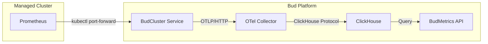

# OpenTelemetry Metrics Collection System

## Overview

The budcluster service now uses OpenTelemetry Collector to collect metrics from managed Kubernetes clusters and store them in ClickHouse for analysis. This replaces the previous Mimir-based system.

## Architecture



## Components

### 1. OTel Bridge (budcluster)
- Located in `budcluster/metrics_collector/otel_bridge.py`
- Manages port-forwarding to Prometheus services in clusters
- Scrapes metrics using PromQL queries
- Transforms Prometheus metrics to OTLP format
- Forwards metrics to OTel Collector

### 2. OpenTelemetry Collector
- Deployed as a Kubernetes service in the Bud platform
- Receives metrics via OTLP protocol (HTTP/gRPC)
- Processes metrics with batching and resource enrichment
- Exports metrics to ClickHouse with configurable TTL

### 3. ClickHouse Storage
- Stores time-series metrics data
- Tables created automatically via migration scripts
- Optimized with appropriate compression codecs
- 90-day retention by default

### 4. BudMetrics Query API
- Provides REST API for querying cluster metrics
- Aggregates data across time ranges
- Returns metrics for visualization and analysis

## Configuration

### Environment Variables (budcluster)

**Note:** budcluster does NOT connect to ClickHouse directly. It sends metrics to the OTel Collector, which handles ClickHouse storage.

```env
# Enable/disable metrics collection
METRICS_COLLECTION_ENABLED=true

# OTel Collector endpoint (Kubernetes service) - budcluster sends metrics here
OTEL_COLLECTOR_ENDPOINT=http://bud-otel-collector:4318

# Prometheus configuration (for scraping metrics from managed clusters)
PROMETHEUS_SERVICE_NAME=bud-metrics-kube-prometheu-prometheus
PROMETHEUS_NAMESPACE=bud-system
PROMETHEUS_PORT=9090

# Collection settings
METRICS_COLLECTION_TIMEOUT=30
METRICS_BATCH_SIZE=20000
```

### Helm Values (infra/helm/bud)

**Note:** ClickHouse configuration is for the OTel Collector, not budcluster. The OTel Collector connects to ClickHouse to store metrics.

```yaml
otelCollector:
    enabled: true
    image:
        repository: otel/opentelemetry-collector-contrib
        tag: 0.91.0
    replicas: 1
    resources:
        limits:
            memory: 2Gi
            cpu: 1000m
    clickhouse:
        host: "{{ $.Release.Name }}-clickhouse"
        port: 9000
        database: metrics
        ttl: 90d
```

## Metrics Collection Process

1. **Scheduled Collection**: Dapr cron binding triggers collection every 5 minutes
2. **Port-Forward Setup**: Establishes secure connection to cluster's Prometheus
3. **Query Execution**: Runs standard PromQL queries for node, pod, and GPU metrics
4. **Data Transformation**: Converts Prometheus format to OpenTelemetry format
5. **Batch Sending**: Sends metrics to OTel Collector in batches
6. **Storage**: OTel Collector writes metrics to ClickHouse

## Standard Metrics Collected

### Node Metrics
- `node_cpu_seconds_total` - CPU usage
- `node_memory_MemAvailable_bytes` - Available memory
- `node_memory_MemTotal_bytes` - Total memory
- `node_filesystem_avail_bytes` - Available disk space
- `node_load1`, `node_load5`, `node_load15` - System load

### Pod/Container Metrics
- `kube_pod_container_resource_requests` - Resource requests
- `kube_pod_container_resource_limits` - Resource limits
- `kube_pod_container_status_restarts_total` - Container restarts
- `container_cpu_usage_seconds_total` - Container CPU usage
- `container_memory_usage_bytes` - Container memory usage

### GPU Metrics (if available)
- `DCGM_FI_DEV_GPU_UTIL` - GPU utilization
- `DCGM_FI_DEV_FB_FREE` - Free GPU memory
- `DCGM_FI_DEV_FB_USED` - Used GPU memory
- `DCGM_FI_DEV_GPU_TEMP` - GPU temperature
- `DCGM_FI_DEV_POWER_USAGE` - Power consumption

## API Endpoints (budmetrics)

### Query Cluster Metrics
```
POST /cluster-metrics/query
{
    "cluster_id": "uuid",
    "metric_name": "node_cpu_seconds_total",
    "start_time": "2024-01-01T00:00:00Z",
    "end_time": "2024-01-02T00:00:00Z",
    "aggregation": "avg"
}
```

### Get Cluster Health
```
GET /cluster-metrics/{cluster_id}/health
```

### Get Resource Summary
```
GET /cluster-metrics/{cluster_id}/summary
```

## Deployment

### 1. Deploy with Helm
```bash
# Update Helm dependencies
helm dependency update infra/helm/bud/

# Install or upgrade
helm upgrade --install bud infra/helm/bud/ \
  --set otelCollector.enabled=true \
  --set clickhouse.enabled=true
```

### 2. Run ClickHouse Migrations
```bash
cd services/budmetrics
python scripts/migrate_clickhouse.py
```

### 3. Verify OTel Collector
```bash
# Check if OTel Collector is running
kubectl get pods | grep otel-collector

# Check logs
kubectl logs -f deployment/bud-otel-collector
```

### 4. Test Metrics Collection
```bash
# Trigger manual collection
curl -X POST http://budcluster:9081/metrics/collect-all

# Check collection status
curl http://budcluster:9081/metrics/status
```

## Troubleshooting

### Port-Forward Issues
- Check if Prometheus service name is correct
- Verify cluster kubeconfig is valid
- Check `VALIDATE_CERTS` setting for self-signed certificates

### OTel Collector Connection
- Ensure OTel Collector pod is running
- Check service endpoint is accessible
- Verify network policies allow communication

### ClickHouse Storage
- Confirm ClickHouse is running and accessible
- Check database and tables exist
- Verify user permissions

### Debug Logging
Enable debug logging in OTel Collector:
```yaml
otelCollector:
    debug: true
    logLevel: debug
```

## Migration from Mimir

The system has been migrated from Mimir to ClickHouse for the following benefits:
- Unified analytics platform (already used for AI inference metrics)
- Better compression and query performance for time-series data
- More flexible data retention policies
- Direct SQL access for complex queries

## Security Considerations

1. **Encryption**: All cluster credentials are encrypted using RSA/AES
2. **TLS Verification**: Can be disabled for development with `VALIDATE_CERTS=false`
3. **Network Isolation**: Port-forwards are cluster-specific and isolated
4. **Access Control**: ClickHouse credentials should be properly secured

## Performance Tuning

### OTel Collector
- Adjust `batchSize` for throughput
- Configure `memoryLimit` based on load
- Use multiple replicas for high availability

### ClickHouse
- Optimize partition keys for query patterns
- Configure appropriate TTL for data retention
- Use materialized views for common aggregations

### Collection Frequency
- Default: 5 minutes (configured in Dapr cron binding)
- Adjust based on monitoring requirements and cluster load
