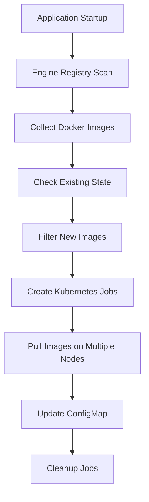

# Engine Preloading in BudEval

This document describes the engine preloading system in BudEval, which automatically downloads and caches evaluation engine Docker images during application startup for faster evaluation job execution.

## Overview

The engine preloading system ensures that Docker images for all registered evaluation engines are available on cluster nodes before evaluation jobs are submitted. This eliminates the image pull time during job execution, significantly reducing the time to start evaluations.

**Compatible with all Kubernetes distributions including K3s (containerd) and standard Kubernetes (Docker).**

## Key Features

- **Automatic Preloading**: Engines are preloaded during application startup
- **Background Processing**: Preloading doesn't block API requests
- **Smart Caching**: Only preloads engines that haven't been cached yet
- **Cluster-wide Coverage**: Uses Kubernetes Jobs to preload images on multiple nodes
- **Runtime Agnostic**: Works with containerd (K3s), Docker, and other container runtimes
- **Status Tracking**: Maintains state via Kubernetes ConfigMap
- **Manual Control**: API endpoints for manual preloading operations

## Architecture

### Components

1. **EnginePreloader** (`budeval/evals/engine_preloader.py`)
   - Main orchestrator for engine preloading operations
   - Manages preloading state and coordinates with Ansible

2. **Ansible Playbook** (`budeval/ansible/playbooks/preload_eval_engines.yml`)
   - Handles Kubernetes operations for image preloading
   - Creates Kubernetes Jobs to pull images across cluster nodes

3. **Engine Registry Integration**
   - Automatically discovers registered engines and their Docker images
   - Uses metadata from `budeval/registry/engines/`

4. **Status Management**
   - Tracks preloaded engines in Kubernetes ConfigMap
   - Provides runtime status through class methods

### Preloading Process



### Kubernetes-Native Approach

The system uses **Kubernetes Jobs** instead of Docker-in-Docker to ensure compatibility with all container runtimes:

- **K3s (containerd)**: Jobs run natively with containerd runtime
- **Standard Kubernetes (Docker)**: Jobs run with Docker runtime
- **Other runtimes**: Compatible with any OCI-compliant runtime

Each engine image is pulled by creating a Job that:
1. Uses the target engine image as the container image
2. Runs with `imagePullPolicy: Always` to ensure fresh pulls
3. Executes on multiple nodes via `parallelism` setting
4. Automatically cleans up after completion

## Configuration

Engine preloading is automatically configured based on the engines registered in the system. No additional configuration is required.

### Engine Registration

Engines are registered using the `@EngineRegistry.register` decorator:

```python
@EngineRegistry.register(EngineMetadata(
    name="OpenCompass",
    version="0.4.2",
    docker_image_url="docker.io/budstudio/opencompass:latest",
    # ... other metadata
))
class OpenCompassEngine:
    # Engine implementation
```

The `docker_image_url` field is used for preloading.

## Usage

### Automatic Startup Preloading

Engine preloading happens automatically during application startup:

```python
# In budeval/main.py
@app.on_event("startup")
async def startup_event():
    # Volume initialization
    volume_task = asyncio.create_task(volume_init.ensure_eval_datasets_volume())

    # Engine preloading
    engine_task = asyncio.create_task(engine_preloader.preload_all_engines())
```

### Manual API Operations

#### Preload All Engines
```bash
curl -X POST http://localhost:8099/evals/preload-engines
```

#### Preload Specific Engines
```bash
curl -X POST http://localhost:8099/evals/preload-engines \
  -H "Content-Type: application/json" \
  -d '{"engine_names": ["OpenCompass"]}'
```

#### Check Engine Status
```bash
curl http://localhost:8099/evals/engine-status
```

Response:
```json
{
  "initialized": true,
  "total_engines": 1,
  "preloaded_count": 1,
  "engines": {
    "opencompass": {
      "preloaded": true,
      "docker_image": "docker.io/budstudio/opencompass:latest",
      "version": "0.4.2",
      "description": "OpenCompass is an LLM evaluation platform..."
    }
  }
}
```

### Command Line Tools

#### Quick Status Check
```bash
./engine-status
```

#### Detailed Status Check
```bash
python check_engine_status.py
```

#### Check Image Availability (slower)
```bash
python check_engine_status.py --check-images
```

## Kubernetes Resources

### ConfigMap: preloaded-engines

Stores the state of preloaded engines:

```yaml
apiVersion: v1
kind: ConfigMap
metadata:
  name: preloaded-engines
  namespace: budeval
data:
  engines: |
    {
      "opencompass": {
        "image": "docker.io/budstudio/opencompass:latest,
        "version": "0.4.2",
        "preloaded_at": "2024-01-01T12:00:00Z",
        "method": "kubernetes-jobs"
      }
    }
  last_updated: "2024-01-01T12:00:00Z"
  preload_method: "kubernetes-jobs"
```

### Jobs: preload-{engine-name} (Temporary)

Created during preloading operations to pull images on cluster nodes:

```yaml
apiVersion: batch/v1
kind: Job
metadata:
  name: preload-opencompass
  namespace: budeval
spec:
  parallelism: 3  # Run on multiple nodes
  completions: 3
  backoffLimit: 2
  ttlSecondsAfterFinished: 300
  template:
    spec:
      containers:
      - name: image-puller
        image: docker.io/budstudio/opencompass:latest
        imagePullPolicy: Always
        command: ["/bin/sh", "-c", "echo 'Image cached'; sleep 10"]
      restartPolicy: Never
```

### DaemonSet: engine-preloader (Coordinator)

A lightweight coordinator that runs on all nodes during preloading:

```yaml
apiVersion: apps/v1
kind: DaemonSet
metadata:
  name: engine-preloader
  namespace: budeval
spec:
  template:
    spec:
      containers:
      - name: image-preloader
        image: busybox:1.35
        # Lightweight coordinator - actual pulls done by Jobs
```

## Benefits

### Performance Improvements

- **Faster Job Startup**: Eliminates container image pull time during job execution
- **Predictable Performance**: No variation in startup time due to image pulls
- **Reduced Network Load**: Images pulled once during startup vs. every job

### Resource Efficiency

- **Cluster-wide Caching**: Images available on multiple nodes
- **Smart Updates**: Only pulls new or changed images
- **Background Operation**: Doesn't impact user-facing operations
- **Runtime Agnostic**: Works with any Kubernetes-compatible container runtime

### K3s Compatibility

- **Native containerd Support**: No Docker-in-Docker required
- **Lightweight**: Minimal resource overhead
- **Edge-friendly**: Works in resource-constrained environments

## Monitoring and Troubleshooting

### Check Preloading Status

```bash
# Quick check
./engine-status

# Detailed check
python check_engine_status.py

# Kubernetes resources
kubectl get configmap preloaded-engines -n budeval
kubectl get jobs -n budeval -l purpose=image-preloader
```

### Common Issues

#### 1. Images Not Preloaded

**Symptoms**: Engine status shows `preloaded: false`

**Solutions**:
- Check if application startup completed
- Manually trigger preloading: `POST /evals/preload-engines`
- Check Kubernetes cluster connectivity
- Verify engine registration and Docker image URLs

#### 2. Jobs Failing

**Symptoms**: Preload jobs show Failed status

**Solutions**:
```bash
# Check job status
kubectl get jobs -n budeval -l purpose=image-preloader

# Check job logs
kubectl logs -n budeval -l purpose=image-preloader

# Check specific job
kubectl describe job preload-opencompass -n budeval
```

#### 3. Image Pull Failures

**Symptoms**: Job logs show image pull errors

**Solutions**:
- Verify container image URLs are accessible
- Check cluster's image pull secrets if using private registries
- Verify network connectivity from cluster to image registry
- For K3s: Ensure containerd can access the registry

#### 4. K3s Specific Issues

**Symptoms**: Jobs work but images not cached

**Solutions**:
```bash
# Check containerd image cache
sudo k3s crictl images | grep opencompass

# Check containerd status
sudo systemctl status k3s

# Verify node resources
kubectl describe nodes
```

### Application Logs

Check for engine preloading activity:

```bash
# Check startup logs
grep -i "engine.*preload" /home/ubuntu/bud-serve-eval/logs/app.log

# Check Dapr logs
tail -f /home/ubuntu/bud-serve-eval/.dapr/logs/budeval_app_*.log | grep -i engine
```

## Integration with Evaluation Jobs

Engine preloading integrates seamlessly with the existing job execution system:

1. **Job Submission**: When a job is submitted, the system checks if the required engine is preloaded
2. **Fast Startup**: If preloaded, the job pod starts immediately without image pull delay
3. **Fallback**: If not preloaded, Kubernetes pulls the image as usual (with delay)

### Job Performance Comparison

| Scenario | Image Pull Time | Job Startup Time | Total Time |
|----------|----------------|------------------|------------|
| **Without Preloading** | 30-120s | 10-30s | 40-150s |
| **With Preloading** | 0s | 10-30s | 10-30s |

*Times vary based on image size, network speed, and cluster configuration*

### Runtime Compatibility

| Container Runtime | Support | Notes |
|------------------|---------|-------|
| **containerd (K3s)** | ✅ Full | Native support, no special configuration |
| **Docker** | ✅ Full | Standard Kubernetes Docker runtime |
| **CRI-O** | ✅ Full | OCI-compliant runtime support |
| **Other OCI runtimes** | ✅ Expected | Should work with any OCI-compliant runtime |

## Future Enhancements

### Planned Features

1. **Image Versioning**: Track and manage multiple versions of engine images
2. **Selective Node Preloading**: Preload images only on specific node pools
3. **Image Size Optimization**: Compress or optimize images for faster transfer
4. **Registry Mirroring**: Use local registry mirrors for faster pulls
5. **Preload Scheduling**: Schedule preloading during low-usage periods

### Advanced Configuration

Future versions may support:

```yaml
# Example future configuration
engine_preloading:
  enabled: true
  strategy: "kubernetes-jobs"  # or "daemonset"
  parallelism: 3  # Number of nodes to preload simultaneously
  node_selector:
    workload: "evaluation"
  schedule: "0 2 * * *"  # Cron schedule for updates
  retention: "7d"        # Keep images for 7 days
  runtime_detection: true  # Auto-detect container runtime
```

## API Reference

### Endpoints

| Method | Endpoint | Description |
|--------|----------|-------------|
| `POST` | `/evals/preload-engines` | Preload all or specific engines |
| `GET` | `/evals/engine-status` | Get engine preloading status |
| `POST` | `/evals/start` | Start evaluation (with engine preloading check) |

### Response Schemas

#### Engine Status Response
```json
{
  "initialized": boolean,
  "total_engines": number,
  "preloaded_count": number,
  "engines": {
    "engine_name": {
      "preloaded": boolean,
      "docker_image": string,
      "version": string,
      "description": string
    }
  }
}
```

#### Preload Response
```json
{
  "status": "success",
  "message": string,
  "preloaded_engines": [string]
}
```

## Best Practices

1. **Monitor Preloading**: Regularly check engine status to ensure images are current
2. **Update Images**: Re-run preloading when engine images are updated
3. **Resource Planning**: Account for image sizes when planning cluster storage
4. **Network Considerations**: Ensure sufficient bandwidth for image pulls
5. **Security**: Verify image sources and use image scanning tools
6. **K3s Optimization**: Consider using local registry for air-gapped environments

## Conclusion

Engine preloading significantly improves the user experience by reducing evaluation job startup times. The Kubernetes-native approach ensures compatibility with all container runtimes including K3s (containerd), making it suitable for edge deployments and traditional Kubernetes clusters alike. The system is designed to be automatic and maintenance-free while providing manual controls for advanced use cases.
