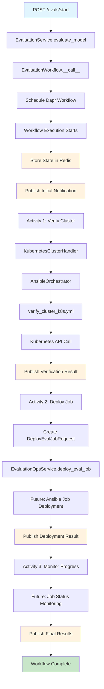

I'll analyze the codebase to understand what happens when the start endpoint is hit and document the entire flow. Let me start by examining the routes and services.

Now let me examine the workflows and services more closely to understand the complete flow:

Now let me examine the registry engines to understand how OpenCompass is integrated:

Now I have a comprehensive understanding of the system. Let me create a detailed documentation of what happens when the `/evals/start` endpoint is hit.

# 📋 Complete Documentation: What Happens When You Hit the `/evals/start` Endpoint

## 🎯 Overview

When you hit the `/evals/start` endpoint, you trigger a sophisticated **model evaluation workflow** that leverages **Dapr workflows**, **Kubernetes orchestration**, **Ansible automation**, and **real-time monitoring**. This document provides a comprehensive breakdown of the entire flow, from the initial API call to job completion.

---

## 🚀 1. API Entry Point

### **Endpoint**: `POST /evals/start`

**Location**: ```27:46:budeval/evals/routes.py```

```python
@evals_routes.post("/start")
async def start_eval(request: EvaluationRequest):
    """Start an evaluation."""
    try:
        response = await EvaluationService().evaluate_model(request)
        return response
    except Exception as e:
        raise HTTPException(status_code=500, detail=f"Failed to save evaluation request: {str(e)}") from e
```

### **Expected Payload**:

```json
{
  "eval_request_id": "123e4567-e89b-12d3-a456-426614174000",
  "model_name": "gpt-4",
  "api_key": "sk-...",
  "base_url": "https://api.openai.com/v1",
  "kubeconfig": "<Kubernetes config JSON content>",
  "source": "client_app",
  "source_topic": "budSimMessages"
}
```

---

## 🔄 2. Service Layer Processing

### **EvaluationService.evaluate_model()**

**Location**: ```32:57:budeval/evals/services.py```

```python
async def evaluate_model(self, evaluate_model_request: StartEvaluationRequest) -> Union[WorkflowMetadataResponse, ErrorResponse]:
    """Evaluate model by triggering Dapr workflow."""
    logger.info(f"Model Evaluation Started for workflow_id: {evaluate_model_request.model_name}")

    from .workflows import EvaluationWorkflow

    try:
        response = await EvaluationWorkflow().__call__(evaluate_model_request)
    except Exception as e:
        logger.error(f"Error evaluating model: {e}", exc_info=True)
        raise ErrorResponse(message=f"Error evaluating model: {e}") from e
    return response
```

**What happens here:**
- Logs the start of model evaluation
- Instantiates the `EvaluationWorkflow` class
- Calls the workflow's `__call__` method
- Handles any exceptions and converts them to `ErrorResponse`

---

## ⚙️ 3. Dapr Workflow Orchestration

### **EvaluationWorkflow.__call__()**

**Location**: ```364:403:budeval/evals/workflows.py```

```python
async def __call__(self, request: StartEvaluationRequest, workflow_id: Optional[str] = None) -> Union[WorkflowMetadataResponse, ErrorResponse]:
    """Evaluate a model with the given name."""
    workflow_id = str(workflow_id or uuid.uuid4())

    workflow_steps = [
        WorkflowStep(id="verify_cluster_connection", title="Verifying Cluster Connection", description="Verify if the cluster is reachable"),
        WorkflowStep(id="deploy_eval_job", title="Deploying Evaluation Job", description="Deploy the evaluation job to the cluster"),
        WorkflowStep(id="monitor_eval_job_progress", title="Monitoring Evaluation Job Progress", description="Monitor the progress of the evaluation job"),
    ]

    eta = 30 * 5  # 150 seconds estimate

    # Schedule the workflow
    response = await dapr_workflows.schedule_workflow(
        workflow_name="evaluate_model",
        workflow_input=request.model_dump_json(),
        workflow_id=workflow_id,
        workflow_steps=workflow_steps,
        eta=eta,
        target_topic_name=request.source_topic,
        target_name=request.source,
    )

    return response
```

**What happens here:**
- Generates a unique workflow ID
- Defines the workflow steps (3 main phases)
- Sets an estimated time of completion (150 seconds)
- Schedules the Dapr workflow with all metadata
- Returns workflow metadata response

---

## 🔧 4. Dapr Workflow Execution

### **Main Workflow: `evaluate_model`**

**Location**: ```148:362:budeval/evals/workflows.py```

The workflow executes in the following sequence:

#### **Phase 1: Initialization & State Management**

```python
# Parse the request
evaluate_model_request_json = StartEvaluationRequest.model_validate_json(evaluate_model_request)

# Set workflow data in state store
update_workflow_data_in_statestore(instance_id, {
    "model_name": evaluate_model_request_json.model_name,
    "eval_request_id": str(evaluate_model_request_json.eval_request_id),
    "api_key": evaluate_model_request_json.api_key,
    "base_url": evaluate_model_request_json.base_url,
    "kubeconfig": evaluate_model_request_json.kubeconfig,
})
```

**What happens:**
- Parses and validates the incoming JSON request
- Stores workflow data in **Redis state store** via Dapr
- Creates a persistent record of the workflow execution

#### **Phase 2: Real-time Notifications Setup**

```python
# Notification Request
notification_request = NotificationRequest.from_cloud_event(
    cloud_event=evaluate_model_request_json, name=workflow_name, workflow_id=instance_id
)

# Publish initial notification
notification_req.payload.event = "evaluation_status"
notification_req.payload.content = NotificationContent(
    title="Model evaluation process is initiated",
    message=f"Model evaluation process is initiated for {evaluate_model_request_json.model_name}",
    status=WorkflowStatus.STARTED,
)

dapr_workflows.publish_notification(
    workflow_id=instance_id,
    notification=notification_req,
    target_topic_name=evaluate_model_request_json.source_topic,
    target_name=evaluate_model_request_json.source,
)
```

**What happens:**
- Creates notification requests based on CloudEvent schema
- Publishes initial status notification via **Dapr Pub/Sub**
- Uses **Redis** as the message broker
- Sends notifications to the `budSimMessages` topic

---

## 🔍 5. Workflow Activities Execution

### **Activity 1: Cluster Connection Verification**

**Location**: ```99:144:budeval/evals/workflows.py```

```python
@dapr_workflows.register_activity
@staticmethod
def verify_cluster_connection(ctx: wf.WorkflowActivityContext, verify_cluster_connection_request: str) -> dict:
    """Verify the cluster connection."""

    workflow_id = ctx.workflow_id
    task_id = ctx.task_id

    verify_cluster_connection_request_json = StartEvaluationRequest.model_validate_json(verify_cluster_connection_request)

    try:
        cluster_verified = asyncio.run(
            EvaluationOpsService.verify_cluster_connection(
                verify_cluster_connection_request_json, task_id, workflow_id
            )
        )

        if cluster_verified:
            response = SuccessResponse(message="Cluster connection verified successfully", param={"cluster_verified": cluster_verified})
        else:
            response = ErrorResponse(message="Cluster connection verification failed", code=HTTPStatus.BAD_REQUEST.value)
    except Exception as e:
        response = ErrorResponse(message="Cluster connection verification failed", code=HTTPStatus.BAD_REQUEST.value)

    return response.model_dump(mode="json")
```

#### **Kubernetes Cluster Handler**

**Location**: ```12:21:budeval/evals/kubernetes.py```

```python
def verify_cluster_connection(self, kubeconfig: str) -> bool:
    """Verify cluster connection."""
    try:
        logger.info(f"Verifying cluster connection for kubeconfig: {kubeconfig}")
        ansible_runner = AnsibleOrchestrator()
        return ansible_runner.verify_cluster_connection(kubeconfig)
    except Exception as e:
        logger.error(f"Error verifying cluster connection: {e}")
        return False
```

#### **Ansible Orchestrator**

**Location**: ```35:56:budeval/registry/orchestrator/ansible_orchestrator.py```

```python
def verify_cluster_connection(self, kubeconfig: str) -> bool:
    """Verify cluster connection using an Ansible playbook via a kubeconfig in JSON form."""
    temp_id = f"verify-{uuid.uuid4().hex}"
    playbook = "verify_cluster_k8s.yml"

    # 1) Parse the incoming JSON string into a Python dict
    kubeconfig_dict = json.loads(kubeconfig)

    # 2) Dump that dict out as YAML
    kubeconfig_yaml = yaml.safe_dump(kubeconfig_dict, sort_keys=False, default_flow_style=False)

    files = {f"{temp_id}_kubeconfig.yaml": kubeconfig_yaml}
    extravars = {"kubeconfig_path": f"{temp_id}_kubeconfig.yaml"}

    try:
        self._run_ansible_playbook(playbook, temp_id, files, extravars)
        logger.info("::: EVAL Ansible ::: Ansible-based cluster verification succeeded for %s", temp_id)
        return True
    except Exception as e:
        logger.error("::: EVAL Ansible ::: Ansible-based cluster verification failed: %s", e, exc_info=True)
        return False
```

#### **Ansible Playbook Execution**

**Location**: ```1:21:budeval/ansible/playbooks/verify_cluster_k8s.yml```

```yaml
---
- name: Verify Kubernetes cluster connectivity
  hosts: localhost
  connection: local
  gather_facts: no
  collections:
    - community.kubernetes

  tasks:
    - name: List Kubernetes namespaces to verify connectivity
      community.kubernetes.k8s_info:
        kind: Namespace
        kubeconfig: "{{ kubeconfig_path }}"
      register: ns

    - name: Assert that namespaces were listed successfully
      assert:
        that:
          - ns.resources is defined
        fail_msg: "Failed to connect to Kubernetes cluster: unable to list namespaces"
```

**What happens in this phase:**
1. **Dapr Activity** receives the cluster verification request
2. **Kubernetes Handler** delegates to Ansible orchestrator
3. **Ansible Orchestrator** converts JSON kubeconfig to YAML
4. **Ansible Playbook** executes to verify cluster connectivity by listing namespaces
5. **Success/Failure** is propagated back through the chain
6. **Notification** is published about verification status

---

### **Activity 2: Deploy Evaluation Job**

**Location**: ```46:97:budeval/evals/workflows.py```

```python
@dapr_workflows.register_activity
@staticmethod
def deploy_eval_job(ctx: wf.WorkflowActivityContext, evaluate_model_request: str) -> dict:
    """Deploy the evaluation job."""

    workflow_id = ctx.workflow_id
    task_id = ctx.task_id

    evaluate_model_request_json = StartEvaluationRequest.model_validate_json(evaluate_model_request)
    payload = DeployEvalJobRequest(
       engine="OpenCompass",
       eval_request_id=str(evaluate_model_request_json.eval_request_id),
       api_key=evaluate_model_request_json.api_key,
       base_url=evaluate_model_request_json.base_url,
       kubeconfig=evaluate_model_request_json.kubeconfig,
       dataset=["dataset1"] #TODO: Make this from the request
    )

    try:
        job_details = asyncio.run(
            EvaluationOpsService.deploy_eval_job(payload, task_id, workflow_id)
        )

        response = SuccessResponse(
            message="Evaluation job deployed successfully",
            param=dict(job_details)
        )
    except Exception as e:
        response = ErrorResponse(
            message="Error deploying evaluation job",
            code=HTTPStatus.INTERNAL_SERVER_ERROR.value
        )
    return response.model_dump(mode="json")
```

**What happens in this phase:**
1. **Creates DeployEvalJobRequest** with OpenCompass engine configuration
2. **Calls EvaluationOpsService.deploy_eval_job()** (currently returns dummy data)
3. **Future Implementation** will:
   - Use Ansible to deploy Kubernetes Job
   - Configure OpenCompass Docker container
   - Set up evaluation datasets
   - Deploy to target cluster

---

## 📊 6. Monitoring & Observability

### **Structured Logging**

**Location**: ```1:60:budeval/commons/logging.py```

The system uses **Structlog** for structured logging with the following configuration:

```python
structlog.configure(
    processors=[
        structlog.contextvars.merge_contextvars,
        structlog.stdlib.filter_by_level,
        structlog.processors.TimeStamper(fmt="iso"),
        structlog.stdlib.add_logger_name,
        structlog.stdlib.add_log_level,
        structlog.stdlib.PositionalArgumentsFormatter(),
        structlog.processors.StackInfoRenderer(),
        structlog.processors.format_exc_info,
        structlog.processors.UnicodeDecoder(),
        structlog.stdlib.ProcessorFormatter.wrap_for_formatter,
    ],
    logger_factory=structlog.stdlib.LoggerFactory(),
    cache_logger_on_first_use=True,
)
```

### **Dapr Observability**

**Location**: ```1:18:.dapr/appconfig-dev.yaml```

```yaml
apiVersion: dapr.io/v1alpha1
kind: Configuration
metadata:
  name: appconfig
  namespace: development
spec:
  tracing:
    samplingRate: "1"
    stdout: true
  features:
    - name: SchedulerReminders
      enabled: true
```

**Monitoring Features:**
- **Distributed Tracing**: 100% sampling rate with stdout output
- **Workflow State Tracking**: Redis-based state store for workflow persistence
- **Real-time Notifications**: Pub/Sub notifications for workflow progress
- **Structured Logging**: ISO timestamp, log levels, and contextual information

---

## 🔔 7. Real-time Notification System

### **Pub/Sub Configuration**

**Location**: ```1:26:.dapr/components/pubsub-redis.yaml```

```yaml
apiVersion: dapr.io/v1alpha1
kind: Component
metadata:
  name: pubsub-redis
  namespace: development
spec:
  type: pubsub.redis
  version: v1
  metadata:
    - name: redisHost
      secretKeyRef:
        name: REDIS_URI
        key: REDIS_URI
    - name: redisPassword
      secretKeyRef:
        name: REDIS_PASSWORD
        key: REDIS_PASSWORD
    - name: consumerID
      value: "{appID}"
    - name: concurrency
      value: "10"
```

### **Subscription Configuration**

**Location**: ```1:13:.dapr/components/subscriptions.yaml```

```yaml
apiVersion: dapr.io/v2alpha1
kind: Subscription
metadata:
  name: pubsub-subscription
  namespace: development
spec:
  topic: budSimMessages
  routes:
    default: /notifications
  pubsubname: pubsub-redis
  deadLetterTopic: poisonMessages
```

### **Notification Flow**

Throughout the workflow, notifications are published for:

1. **Workflow Started**: Initial evaluation process initiation
2. **ETA Updates**: Estimated time to completion (initially 100 minutes, then 20 minutes)
3. **Cluster Verification**: Success/failure of cluster connection
4. **Job Deployment**: Success/failure of evaluation job deployment
5. **Final Results**: Completion status and results
6. **Error Handling**: Any failures during the process

**Notification Payload Example:**

```json
{
  "workflow_id": "uuid-here",
  "payload": {
    "event": "evaluation_status",
    "content": {
      "title": "Model evaluation process is initiated",
      "message": "Model evaluation process is initiated for gpt-4",
      "status": "STARTED",
      "result": null
    }
  },
  "target_topic_name": "budSimMessages",
  "target_name": "client_app"
}
```

---

## 🏗️ 8. Engine Registry & Community Integration

### **OpenCompass Engine**

**Location**: ```1:82:budeval/registry/engines/opencompass.py```

```python
@EngineRegistry.register(EngineMetadata(
    name="OpenCompass",
    version="0.4.2",
    description="OpenCompass is an LLM evaluation platform, supporting a wide range of models over 100+ datasets",
    author="OpenCompass Contributors",
    docker_image_url="ghcr.io/open-compass/opencompass:0.4.2",
    tags=["llm", "evaluation", "benchmark", "open-source"],
    config_schema={
        "required": ["model_path", "datasets"],
        "properties": {
            "model_path": {"type": "string", "description": "Path to the model or model name"},
            "datasets": {"type": "array", "items": {"type": "string"}, "description": "List of datasets to evaluate on"},
            "max_num_workers": {"type": "integer", "description": "Maximum number of workers for parallel evaluation"},
            "inference_backend": {"type": "string", "enum": ["huggingface", "lmdeploy", "vllm"], "default": "huggingface"}
        }
    }
))
class OpenCompassEngine:
    """OpenCompass engine for LLM evaluation and benchmarking."""
```

**Community Integration:**
- **Engine Registry**: Pluggable architecture for different evaluation engines
- **Docker Images**: Uses community-maintained Docker images (`ghcr.io/open-compass/opencompass:0.4.2`)
- **Open Source**: Leverages open-source evaluation frameworks
- **Standardized Interface**: Common interface for all evaluation engines

---

## 🚀 9. Job Deployment Architecture

### **Future Kubernetes Job Deployment**

When fully implemented, the job deployment will:

1. **Generate Kubernetes Job YAML**:
```yaml
apiVersion: batch/v1
kind: Job
metadata:
  name: {uuid}
  namespace: budeval
spec:
  ttlSecondsAfterFinished: 600
  template:
    spec:
      containers:
        - name: engine
          image: ghcr.io/open-compass/opencompass:0.4.2
          env:
            - name: ENGINE_ARGS
              value: '{"model_path": "gpt-4", "datasets": ["dataset1"], "api_key": "sk-...", "base_url": "https://api.openai.com/v1"}'
      restartPolicy: Never
  backoffLimit: 1
```

2. **Deploy via Ansible**:
   - Use `submit_job_k8s.yml` playbook
   - Apply the Job to the target cluster
   - Monitor job status and logs

3. **Job Monitoring**:
   - Track job completion status
   - Collect evaluation results
   - Handle job failures and retries

---

## 📈 10. State Management & Persistence

### **Redis State Store**

**Location**: ```1:23:.dapr/components/statestore.yaml```

```yaml
apiVersion: dapr.io/v1alpha1
kind: Component
metadata:
  name: statestore
  namespace: development
spec:
  type: state.redis
  version: v1
  metadata:
    - name: redisHost
      secretKeyRef:
        name: REDIS_URI
        key: REDIS_URI
    - name: redisPassword
      secretKeyRef:
        name: REDIS_PASSWORD
        key: REDIS_PASSWORD
    - name: actorStateStore
      value: "true"
```

**State Management Features:**
- **Workflow Persistence**: All workflow data stored in Redis
- **State Recovery**: Workflows can be resumed after failures
- **Actor Support**: Enables stateful actor patterns
- **Distributed State**: Shared state across multiple service instances

---

## 🔄 11. Complete Flow Summary



---

## 🎯 12. Key Technologies & Integration Points

| Component | Technology | Purpose |
|-----------|------------|---------|
| **API Layer** | FastAPI | REST API endpoints |
| **Workflow Engine** | Dapr Workflows | Orchestration and state management |
| **State Store** | Redis (via Dapr) | Workflow persistence and state |
| **Pub/Sub** | Redis (via Dapr) | Real-time notifications |
| **Orchestration** | Ansible | Infrastructure automation |
| **Container Platform** | Kubernetes | Job execution environment |
| **Evaluation Engine** | OpenCompass | LLM evaluation framework |
| **Logging** | Structlog | Structured logging |
| **Monitoring** | Dapr Tracing | Distributed tracing |
| **Configuration** | Dapr Config Store | Centralized configuration |
| **Secrets** | Dapr Secret Store | Secure credential management |

---

## 🔍 13. Monitoring & Debugging

### **Log Levels & Debugging**

```bash
# Set log level via environment variable
export LOG_LEVEL=DEBUG

# View structured logs
docker logs <container_name> | jq '.'
```

### **Workflow Status Tracking**

```python
# Check workflow status in state store
workflow_status = check_workflow_status_in_statestore(instance_id)

# Update workflow data
update_workflow_data_in_statestore(instance_id, data)
```

### **Dapr Dashboard**

Access Dapr dashboard for:
- Workflow execution status
- Component health
- Pub/Sub message flow
- State store contents

---

## 🚨 14. Error Handling & Resilience

### **Retry Policies**

```python
retry_policy = wf.RetryPolicy(
    first_retry_interval=timedelta(seconds=1),
    max_number_of_attempts=1,
    backoff_coefficient=1,
    max_retry_interval=timedelta(seconds=10),
    retry_timeout=timedelta(seconds=100),
)
```

### **Error Propagation**

1. **Activity Failures**: Captured and returned as ErrorResponse
2. **Workflow Failures**: Logged and published as notifications
3. **Infrastructure Failures**: Handled by Ansible error handling
4. **API Failures**: Converted to HTTP exceptions

### **Dead Letter Queues**

```yaml
spec:
  topic: budSimMessages
  deadLetterTopic: poisonMessages
```

Failed messages are routed to `poisonMessages` topic for manual inspection.

---

This comprehensive documentation covers the entire flow from API call to job completion, including all the underlying technologies, monitoring, and integration points. The system demonstrates a sophisticated microservices architecture leveraging modern cloud-native patterns and tools.

```python
@evals_routes.post("/start")
async def start_eval(request: EvaluationRequest):
    """Start an evaluation."""
    try:
        response = await EvaluationService().evaluate_model(request)
        return response
    except Exception as e:
        raise HTTPException(status_code=500, detail=f"Failed to save evaluation request: {str(e)}") from e
```

```json
{
  "eval_request_id": "123e4567-e89b-12d3-a456-426614174000",
  "model_name": "gpt-4",
  "api_key": "sk-...",
  "base_url": "https://api.openai.com/v1",
  "kubeconfig": "<Kubernetes config JSON content>",
  "source": "client_app",
  "source_topic": "budSimMessages"
}
```

```python
async def evaluate_model(self, evaluate_model_request: StartEvaluationRequest) -> Union[WorkflowMetadataResponse, ErrorResponse]:
    """Evaluate model by triggering Dapr workflow."""
    logger.info(f"Model Evaluation Started for workflow_id: {evaluate_model_request.model_name}")

    from .workflows import EvaluationWorkflow

    try:
        response = await EvaluationWorkflow().__call__(evaluate_model_request)
    except Exception as e:
        logger.error(f"Error evaluating model: {e}", exc_info=True)
        raise ErrorResponse(message=f"Error evaluating model: {e}") from e
    return response
```

```python
async def __call__(self, request: StartEvaluationRequest, workflow_id: Optional[str] = None) -> Union[WorkflowMetadataResponse, ErrorResponse]:
    """Evaluate a model with the given name."""
    workflow_id = str(workflow_id or uuid.uuid4())

    workflow_steps = [
        WorkflowStep(id="verify_cluster_connection", title="Verifying Cluster Connection", description="Verify if the cluster is reachable"),
        WorkflowStep(id="deploy_eval_job", title="Deploying Evaluation Job", description="Deploy the evaluation job to the cluster"),
        WorkflowStep(id="monitor_eval_job_progress", title="Monitoring Evaluation Job Progress", description="Monitor the progress of the evaluation job"),
    ]

    eta = 30 * 5  # 150 seconds estimate

    # Schedule the workflow
    response = await dapr_workflows.schedule_workflow(
        workflow_name="evaluate_model",
        workflow_input=request.model_dump_json(),
        workflow_id=workflow_id,
        workflow_steps=workflow_steps,
        eta=eta,
        target_topic_name=request.source_topic,
        target_name=request.source,
    )

    return response
```

```python
# Parse the request
evaluate_model_request_json = StartEvaluationRequest.model_validate_json(evaluate_model_request)

# Set workflow data in state store
update_workflow_data_in_statestore(instance_id, {
    "model_name": evaluate_model_request_json.model_name,
    "eval_request_id": str(evaluate_model_request_json.eval_request_id),
    "api_key": evaluate_model_request_json.api_key,
    "base_url": evaluate_model_request_json.base_url,
    "kubeconfig": evaluate_model_request_json.kubeconfig,
})
```

```python
# Notification Request
notification_request = NotificationRequest.from_cloud_event(
    cloud_event=evaluate_model_request_json, name=workflow_name, workflow_id=instance_id
)

# Publish initial notification
notification_req.payload.event = "evaluation_status"
notification_req.payload.content = NotificationContent(
    title="Model evaluation process is initiated",
    message=f"Model evaluation process is initiated for {evaluate_model_request_json.model_name}",
    status=WorkflowStatus.STARTED,
)

dapr_workflows.publish_notification(
    workflow_id=instance_id,
    notification=notification_req,
    target_topic_name=evaluate_model_request_json.source_topic,
    target_name=evaluate_model_request_json.source,
)
```

```python
@dapr_workflows.register_activity
@staticmethod
def verify_cluster_connection(ctx: wf.WorkflowActivityContext, verify_cluster_connection_request: str) -> dict:
    """Verify the cluster connection."""

    workflow_id = ctx.workflow_id
    task_id = ctx.task_id

    verify_cluster_connection_request_json = StartEvaluationRequest.model_validate_json(verify_cluster_connection_request)

    try:
        cluster_verified = asyncio.run(
            EvaluationOpsService.verify_cluster_connection(
                verify_cluster_connection_request_json, task_id, workflow_id
            )
        )

        if cluster_verified:
            response = SuccessResponse(message="Cluster connection verified successfully", param={"cluster_verified": cluster_verified})
        else:
            response = ErrorResponse(message="Cluster connection verification failed", code=HTTPStatus.BAD_REQUEST.value)
    except Exception as e:
        response = ErrorResponse(message="Cluster connection verification failed", code=HTTPStatus.BAD_REQUEST.value)

    return response.model_dump(mode="json")
```

```python
def verify_cluster_connection(self, kubeconfig: str) -> bool:
    """Verify cluster connection."""
    try:
        logger.info(f"Verifying cluster connection for kubeconfig: {kubeconfig}")
        ansible_runner = AnsibleOrchestrator()
        return ansible_runner.verify_cluster_connection(kubeconfig)
    except Exception as e:
        logger.error(f"Error verifying cluster connection: {e}")
        return False
```

```python
def verify_cluster_connection(self, kubeconfig: str) -> bool:
    """Verify cluster connection using an Ansible playbook via a kubeconfig in JSON form."""
    temp_id = f"verify-{uuid.uuid4().hex}"
    playbook = "verify_cluster_k8s.yml"

    # 1) Parse the incoming JSON string into a Python dict
    kubeconfig_dict = json.loads(kubeconfig)

    # 2) Dump that dict out as YAML
    kubeconfig_yaml = yaml.safe_dump(kubeconfig_dict, sort_keys=False, default_flow_style=False)

    files = {f"{temp_id}_kubeconfig.yaml": kubeconfig_yaml}
    extravars = {"kubeconfig_path": f"{temp_id}_kubeconfig.yaml"}

    try:
        self._run_ansible_playbook(playbook, temp_id, files, extravars)
        logger.info("::: EVAL Ansible ::: Ansible-based cluster verification succeeded for %s", temp_id)
        return True
    except Exception as e:
        logger.error("::: EVAL Ansible ::: Ansible-based cluster verification failed: %s", e, exc_info=True)
        return False
```

```yaml
---
- name: Verify Kubernetes cluster connectivity
  hosts: localhost
  connection: local
  gather_facts: no
  collections:
    - community.kubernetes

  tasks:
    - name: List Kubernetes namespaces to verify connectivity
      community.kubernetes.k8s_info:
        kind: Namespace
        kubeconfig: "{{ kubeconfig_path }}"
      register: ns

    - name: Assert that namespaces were listed successfully
      assert:
        that:
          - ns.resources is defined
        fail_msg: "Failed to connect to Kubernetes cluster: unable to list namespaces"
```

```python
@dapr_workflows.register_activity
@staticmethod
def deploy_eval_job(ctx: wf.WorkflowActivityContext, evaluate_model_request: str) -> dict:
    """Deploy the evaluation job."""

    workflow_id = ctx.workflow_id
    task_id = ctx.task_id

    evaluate_model_request_json = StartEvaluationRequest.model_validate_json(evaluate_model_request)
    payload = DeployEvalJobRequest(
       engine="OpenCompass",
       eval_request_id=str(evaluate_model_request_json.eval_request_id),
       api_key=evaluate_model_request_json.api_key,
       base_url=evaluate_model_request_json.base_url,
       kubeconfig=evaluate_model_request_json.kubeconfig,
       dataset=["dataset1"] #TODO: Make this from the request
    )

    try:
        job_details = asyncio.run(
            EvaluationOpsService.deploy_eval_job(payload, task_id, workflow_id)
        )

        response = SuccessResponse(
            message="Evaluation job deployed successfully",
            param=dict(job_details)
        )
    except Exception as e:
        response = ErrorResponse(
            message="Error deploying evaluation job",
            code=HTTPStatus.INTERNAL_SERVER_ERROR.value
        )
    return response.model_dump(mode="json")
```

```python
structlog.configure(
    processors=[
        structlog.contextvars.merge_contextvars,
        structlog.stdlib.filter_by_level,
        structlog.processors.TimeStamper(fmt="iso"),
        structlog.stdlib.add_logger_name,
        structlog.stdlib.add_log_level,
        structlog.stdlib.PositionalArgumentsFormatter(),
        structlog.processors.StackInfoRenderer(),
        structlog.processors.format_exc_info,
        structlog.processors.UnicodeDecoder(),
        structlog.stdlib.ProcessorFormatter.wrap_for_formatter,
    ],
    logger_factory=structlog.stdlib.LoggerFactory(),
    cache_logger_on_first_use=True,
)
```

```yaml
apiVersion: dapr.io/v1alpha1
kind: Configuration
metadata:
  name: appconfig
  namespace: development
spec:
  tracing:
    samplingRate: "1"
    stdout: true
  features:
    - name: SchedulerReminders
      enabled: true
```

```yaml
apiVersion: dapr.io/v1alpha1
kind: Component
metadata:
  name: pubsub-redis
  namespace: development
spec:
  type: pubsub.redis
  version: v1
  metadata:
    - name: redisHost
      secretKeyRef:
        name: REDIS_URI
        key: REDIS_URI
    - name: redisPassword
      secretKeyRef:
        name: REDIS_PASSWORD
        key: REDIS_PASSWORD
    - name: consumerID
      value: "{appID}"
    - name: concurrency
      value: "10"
```

```yaml
apiVersion: dapr.io/v2alpha1
kind: Subscription
metadata:
  name: pubsub-subscription
  namespace: development
spec:
  topic: budSimMessages
  routes:
    default: /notifications
  pubsubname: pubsub-redis
  deadLetterTopic: poisonMessages
```

```json
{
  "workflow_id": "uuid-here",
  "payload": {
    "event": "evaluation_status",
    "content": {
      "title": "Model evaluation process is initiated",
      "message": "Model evaluation process is initiated for gpt-4",
      "status": "STARTED",
      "result": null
    }
  },
  "target_topic_name": "budSimMessages",
  "target_name": "client_app"
}
```

```python
@EngineRegistry.register(EngineMetadata(
    name="OpenCompass",
    version="0.4.2",
    description="OpenCompass is an LLM evaluation platform, supporting a wide range of models over 100+ datasets",
    author="OpenCompass Contributors",
    docker_image_url="ghcr.io/open-compass/opencompass:0.4.2",
    tags=["llm", "evaluation", "benchmark", "open-source"],
    config_schema={
        "required": ["model_path", "datasets"],
        "properties": {
            "model_path": {"type": "string", "description": "Path to the model or model name"},
            "datasets": {"type": "array", "items": {"type": "string"}, "description": "List of datasets to evaluate on"},
            "max_num_workers": {"type": "integer", "description": "Maximum number of workers for parallel evaluation"},
            "inference_backend": {"type": "string", "enum": ["huggingface", "lmdeploy", "vllm"], "default": "huggingface"}
        }
    }
))
class OpenCompassEngine:
    """OpenCompass engine for LLM evaluation and benchmarking."""
```

```yaml
apiVersion: batch/v1
kind: Job
metadata:
  name: {uuid}
  namespace: budeval
spec:
  ttlSecondsAfterFinished: 600
  template:
    spec:
      containers:
        - name: engine
          image: ghcr.io/open-compass/opencompass:0.4.2
          env:
            - name: ENGINE_ARGS
              value: '{"model_path": "gpt-4", "datasets": ["dataset1"], "api_key": "sk-...", "base_url": "https://api.openai.com/v1"}'
      restartPolicy: Never
  backoffLimit: 1
```

```yaml
apiVersion: dapr.io/v1alpha1
kind: Component
metadata:
  name: statestore
  namespace: development
spec:
  type: state.redis
  version: v1
  metadata:
    - name: redisHost
      secretKeyRef:
        name: REDIS_URI
        key: REDIS_URI
    - name: redisPassword
      secretKeyRef:
        name: REDIS_PASSWORD
        key: REDIS_PASSWORD
    - name: actorStateStore
      value: "true"
```

```plaintext
graph TD
    A[POST /evals/start] --> B[EvaluationService.evaluate_model]
    B --> C[EvaluationWorkflow.__call__]
    C --> D[Schedule Dapr Workflow]
    D --> E[Workflow Execution Starts]

    E --> F[Store State in Redis]
    F --> G[Publish Initial Notification]
    G --> H[Activity 1: Verify Cluster]

    H --> I[KubernetesClusterHandler]
    I --> J[AnsibleOrchestrator]
    J --> K[verify_cluster_k8s.yml]
    K --> L[Kubernetes API Call]
    L --> M[Publish Verification Result]

    M --> N[Activity 2: Deploy Job]
    N --> O[Create DeployEvalJobRequest]
    O --> P[EvaluationOpsService.deploy_eval_job]
    P --> Q[Future: Ansible Job Deployment]
    Q --> R[Publish Deployment Result]

    R --> S[Activity 3: Monitor Progress]
    S --> T[Future: Job Status Monitoring]
    T --> U[Publish Final Results]
    U --> V[Workflow Complete]

    style A fill:#e1f5fe
    style V fill:#c8e6c9
    style F fill:#fff3e0
    style G fill:#fff3e0
    style M fill:#fff3e0
    style R fill:#fff3e0
    style U fill:#fff3e0
```

```shellscript
# Set log level via environment variable
export LOG_LEVEL=DEBUG

# View structured logs
docker logs <container_name> | jq '.'
```

```python
# Check workflow status in state store
workflow_status = check_workflow_status_in_statestore(instance_id)

# Update workflow data
update_workflow_data_in_statestore(instance_id, data)
```

```python
retry_policy = wf.RetryPolicy(
    first_retry_interval=timedelta(seconds=1),
    max_number_of_attempts=1,
    backoff_coefficient=1,
    max_retry_interval=timedelta(seconds=10),
    retry_timeout=timedelta(seconds=100),
)
```

```yaml
spec:
  topic: budSimMessages
  deadLetterTopic: poisonMessages
```
