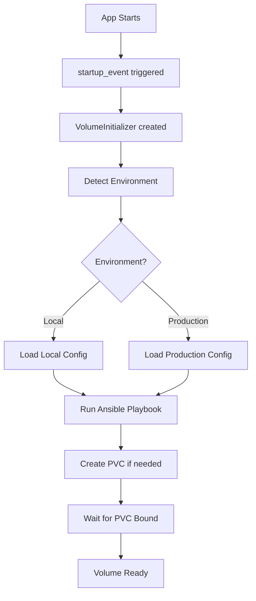
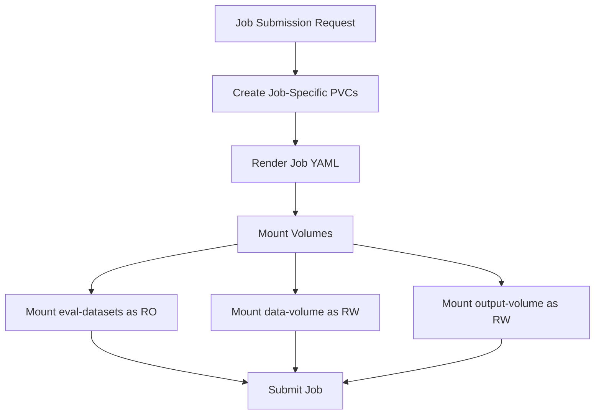

# Volume Implementation Guide

This guide provides detailed implementation information for the BudEval volume management system.

## File Structure

```
budeval/
├── ansible/
│   └── playbooks/
│       ├── ensure_eval_datasets_volume.yml    # Shared volume creation
│       ├── submit_job_with_volumes_k8s.yml    # Job submission with volumes
│       └── cleanup_job_resources_k8s.yml      # Volume cleanup
├── commons/
│   └── storage_config.py                      # Storage configuration
├── evals/
│   └── volume_init.py                         # Volume initialization logic
├── registry/
│   └── orchestrator/
│       └── ansible_orchestrator.py            # Volume rendering and management
└── main.py                                    # Startup hook
```

## Key Components

### 1. Storage Configuration (`storage_config.py`)

```python
class StorageConfig:
    """Storage configuration based on environment."""
    
    @staticmethod
    def get_environment() -> str:
        """Detect the current environment."""
        if os.path.exists("/home/ubuntu/bud-serve-eval/k3s.yaml"):
            return "local"
        return os.environ.get("BUDEVAL_ENV", "production").lower()
    
    @staticmethod
    def get_storage_config() -> Dict[str, Any]:
        """Get storage configuration for current environment."""
        # Returns environment-specific configuration
```

### 2. Volume Initializer (`volume_init.py`)

```python
class VolumeInitializer:
    """Handles initialization of required persistent volumes."""
    
    async def ensure_eval_datasets_volume(self, kubeconfig: Optional[str] = None):
        """Ensure the eval-datasets volume exists in the budeval namespace."""
        # 1. Detect environment
        # 2. Load configuration
        # 3. Run Ansible playbook to create volume
```

### 3. Ansible Orchestrator Updates

The orchestrator was updated to:
- Remove hostPath specifications
- Use dynamic provisioning
- Support environment-aware configurations

```python
def _render_persistent_volume_claim_yaml(self, name: str, pv_name: str, size: str, namespace: str) -> str:
    """Render PVC YAML for dynamic provisioning."""
    return f"""apiVersion: v1
kind: PersistentVolumeClaim
metadata:
  name: {name}
  namespace: {namespace}
spec:
  accessModes:
    - ReadWriteOnce
  storageClassName: ""  # Use default storage class
  resources:
    requests:
      storage: {size}
"""
```

### 4. Job Template Updates

Jobs now include the shared dataset volume:

```yaml
volumeMounts:
  - name: eval-datasets
    mountPath: /datasets
    readOnly: true
volumes:
  - name: eval-datasets
    persistentVolumeClaim:
      claimName: eval-datasets-pvc
```

## Ansible Playbooks

### ensure_eval_datasets_volume.yml

```yaml
---
- name: Ensure eval-datasets volume exists
  hosts: localhost
  vars:
    namespace: "budeval"
    pvc_name: "eval-datasets-pvc"
    volume_size: "10Gi"  # Overridden by extravars
    storage_class: ""
    access_mode: "ReadWriteMany"  # Overridden by extravars
  
  tasks:
    - name: Create PVC if it doesn't exist
      community.kubernetes.k8s:
        state: present
        definition:
          apiVersion: v1
          kind: PersistentVolumeClaim
          metadata:
            name: "{{ pvc_name }}"
            namespace: "{{ namespace }}"
          spec:
            accessModes:
              - "{{ access_mode }}"
            storageClassName: "{{ storage_class }}"
            resources:
              requests:
                storage: "{{ volume_size }}"
```

## Implementation Flow

### Application Startup



### Job Submission



## Code Examples

### Manual Volume Check

```python
#!/usr/bin/env python3
from budeval.commons.storage_config import StorageConfig

# Check current environment
env = StorageConfig.get_environment()
print(f"Environment: {env}")

# Get configuration
config = StorageConfig.get_eval_datasets_config()
print(f"Eval datasets config: {config}")
```

### Trigger Volume Creation

```python
import asyncio
from budeval.evals.volume_init import VolumeInitializer

async def create_volume():
    volume_init = VolumeInitializer()
    await volume_init.ensure_eval_datasets_volume()

asyncio.run(create_volume())
```

## Testing

### Unit Tests

```python
# test_storage_config.py
def test_environment_detection():
    """Test environment detection logic."""
    env = StorageConfig.get_environment()
    assert env in ["local", "production"]

def test_storage_config():
    """Test storage configuration loading."""
    config = StorageConfig.get_storage_config()
    assert "eval_datasets" in config
    assert "job_volumes" in config
```

### Integration Tests

1. **Volume Creation Test**
   ```bash
   # Clean up
   kubectl delete pvc eval-datasets-pvc -n budeval
   
   # Trigger creation
   curl -X POST http://localhost:8099/evals/init-volume
   
   # Verify
   kubectl get pvc -n budeval
   ```

2. **Job Submission Test**
   ```bash
   # Submit a test job
   curl -X POST http://localhost:8099/evals/start \
     -H "Content-Type: application/json" \
     -d '{...job data...}'
   
   # Check volume mounts
   kubectl describe pod <job-pod> -n budeval
   ```

## Monitoring

### Volume Usage

```bash
# Check PVC usage
kubectl describe pvc eval-datasets-pvc -n budeval

# Check volume capacity
kubectl get pvc -n budeval -o custom-columns=NAME:.metadata.name,SIZE:.spec.resources.requests.storage,STATUS:.status.phase
```

### Alerts

Consider setting up alerts for:
- PVC usage > 80%
- PVC in Pending state > 5 minutes
- Failed volume provisioning

## Troubleshooting Guide

### Issue: PVC Stuck in Pending

```bash
# Check events
kubectl describe pvc eval-datasets-pvc -n budeval

# Check storage class
kubectl get storageclass

# Check if storage class supports requested access mode
kubectl describe storageclass <storage-class-name>
```

### Issue: Volume Mount Failed

```bash
# Check pod events
kubectl describe pod <pod-name> -n budeval

# Check if PVC exists
kubectl get pvc -n budeval

# Verify namespace
kubectl get ns budeval
```

### Issue: Access Mode Not Supported

For local development with `local-path`:
- Only supports ReadWriteOnce
- Cannot be mounted by multiple pods simultaneously

Solutions:
1. Use ReadWriteOnce for local development
2. Use NFS or other storage class that supports ReadWriteMany for production

## Migration Guide

### From HostPath to Dynamic Provisioning

1. **Backup Data** (if needed)
   ```bash
   kubectl cp budeval/<pod>:/datasets ./backup/datasets
   ```

2. **Delete Old Volumes**
   ```bash
   kubectl delete pvc eval-datasets-pvc -n budeval
   kubectl delete pv eval-datasets
   ```

3. **Update Configuration**
   - Remove hostPath from PV definitions
   - Update storage class configuration

4. **Restart Application**
   ```bash
   dapr run --run-file ./app.yaml --config .dapr/dapr_config.yaml
   ```

5. **Restore Data** (if needed)
   ```bash
   kubectl cp ./backup/datasets budeval/<pod>:/datasets
   ```

## Performance Considerations

1. **Storage Class Selection**
   - SSD-backed storage for performance-critical workloads
   - Standard storage for cost optimization

2. **Volume Sizing**
   - Monitor usage patterns
   - Implement volume expansion if supported

3. **Access Patterns**
   - Use ReadWriteOnce when possible (better performance)
   - ReadWriteMany only when truly needed

## Security Best Practices

1. **RBAC Configuration**
   ```yaml
   apiVersion: rbac.authorization.k8s.io/v1
   kind: Role
   metadata:
     name: volume-manager
     namespace: budeval
   rules:
   - apiGroups: [""]
     resources: ["persistentvolumeclaims"]
     verbs: ["get", "list", "create", "update", "patch"]
   ```

2. **Pod Security Policies**
   - Restrict volume types
   - Enforce read-only mounts where appropriate

3. **Encryption**
   - Enable encryption at rest
   - Use encrypted storage classes

## Future Improvements

1. **Volume Snapshots**
   ```yaml
   apiVersion: snapshot.storage.k8s.io/v1
   kind: VolumeSnapshot
   metadata:
     name: eval-datasets-snapshot
   spec:
     volumeSnapshotClassName: csi-snapclass
     source:
       persistentVolumeClaimName: eval-datasets-pvc
   ```

2. **Dynamic Volume Expansion**
   - Monitor usage
   - Automatically expand when threshold reached

3. **Multi-Zone Replication**
   - Use storage classes with zone replication
   - Ensure high availability