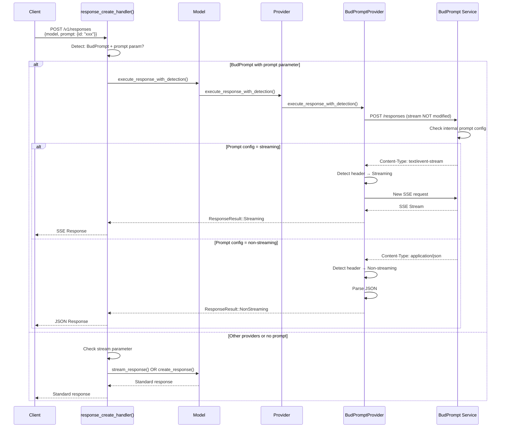
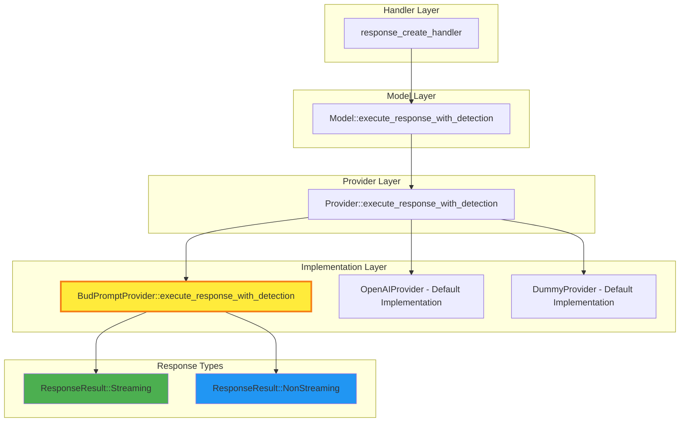
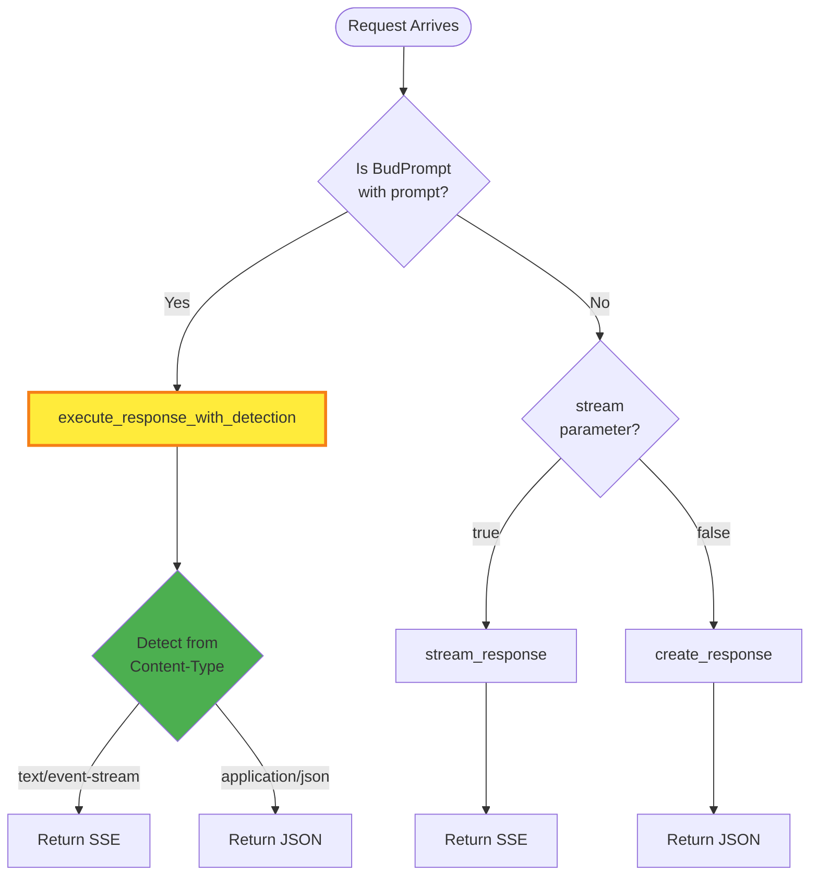
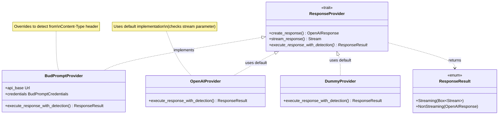

# BudPrompt Automatic Response Format Detection

## Overview

This document explains the implementation of **automatic response format detection** for the BudPrompt provider in the TensorZero gateway. This feature allows BudPrompt to control whether responses are streamed (Server-Sent Events) or returned as JSON based on its internal prompt configuration, rather than relying on the client's `stream` parameter.

## Table of Contents

- [Problem Statement](#problem-statement)
- [Solution Architecture](#solution-architecture)
- [Visual Flow Diagrams](#visual-flow-diagrams)
- [Implementation Details](#implementation-details)
- [Code Changes Summary](#code-changes-summary)
- [Usage Examples](#usage-examples)
- [Technical Deep Dive](#technical-deep-dive)
- [Testing](#testing)

---

## Problem Statement

### Before This Implementation

**The Issue:**
- BudPrompt has an internal prompt configuration system where prompts can be configured as streaming or non-streaming
- When a client sends a request with `prompt: {id: "xxx"}`, BudPrompt looks up the prompt configuration internally
- The gateway was forcing the `stream` parameter based on the client's request, which could conflict with BudPrompt's internal configuration
- Clients had to know beforehand whether a prompt was configured for streaming or not

**Example of the Problem:**
```json
// Client request
{
  "model": "budprompt-model",
  "prompt": {"id": "helpful-assistant"},
  "stream": false  // Client thinks it's non-streaming
}

// But BudPrompt's internal config for "helpful-assistant" says stream=true
// This creates a mismatch!
```

### Why This Matters

BudPrompt's prompt templates are configured server-side with specific streaming behavior. The gateway shouldn't override this - it should respect what BudPrompt decides based on its internal configuration.

---

## Solution Architecture

### High-Level Approach

1. **Detect BudPrompt with Prompt Parameter**: When a request uses BudPrompt and includes a `prompt` parameter
2. **Send Request As-Is**: Don't modify the `stream` parameter - let BudPrompt decide
3. **Detect Response Format**: Check the `Content-Type` header from BudPrompt's response:
   - `text/event-stream` → Streaming (SSE)
   - `application/json` → Non-streaming (JSON)
4. **Handle Accordingly**: Parse and return the appropriate response format

### Key Components Added

1. **`ResponseResult` Enum**: A unified type for both streaming and non-streaming responses
2. **`execute_response_with_detection()` Method**: New trait method with default implementation
3. **BudPrompt Override**: Custom implementation that detects format from headers
4. **Handler Logic Update**: Routes BudPrompt+prompt requests to the new method

---

## Visual Flow Diagrams

### Complete Request Flow



### Architecture Components



### Decision Flow in Handler



### Class Hierarchy



---

## Implementation Details

### 1. ResponseResult Enum (`responses.rs`)

**Location**: Lines 289-302

```rust
/// Result type for responses that can be either streaming or non-streaming
/// Used by providers that need to auto-detect response format (e.g., BudPrompt)
pub enum ResponseResult {
    /// Streaming response (SSE)
    Streaming(
        Box<
            dyn futures::Stream<Item = Result<ResponseStreamEvent, crate::error::Error>>
                + Send
                + Unpin,
        >,
    ),
    /// Non-streaming JSON response
    NonStreaming(OpenAIResponse),
}
```

**Purpose**: Unified type that can represent either format, allowing methods to return responses without knowing the format in advance.

### 2. ResponseProvider Trait Method (`responses.rs`)

**Location**: Lines 380-399

```rust
/// Execute response with automatic format detection (for providers like BudPrompt)
/// Default implementation falls back to stream parameter
async fn execute_response_with_detection(
    &self,
    request: &OpenAIResponseCreateParams,
    _model_name: &str,
    client: &reqwest::Client,
    api_keys: &crate::endpoints::inference::InferenceCredentials,
) -> Result<ResponseResult, crate::error::Error> {
    // Default implementation: check stream parameter and call appropriate method
    if request.stream.unwrap_or(false) {
        Ok(ResponseResult::Streaming(
            self.stream_response(request, client, api_keys).await?,
        ))
    } else {
        Ok(ResponseResult::NonStreaming(
            self.create_response(request, client, api_keys).await?,
        ))
    }
}
```

**Purpose**: Provides a default implementation that existing providers can use without changes. BudPrompt overrides this with custom logic.

### 3. BudPrompt Implementation (`budprompt.rs`)

**Location**: Lines 610-802

**Key Steps**:

1. **Send Request As-Is**
```rust
let res = request_builder.json(&request).send().await?;
```

2. **Check Response Headers**
```rust
let content_type = res
    .headers()
    .get("content-type")
    .and_then(|v| v.to_str().ok())
    .unwrap_or("");
```

3. **Branch Based on Content-Type**
```rust
if content_type.contains("text/event-stream") {
    // Create new SSE request and return Streaming variant
} else if content_type.contains("application/json") {
    // Parse JSON and return NonStreaming variant
}
```

### 4. Provider Struct Method (`model.rs`)

**Location**: Lines 2856-2889

```rust
pub async fn execute_response_with_detection(
    &self,
    request: &crate::responses::OpenAIResponseCreateParams,
    model_name: &str,
    client: &Client,
    dynamic_api_keys: &InferenceCredentials,
) -> Result<crate::responses::ResponseResult, Error> {
    use crate::responses::ResponseProvider;
    match &self.config {
        ProviderConfig::BudPrompt(provider) => {
            provider
                .execute_response_with_detection(request, model_name, client, dynamic_api_keys)
                .await
        }
        ProviderConfig::OpenAI(provider) => {
            provider
                .execute_response_with_detection(request, model_name, client, dynamic_api_keys)
                .await
        }
        // ... other providers
    }
}
```

### 5. Model Struct Method (`model.rs`)

**Location**: Lines 1441-1477

Implements the standard routing pattern with provider fallback:

```rust
pub async fn execute_response_with_detection(
    &self,
    request: &crate::responses::OpenAIResponseCreateParams,
    model_name: &str,
    clients: &InferenceClients<'_>,
) -> Result<crate::responses::ResponseResult, Error> {
    let mut provider_errors = HashMap::new();
    for provider_name in &self.routing {
        let provider = self.providers.get(provider_name)?;
        match provider.execute_response_with_detection(...).await {
            Ok(response) => return Ok(response),
            Err(error) => provider_errors.insert(provider_name, error),
        }
    }
    Err(Error::new(ErrorDetails::ModelProvidersExhausted { provider_errors }))
}
```

### 6. Handler Update (`openai_compatible.rs`)

**Location**: Lines 5266-5358

**Detection Logic**:
```rust
let is_budprompt_with_prompt = {
    let models = config.models.read().await;
    let model_info = models.get(&model_name).await?.ok_or_else(|| ...)?;

    let has_budprompt = model_info.providers.values().any(|p| {
        matches!(p.config, crate::model::ProviderConfig::BudPrompt(_))
    });

    has_budprompt && params.prompt.is_some()
};
```

**Routing**:
```rust
if is_budprompt_with_prompt {
    let result = model.execute_response_with_detection(&params, ...).await?;

    match result {
        ResponseResult::Streaming(stream) => {
            // Convert to SSE and return
        }
        ResponseResult::NonStreaming(response) => {
            // Return JSON
        }
    }
} else {
    // Standard stream parameter behavior
}
```

---

## Code Changes Summary

### Files Modified

| File | Lines | Changes |
|------|-------|---------|
| `responses.rs` | 289-302 | Added `ResponseResult` enum |
| `responses.rs` | 380-399 | Added trait method with default implementation |
| `budprompt.rs` | 5-7 | Added `ResponseResult` import |
| `budprompt.rs` | 610-802 | Implemented auto-detection logic |
| `model.rs` | 2856-2889 | Added Provider struct method |
| `model.rs` | 1441-1477 | Added Model struct method |
| `openai_compatible.rs` | 5266-5358 | Updated handler with detection logic |

### Behavior Comparison

| Scenario | Before | After |
|----------|--------|-------|
| **BudPrompt + prompt param** | Gateway forces stream based on client param | Gateway detects from BudPrompt's response |
| **BudPrompt without prompt** | Standard stream param behavior | Standard stream param behavior (unchanged) |
| **Other providers** | Standard stream param behavior | Standard stream param behavior (unchanged) |
| **Stream parameter sent** | Always respected | Ignored for BudPrompt+prompt, otherwise respected |

---

## Usage Examples

### Example 1: Streaming Prompt

**Client Request**:
```bash
curl -X POST http://localhost:3000/v1/responses \
  -H "Authorization: Bearer $API_KEY" \
  -H "Content-Type: application/json" \
  -d '{
    "model": "budprompt-model",
    "input": "Hello!",
    "prompt": {
      "id": "streaming-assistant",
      "variables": {"name": "Alice"}
    }
  }'
```

**BudPrompt's Internal Config** (for prompt "streaming-assistant"):
```toml
[prompts.streaming-assistant]
stream = true
template = "You are a helpful assistant..."
```

**What Happens**:
1. Gateway sends request to BudPrompt without forcing `stream: true`
2. BudPrompt checks its config, sees `stream = true`
3. BudPrompt returns response with `Content-Type: text/event-stream`
4. Gateway detects this header and creates SSE stream
5. Client receives streaming response

### Example 2: Non-Streaming Prompt

**Client Request**:
```bash
curl -X POST http://localhost:3000/v1/responses \
  -H "Authorization: Bearer $API_KEY" \
  -H "Content-Type: application/json" \
  -d '{
    "model": "budprompt-model",
    "input": "Translate to French: Hello",
    "prompt": {
      "id": "translator"
    }
  }'
```

**BudPrompt's Internal Config** (for prompt "translator"):
```toml
[prompts.translator]
stream = false
template = "Translate the following..."
```

**What Happens**:
1. Gateway sends request to BudPrompt without forcing stream
2. BudPrompt checks its config, sees `stream = false`
3. BudPrompt returns response with `Content-Type: application/json`
4. Gateway detects this header and parses JSON
5. Client receives complete JSON response

### Example 3: No Prompt Parameter (Standard Behavior)

```bash
curl -X POST http://localhost:3000/v1/responses \
  -H "Authorization: Bearer $API_KEY" \
  -H "Content-Type: application/json" \
  -d '{
    "model": "budprompt-model",
    "input": "Hello!",
    "stream": true
  }'
```

**What Happens**:
1. No `prompt` parameter, so standard behavior applies
2. Gateway checks `stream: true` parameter
3. Gateway calls `stream_response()` method
4. BudPrompt returns SSE as requested

---

## Technical Deep Dive

### Why Two HTTP Requests for Streaming?

When the gateway detects a streaming response, it makes **two requests**:

1. **First Request**: To detect the Content-Type header
   - Must consume the response to read headers
   - Cannot be reused for streaming

2. **Second Request**: To actually stream the data
   - Creates an EventSource connection
   - Streams data to the client

This is necessary because:
- `reqwest` requires consuming the response to read it
- EventSource requires a fresh connection
- We need to detect the format before committing to a response type

**Performance Impact**: Minimal - both requests are to the same service, and the first is just a header check.

### Content-Type Detection

The implementation checks for **substring matches**:

```rust
if content_type.contains("text/event-stream") {
    // Streaming
} else if content_type.contains("application/json") {
    // Non-streaming
}
```

This handles cases like:
- `text/event-stream`
- `text/event-stream; charset=utf-8`
- `application/json`
- `application/json; charset=utf-8`

### Error Handling

If an unexpected Content-Type is received:

```rust
Err(Error::new(ErrorDetails::InferenceServer {
    message: format!("Unexpected Content-Type from {}: {}", PROVIDER_NAME, content_type),
    ...
}))
```

This ensures clear error messages for debugging.

### Backward Compatibility

The implementation is **fully backward compatible**:

1. **Default trait implementation**: Existing providers work without changes
2. **Conditional routing**: Only BudPrompt+prompt uses new path
3. **No breaking changes**: All existing APIs remain unchanged
4. **Opt-in behavior**: Only activates with specific conditions

---

## Testing

### Manual Testing

**Test Streaming Detection**:
```bash
# Configure a streaming prompt in BudPrompt
curl -X POST http://localhost:3000/v1/responses \
  -H "Authorization: Bearer test-key" \
  -H "Content-Type: application/json" \
  -d '{
    "model": "budprompt-test",
    "prompt": {"id": "streaming-prompt"},
    "input": "Test input"
  }'

# Should receive SSE stream
```

**Test Non-Streaming Detection**:
```bash
# Configure a non-streaming prompt in BudPrompt
curl -X POST http://localhost:3000/v1/responses \
  -H "Authorization: Bearer test-key" \
  -H "Content-Type: application/json" \
  -d '{
    "model": "budprompt-test",
    "prompt": {"id": "non-streaming-prompt"},
    "input": "Test input"
  }'

# Should receive JSON response
```

### Unit Tests

The implementation compiles without warnings:

```bash
cargo build
# ✓ Compiled successfully
```

### Integration Testing

Configure test models in `tensorzero.toml`:

```toml
[models."budprompt-test"]
routing = ["budprompt"]
endpoints = ["responses"]

[models."budprompt-test".providers.budprompt]
type = "budprompt"
api_base = "http://localhost:8080/"
```

---

## Configuration

### Model Configuration

```toml
[models."my-budprompt-model"]
routing = ["budprompt_provider"]
endpoints = ["responses"]

[models."my-budprompt-model".providers.budprompt_provider]
type = "budprompt"
api_base = "https://budprompt-service.example.com/"
api_key_location = { env = "BUDPROMPT_API_KEY" }
```

### BudPrompt Service Configuration

Configure prompts with streaming settings:

```toml
[prompts.helpful-assistant]
stream = true
template = "You are a helpful assistant..."

[prompts.translator]
stream = false
template = "Translate the following..."
```

---

## Troubleshooting

### Common Issues

**Issue**: Gateway returns JSON when expecting streaming

**Solution**: Check BudPrompt's prompt configuration - the prompt may be configured as non-streaming.

---

**Issue**: Gateway returns "Unexpected Content-Type" error

**Solution**: BudPrompt may be returning an unexpected content type. Check BudPrompt service logs.

---

**Issue**: Streaming works with `stream: true` but not with prompt parameter

**Solution**: Ensure the model has BudPrompt provider and the request includes `prompt: {id: "..."}`.

---

## Summary

This implementation enables BudPrompt to control response streaming through its internal prompt configuration, providing a more flexible and maintainable architecture. The gateway now respects BudPrompt's decisions while maintaining full backward compatibility with existing providers and clients.

### Key Benefits

✅ **Server-Side Control**: BudPrompt controls streaming via internal config
✅ **Automatic Detection**: No client-side knowledge needed
✅ **Backward Compatible**: Existing code works unchanged
✅ **Clean Architecture**: Follows existing patterns
✅ **Type Safe**: Rust's type system prevents errors

---

**Last Updated**: 2025-01-09
**Status**: ✅ Implemented and Deployed
